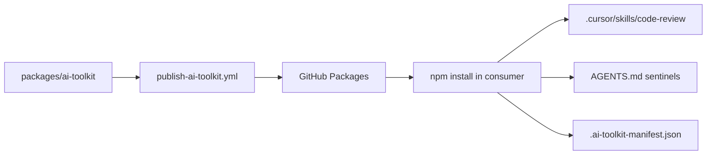

# AI Toolkit Registry — Plan Brief

> Full plan: `context/changes/ai-toolkit-registry/plan.md`
> Research: `context/changes/ai-toolkit-registry/research.md`

## What & Why

Publish `@szymoniwacz/ai-toolkit` to GitHub Packages so the same Cursor `code-review` skill and agent rules install across `szymoniwacz/*` repos without hand-copying files. Model 1 (GitHub Packages + `GITHUB_TOKEN`) — no AWS CodeArtifact or custom API.

## Starting Point

M5L2/M5L3 automated PR review exists (`packages/code-reviewer/`). M5L4 distribution is spec'd in `.cursor/prompts/m5l4-*` but `packages/ai-toolkit/` does not exist. Course templates target Claude paths and `@twoj-zespol`; this repo uses Cursor (`.cursor/skills/`, `AGENTS.md`) and `@szymoniwacz`.

## Desired End State

A private npm package on GitHub Packages. Consumer Rails repos at repo root run `npm install @szymoniwacz/ai-toolkit`, get `.cursor/skills/code-review/`, an appended sentinel block in `AGENTS.md`, and a manifest for clean uninstall. Publishing is automated on main when `packages/ai-toolkit/**` changes and version is bumped manually.

## Key Decisions Made

| Decision | Choice | Why (1 sentence) | Source |
| -------- | ------ | ---------------- | ------ |
| Distribution model | GitHub Packages (Model 1) | Already on GitHub; `GITHUB_TOKEN` auth suffices | Decision |
| Package scope/name | `@szymoniwacz/ai-toolkit` | Matches GitHub user namespace | Decision / Research |
| Install targets | `.cursor/skills/`, `AGENTS.md`, `.cursor/.ai-toolkit-manifest.json` | Cursor + AGENTS.md conventions in this ecosystem | Research / Plan |
| Rules snippet scope | Hard rules + Commands + Style | Portable team guidance beyond security-only | Plan |
| Skill content | Rails/SafeLog adapted conventions | Primary consumers are Rails repos | Plan |
| Installer entry points | postinstall + `ai-toolkit` bin | npm install auto-wires; bin supports reinstall | Plan / Research |
| AGENTS.md handling | Append sentinels at end | Preserves existing local content | Plan |
| Skill reinstall | Overwrite manifest-tracked skill dir | Idempotent updates on package bump | Plan |
| Consumer layout | Rails app at repo root | Typical `szymoniwacz/*` layout | Plan |
| Package visibility | Private, linked to safelog-ai repo | Solo dev, no external consumers | Plan |
| Publisher integration | Standalone `packages/ai-toolkit` only | Root package.json is E2E-only; no workspaces | Plan |
| Publish trigger | Manual version bump + path filter on main | Avoid no-op publishes; explicit release control | Plan |
| CI verification | Smoke install script in validate job | Proves install/uninstall before publish | Plan |
| Out of scope | code-reviewer in v1, CodeArtifact, custom API | Separate CI layer; rejected models | Decision / Research |

## Scope

**In scope:** `packages/ai-toolkit/` skeleton; install/uninstall + bin; Rails-adapted `code-review` skill; `AGENTS.md` rules snippet; publish workflow with validate + smoke test; consumer README and `.npmrc` guidance; first publish to GitHub Packages.

**Out of scope:** CodeArtifact/Terraform; bundling TS code-reviewer; root npm workspaces; auto semver; monorepo consumer layouts; changes to Rails CI or ai-code-review workflow.

## Architecture / Approach

Publisher repo builds a zero-dependency npm package containing static skills/rules and Node install scripts. GitHub Actions validates structure, runs a temp-consumer smoke test, and publishes to `npm.pkg.github.com` on filtered main pushes. Consumers map `@szymoniwacz` scope in `.npmrc`, authenticate via user token or `GH_PKG_TOKEN` in CI, and `postinstall` copies artifacts into the Cursor config tree with sentinel-guarded rules injection. Uninstall reads the manifest — never guesses paths.

## Phases at a Glance

| Phase | What it delivers | Key risk |
| ----- | ---------------- | -------- |
| 1. Package skeleton | Valid publishable `package.json` + layout | Wrong `files` whitelist omits skill/rules |
| 2. Install/uninstall | Cursor paths, sentinels, manifest, bin | Postinstall mutates publisher repo if smoke test cwd wrong |
| 3. Skill + rules | Rails skill + portable AGENTS snippet | Over-fitting to SafeLog product vs portable Rails rules |
| 4. Publish CI | Workflow + smoke script | Path filter or permissions misconfigured |
| 5. Docs + first publish | README, consumer auth, live package | GitHub Packages auth confusion for local install |

**Prerequisites:** GitHub repo with Packages enabled; push access to main; M5L4 spec prompts in `.cursor/prompts/`.

**Estimated effort:** ~2–3 focused sessions across 5 phases.

## Open Risks & Assumptions

- GitHub Packages private read auth for local dev requires `npm login` — same-org CI may differ from cross-repo consumers (`GH_PKG_TOKEN`).
- Overwriting `.cursor/skills/code-review/` may clobber hand-edited consumer copies — documented in README.
- Rules snippet includes Commands/Style that reference `mise exec --` — acceptable for target Rails repos but not universal.

## Success Criteria (Summary)

- `@szymoniwacz/ai-toolkit` published privately on GitHub Packages.
- CI smoke test passes install → assert → uninstall on every PR touching the package.
- Manual install into a consumer Rails repo produces skill, sentinels, and clean uninstall.
