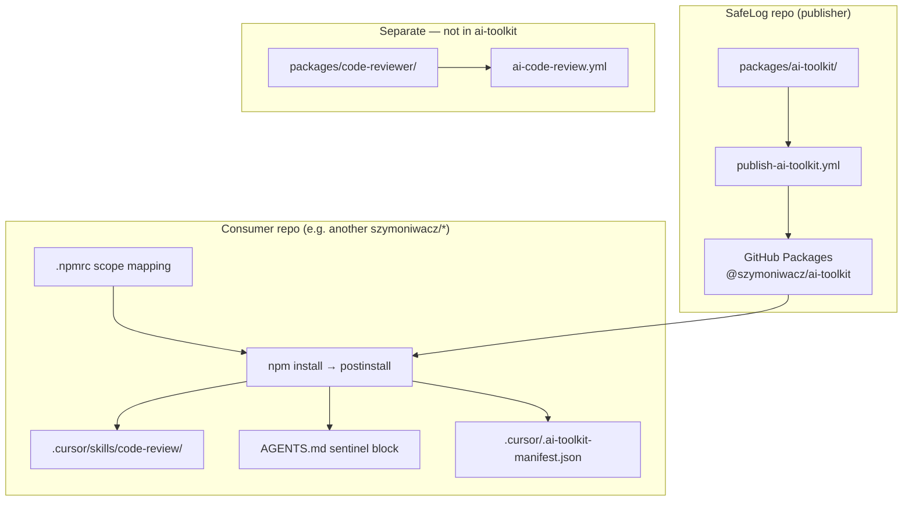

# Research: AI toolkit registry — GitHub Packages distribution of skills and rules

**Date**: 2026-06-20T16:16:46+02:00  
**Researcher**: Cursor Agent  
**Git Commit**: `089b4feff525dcfe9167f27198916b4ff19fbbf4`  
**Branch**: main  
**Repository**: safelog-ai

## Research Question

How should SafeLog implement `@szymoniwacz/ai-toolkit` — a distributable npm package on GitHub Packages that installs shared AI skills and rules across consumer repos — using the M5L4 course specs, templates, and the existing codebase?

Input sources requested:
- `context/team/m5l4-distribution-decision.md` — distribution choice
- `.cursor/prompts/m5l4-github-packages-spec-pack.md` — package structure, install, manifest
- `.cursor/prompts/m5l4-github-packages-spec-cicd.md` — publish workflow
- `.cursor/prompts/m5l4-shared-conventions.md` — conventions base for the skill
- `.cursor/prompts/m5l4-shared-spec-skill.md` — code-review skill spec
- `.cursor/config-templates/m5l4-github-packages-*.template` — starter templates

## Summary

**Nothing is implemented yet for M5L4 distribution.** The repo has completed M5L2/M5L3 automated PR review (`packages/code-reviewer/` + GHA), but `packages/ai-toolkit/` does not exist. All M5L4 guidance lives as course-installed specs and templates under `.cursor/` (manifest lessonId `m5l4`).

The distribution decision is clear: **Model 1 — GitHub Packages** as `@szymoniwacz/ai-toolkit`, containing a `code-review` Cursor skill, a rules snippet derived from `AGENTS.md`, and install/uninstall scripts with a publish workflow. CodeArtifact (Model 2) and custom API (Model 3) are explicitly rejected.

The main implementation work is **materializing** `packages/ai-toolkit/` from the GitHub Packages templates while **adapting three mismatches** between lesson defaults and this repo:

1. **Scope/name**: templates use `@twoj-zespol/ai-toolkit`; decision uses `@szymoniwacz/ai-toolkit`.
2. **Install targets**: templates install to `.claude/skills/` and `CLAUDE.md`; this repo uses `.cursor/skills/` and `AGENTS.md`.
3. **Review output format**: the planned Cursor skill uses Critical/Warning/Suggestion + APPROVE/REQUEST CHANGES; the existing TS agent uses 1–10 scores + pass/fail — these are separate layers and should not be conflated.

`packages/code-reviewer/` is **not** part of the ai-toolkit package per the distribution decision; it remains a private, repo-local CI agent.

## Detailed Findings

### Distribution decision (locked)

[`context/team/m5l4-distribution-decision.md`](https://github.com/szymoniwacz/safelog-ai/blob/089b4feff525dcfe9167f27198916b4ff19fbbf4/context/team/m5l4-distribution-decision.md):

- **Audience**: solo developer, multiple GitHub repos (`szymoniwacz/*`).
- **Choice**: Model 1 — GitHub Packages, `@szymoniwacz/ai-toolkit`, auth via `GITHUB_TOKEN`.
- **Not doing**: CodeArtifact, custom API+CLI.
- **Next**: package in `packages/ai-toolkit/` with code-review skill, `AGENTS.md` rules snippet, install/uninstall scripts, publish workflow.

### Current repo state vs target

| Artifact | Status |
|----------|--------|
| `packages/ai-toolkit/` | **Missing** |
| `skills/code-review/SKILL.md` (in package) | **Missing** |
| `rules/AGENTS.md` (extracted snippet) | **Missing** |
| `install.js` / `uninstall.js` (materialized) | **Templates only** in `.cursor/config-templates/` |
| `.github/workflows/publish-ai-toolkit.yml` | **Missing** |
| Consumer `.npmrc` for `@szymoniwacz` | **Missing** |
| `@szymoniwacz/ai-toolkit` on GitHub Packages | **Not published** |

What **does** exist:

| Artifact | Role |
|----------|------|
| `packages/code-reviewer/` | M5L2/M5L3 OpenAI review agent (`@safelog-ai/code-reviewer`, `private: true`) |
| `.github/workflows/ai-code-review.yml` | PR review CI (not package publish) |
| `.github/actions/code-review/` | Composite action running `npm run review:pr` |
| `.cursor/prompts/m5l4-*` | M5L4 specs (pack, CI/CD, skill, conventions) |
| `.cursor/config-templates/m5l4-github-packages-*` | Starter templates |
| `.cursor/skills/pack-init`, `setup-cicd`, `tf-registry` | Generator skills (pack-init useful; setup-cicd/tf-registry target rejected Model 2) |

### M5L4 course materials (installed via 10x CLI)

[`.cursor/.10x-cli-manifest.json`](https://github.com/szymoniwacz/safelog-ai/blob/089b4feff525dcfe9167f27198916b4ff19fbbf4/.cursor/.10x-cli-manifest.json) records `lessonId: m5l4` with prompts, config templates, and skills.

#### Package spec — `m5l4-github-packages-spec-pack.md`

Target structure:

```text
ai-toolkit/
├── package.json
├── README.md
├── install.js
├── uninstall.js
├── skills/code-review/SKILL.md
└── rules/AGENTS.md
```

Key requirements:
- Publish via `publishConfig.registry: https://npm.pkg.github.com`
- `files`: skills/, rules/, install.js, uninstall.js, README.md
- `postinstall`: `node install.js`
- Consumer `.npmrc`: scope registry mapping only (no token)
- Installer: copy skills → AI tool config dir; append rules to `AGENTS.md` with sentinel markers; write `.ai-toolkit-manifest.json`; idempotent
- Sentinels: `<!-- BEGIN @twoj-zespol/ai-toolkit -->` / `<!-- END ... -->` (replace with `@szymoniwacz/ai-toolkit`)

#### CI/CD spec — `m5l4-github-packages-spec-cicd.md`

- Workflow: `.github/workflows/publish-ai-toolkit.yml`
- Package location: repo root **or** `packages/ai-toolkit/` for monorepo (SafeLog uses monorepo layout)
- Permissions: `contents: read`, `packages: write` — no AWS/OIDC
- Validate: package.json, skill frontmatter, `npm pack --dry-run`
- Publish on push to main/master with `NODE_AUTH_TOKEN: ${{ secrets.GITHUB_TOKEN }}`
- PR runs validate only; publish gated to push events

#### Skill spec — `m5l4-shared-spec-skill.md`

- Skill name: `code-review`
- Target: `skills/code-review/SKILL.md`
- Triggers: "review code", "check this PR", "review my changes", "code review"
- Categories from conventions: Naming, Error handling, TypeScript, Function design, Security, Testing
- Output: Critical → Warning → Suggestion, `file:line`, final APPROVE | REQUEST CHANGES | NEEDS DISCUSSION

#### Conventions handout — `m5l4-shared-conventions.md`

Generic engineering conventions (naming, error handling, TypeScript, functions, security, testing). Intended as **input** to generate the skill — must be adapted for Rails/SafeLog (e.g. add Ruby/Rails idioms, `mise exec --`, security rules from `AGENTS.md` hard rules).

### Config templates — gaps vs spec

Templates exist at `.cursor/config-templates/m5l4-github-packages-*.template`:

| Template | Notes |
|----------|-------|
| `package.json.template` | `@twoj-zespol/ai-toolkit`, postinstall, optional `bin.ai-toolkit` |
| `install.js.template` | Installs to **`.claude/skills/`** and **`CLAUDE.md`** — not `.cursor/skills/` + `AGENTS.md` |
| `uninstall.js.template` | Reads manifest from `.claude/.ai-toolkit-manifest.json` |
| `consumer.npmrc.template` | `@twoj-zespol:registry=...` |
| `publish-ai-toolkit.yml.template` | validate + publish; assumes package at repo root (`npm ci` without `working-directory`) |

**Critical adaptation for SafeLog/Cursor:**

| Spec says | Template does | SafeLog needs |
|-----------|---------------|---------------|
| `.cursor/skills/<name>/` (spec L74) | `.claude/skills/` | `.cursor/skills/` |
| `AGENTS.md` sentinels (spec L75) | `CLAUDE.md` + `rules/CLAUDE.md` | `AGENTS.md` + `rules/AGENTS.md` |
| `.cursor/.ai-toolkit-manifest.json` (spec L76) | `.claude/.ai-toolkit-manifest.json` | `.cursor/.ai-toolkit-manifest.json` |
| `@twoj-zespol` | placeholder scope | `@szymoniwacz` |
| repo root package | no `working-directory` | `packages/ai-toolkit/` |

### Rules source: AGENTS.md

[`AGENTS.md`](https://github.com/szymoniwacz/safelog-ai/blob/089b4feff525dcfe9167f27198916b4ff19b4ff19fbbf4/AGENTS.md) lines 5–21 contain **Hard rules for agents** — the natural extract for `rules/AGENTS.md` in the toolkit:

- Raw log handling, encryption, AI evidence-only, hypothesis-framed reports
- Devise scope, no React/Vite scaffold, never overwrite `context/`
- `mise exec --` for local commands

The **Commands** and **Style and commits** sections (lines 23–40) are SafeLog-repo-specific; include selectively or omit from the distributable rules snippet depending on whether consumers are all Rails repos.

[`.cursorrules`](https://github.com/szymoniwacz/safelog-ai/blob/089b4feff525dcfe9167f27198916b4ff19fbbf4/.cursorrules) contains only commit-message formatting — not a rules source for the toolkit.

### Three separate "code review" mechanisms

Do not conflate these:

| Layer | Location | Runtime | Output |
|-------|----------|---------|--------|
| **TS review agent** | `packages/code-reviewer/` | OpenAI via Vercel AI SDK | 6 scores (1–10) + pass/fail + summary |
| **Cursor subagent skills** | `~/.cursor/skills-cursor/review-bugbot/`, `review-security/` | Cursor platform subagents | Severity table per finding |
| **Planned toolkit skill** | `packages/ai-toolkit/skills/code-review/` | Cursor agent orchestration | Critical/Warning/Suggestion + APPROVE/REQUEST CHANGES |

The distribution decision asks for the **third** (Cursor skill + rules). The TS agent stays in-repo for GHA PR automation (M5L3, implemented in `ci-cd-code-review` change).

SafeLog-specific content in the TS agent (parameterize if ever extracted):

- `packages/code-reviewer/src/prompts/system-prompt.ts:5-7` — SafeLog hard rules in prompt
- `packages/code-reviewer/src/schemas/review-schema.ts:28` — SafeLog security note in Zod describe

### Existing CI patterns to mirror/differ

**Code review CI** (implemented):

- [`.github/workflows/ai-code-review.yml`](https://github.com/szymoniwacz/safelog-ai/blob/089b4feff525dcfe9167f27198916b4ff19fbbf4/.github/workflows/ai-code-review.yml) — PR triggers, fork guard, composite action
- [`.github/actions/code-review/action.yml`](https://github.com/szymoniwacz/safelog-ai/blob/089b4feff525dcfe9167f27198916b4ff19fbbf4/.github/actions/code-review/action.yml) — Node 22, `npm ci` in `packages/code-reviewer`, `npm run review:pr`

**Publish workflow** (to create):

| Pattern | Code review CI | Publish (M5L4 spec) |
|---------|----------------|---------------------|
| Permissions | `pull-requests: write` | `packages: write` |
| Node setup | no registry config | `registry-url` + scope |
| Auth | `OPENAI_API_KEY` | `NODE_AUTH_TOKEN: GITHUB_TOKEN` |
| Working dir | `packages/code-reviewer` | `packages/ai-toolkit` |
| Jobs | single | validate + publish (publish on push only) |

Existing Rails CI at `.github/workflows/ci.yml` must remain unchanged — publish gets its own workflow file per spec.

### Generator skills — which to use

| Skill | Applicable? | Notes |
|-------|-------------|-------|
| `pack-init` | **Partially** | Defines `packages/ai-toolkit/` skeleton but references CodeArtifact inputs and includes `pack.yaml`, `bin/cli.js` not required by GitHub Packages spec |
| `setup-cicd` | **No** | Generates CodeArtifact OIDC pipeline; would overwrite `ci.yml` |
| `tf-registry` | **No** | CodeArtifact Terraform — rejected by decision |

For implementation, follow **GitHub Packages specs + templates** directly; use `pack-init` only for structural reference, not as the sole driver.

## Code References

- `context/team/m5l4-distribution-decision.md:12-25` — Model 1 choice, package contents
- `.cursor/.10x-cli-manifest.json:6-41` — M5L4 installed artifacts
- `.cursor/prompts/m5l4-github-packages-spec-pack.md:19-85` — package layout, installer, sentinels
- `.cursor/prompts/m5l4-github-packages-spec-cicd.md:11-90` — publish workflow requirements
- `.cursor/prompts/m5l4-shared-spec-skill.md:12-40` — code-review skill contract
- `.cursor/prompts/m5l4-shared-conventions.md:7-44` — conventions input for skill generation
- `.cursor/config-templates/m5l4-github-packages-install.js.template:37-73` — template install targets (needs Cursor adaptation)
- `.cursor/config-templates/m5l4-github-packages-package.json.template:1-26` — package.json starter
- `.cursor/config-templates/m5l4-github-packages-publish-ai-toolkit.yml.template:1-46` — publish workflow starter
- `packages/code-reviewer/package.json:2-4` — `@safelog-ai/code-reviewer`, private, not distributable
- `packages/code-reviewer/src/prompts/system-prompt.ts:5-7` — SafeLog rules embedded in CI agent
- `.github/workflows/ai-code-review.yml:1-31` — M5L3 PR review workflow
- `.github/actions/code-review/action.yml:44-66` — composite action invoking code-reviewer
- `AGENTS.md:5-21` — hard rules source for distributable rules snippet
- `context/changes/ci-cd-code-review/change.md:12-16` — M5L3 implemented status
- `context/changes/ci-cd-code-review/requirements.md:143-155` — code-reviewer CI architecture

## Architecture Insights



**Design principles from specs:**

1. **Manifest-driven uninstall** — track installed files; never guess paths.
2. **Sentinel blocks** — idempotent rules injection; update in place on reinstall.
3. **No secrets in package or committed `.npmrc`** — tokens via env/CI secrets only.
4. **Validate before publish** — skill frontmatter checks + `npm pack --dry-run`.
5. **Separate concerns** — toolkit distributes IDE artifacts; code-reviewer is optional future package for CI automation.

## Historical Context (from prior changes)

- [`context/changes/ci-cd-code-review/change.md`](https://github.com/szymoniwacz/safelog-ai/blob/089b4feff525dcfe9167f27198916b4ff19fbbf4/context/changes/ci-cd-code-review/change.md) — M5L3 implemented; wires `packages/code-reviewer` into GHA. Status `implemented`. This is the **automation layer**, not the distribution layer.
- [`context/changes/ci-cd-code-review/requirements.md`](https://github.com/szymoniwacz/safelog-ai/blob/089b4feff525dcfe9167f27198916b4ff19fbbf4/context/changes/ci-cd-code-review/requirements.md) — explicitly non-goal: sending AGENTS.md or plan files to the review model (line 19). The toolkit rules are for **Cursor IDE agents**, not the CI review agent.
- [`context/certification/certification-readiness.md`](https://github.com/szymoniwacz/safelog-ai/blob/089b4feff525dcfe9167f27198916b4ff19fbbf4/context/certification/certification-readiness.md) — M5 Champion in progress; M5L2/M5L3 complete; M5L4 distribution not yet reflected.

## Related Research

- `context/changes/ci-cd-code-review/requirements.md` — M5L3 PR review requirements (adjacent, not duplicate)
- `.cursor/skills/pack-init/SKILL.md` — package skeleton generator (CodeArtifact-oriented)
- `.cursor/skills/setup-cicd/SKILL.md` — CodeArtifact publish pipeline (not chosen)

## Open Questions

| # | Question | Proposed default |
|---|----------|------------------|
| Q1 | Rules snippet scope: hard rules only vs hard rules + Commands/Style? | Hard rules only for cross-repo portability; consumers add repo-specific sections locally |
| Q2 | Conventions skill body: generic TS handout vs Rails-adapted? | Adapt for Rails/SafeLog (`mise exec --`, RSpec, service objects, encryption) since primary consumer is Rails repos |
| Q3 | Include `code-reviewer` in ai-toolkit v1? | No — per distribution decision; keep separate; optional v2 as `@szymoniwacz/code-reviewer` |
| Q4 | Node version alignment: code-reviewer uses 22, M5L4 spec allows ≥20? | Use Node 22 in publish workflow to match existing GHA |
| Q5 | Publish trigger: version bump strategy? | Manual `version` in package.json; publish on push to main (no auto-bump in v1) |
| Q6 | Consumer install: `postinstall` only vs `npx @szymoniwacz/ai-toolkit install`? | Both per spec — postinstall for `npm install`; bin for explicit re-install after skill updates |
| Q7 | First consumer repo? | Another `szymoniwacz/*` repo; same-org GHA may read package without `GH_PKG_TOKEN`; document local `npm login` flow |

## Recommended implementation sequence (for `/10x-plan`)

1. Create `packages/ai-toolkit/` from templates; rename scope to `@szymoniwacz/ai-toolkit`.
2. Adapt `install.js` / `uninstall.js` for `.cursor/skills/`, `AGENTS.md`, `.cursor/.ai-toolkit-manifest.json`.
3. Generate `skills/code-review/SKILL.md` from `m5l4-shared-conventions.md` + Rails/SafeLog adaptations + `AGENTS.md` hard rules.
4. Extract `rules/AGENTS.md` snippet (hard rules block, sentinel-compatible).
5. Add `.github/workflows/publish-ai-toolkit.yml` with `working-directory: packages/ai-toolkit`, checkout `@v6`.
6. Add consumer README section: `.npmrc`, local auth, CI `GH_PKG_TOKEN` note.
7. Smoke test: `npm pack --dry-run`, local install into a temp consumer dir, verify manifest + uninstall.
