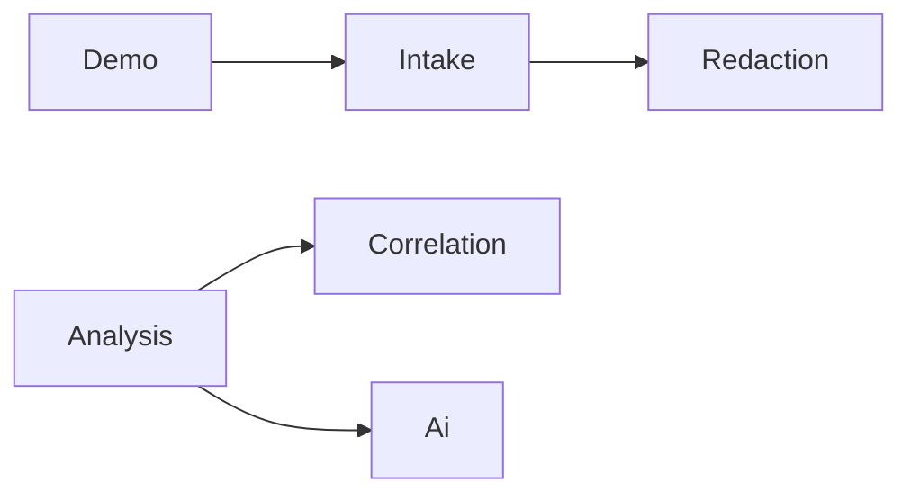

# Artifact 2 — Structure map (dependency analysis)

Source: `context/map/artifact-2-structure.md`

**Project:** SafeLog AI
**Tools:** dependency-cruiser v16 (TypeScript/E2E); Ruby constant-reference scan
**Date:** 2026-06-09

## Executive summary

SafeLog AI is a **Rails 8 monolith** with a thin HTTP layer and a **pipeline-shaped service domain** (`intake → redaction → correlation → analysis → ai`). There are **no circular dependencies** in the Ruby service graph. Security boundaries hold: **`redaction` and `ai` do not cross-import**.

## Top 3 exploration ideas

| # | Question | Tool | Why it matters |
|---|----------|------|----------------|
| 1 | Does the **security pipeline** stay acyclic (`redaction` never reaches `ai`)? | Ruby constant scan | Core guardrail — raw logs must not leak to AI |
| 2 | Where is **change amplification** highest? | Git territory + fan-out | Matches artifact-1 co-change corridor |
| 3 | Are **E2E tests** isolated from Rails imports? | dependency-cruiser | Browser-only boundary |

**Commands (verified):**

```bash
npm run depcruise:validate    # E2E boundary — PASS
npm run depcruise:graph       # context/map/diagrams/e2e-helper-hub.svg
```

## Service domain DAG (Ruby)



## Layer boundary table

| Boundary checked | Result | Evidence |
|------------------|--------|----------|
| Controller → services only (no inverse) | **PASS** | No controller refs in services |
| **Redaction ⊥ AI** | **PASS** | No `Ai::` / `Analysis::` in `app/services/redaction/` |
| **AI ⊥ Redaction/Intake** | **PASS** | No upstream domain imports in `app/services/ai/` |
| Analysis → AI (one direction) | **PASS** | `AnalyzeCase` → `Ai::ClientResolver` |
| E2E ⊥ Rails runtime | **PASS** | dependency-cruiser: 0 violations |

**Key orchestrator:** `Analysis::AnalyzeCase` — highest regression risk when changing analyze flow.
