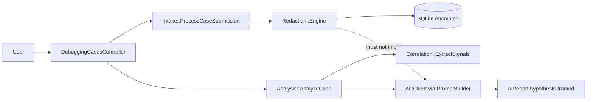

# SafeLog AI — Architecture Report

**Author:** Szymon Iwacz · **Stack:** Rails 8.1 monolith, SQLite, Devise, server-rendered ERB · **Live demo:** https://safelog-ai.fly.dev/

## 1. System overview

SafeLog AI helps engineers debug production issues from **multiple pasted log sources** without leaking secrets. The core insight: **deterministic redaction runs in memory before any persistence or AI reasoning**. Raw pasted content and raw→placeholder mappings exist only for the duration of the request.

**Runtime territory (M4L2):** product logic lives in `app/services/{intake,redaction,correlation,analysis,ai}/`; HTTP is thin; security oracles in `spec/requests/*_security*`. High git activity in `context/changes/` is **documentation workflow**, not deployable runtime — a common catalog illusion in this repo.

**Structure (M4L2):** Ruby services form a **DAG with no cycles**. Critical boundary: **`redaction ⊥ ai`** — verified by constant scan and dependency analysis (`artifact-2-structure.md`). E2E tests are black-box (`depcruise:validate` — 0 violations).

---

## 2. Intake flow and refactor direction (M4L3–M4L4)

**Primary flow researched:** `POST /debugging_cases` → `Intake::CaseSubmission` (validation) → `Intake::ProcessCaseSubmission` (transaction, redaction, persist) → show page with sanitized evidence and redaction summary.

**Findings (ast-grep verified):**

- Single runtime path from paste to persist; no parallel intake shortcuts in production.
- `redaction_findings.create!` has one call-site in `ProcessCaseSubmission` — implicit contract between `Redaction::Engine` output and persistence.
- Security oracles prove raw substrings never land in SQLite; AI prompts contain placeholders only.

**Ranked refactor opportunities (exploration only — M4L4):**

| Rank | ID | Opportunity | Why first |
|------|-----|-------------|-----------|
| 1 | TD-2 | Typed finding persist boundary | Lowest cost; closes implicit hash contract (**partially shipped** post-M4 as `RedactionFinding.build_from_engine_finding`) |
| 2 | IMPL-1 | Extract persist object from `ProcessCaseSubmission` | Composes with TD-2; enables rollback specs |
| 3 | TD-5 | CRLF normalization in `Redaction::Engine` | Low blast radius; paste correctness |

Hard rule during M4: **research and ranking only** — no mandatory production refactor for the Architect badge.

---

## 3. Domain model and planned hardening (M4L5)

**Ubiquitous language:** Debugging case, log source, redaction finding, correlation signal, hypothesis report. Subdomains: **Intake & Redaction** (core), **Correlation** (pure extraction), **Analysis & AI** (hypothesis generation behind adapter).

**Primary invariant — INV-G1:** No diagnostic content reaches persistence until it passes in-memory redaction; raw paste and mappings are never stored. Today enforced procedurally in `ProcessCaseSubmission` plus schema absence of `raw_*` columns and test oracles — **not** by a structural aggregate type.

**Planned improvements (plan-only, not certification blockers):**

1. **`SanitizedCaseDraft` aggregate guardian** — typed gate so AR models cannot accept unsanitized strings (`02-invariant-aggregate-refactor.md`).
2. **`HypothesisGenerator` port + ACL** — isolate OpenAI/provider details from domain; `Analysis::AnalyzeCase` depends on port, adapter wraps `Ai::Client` (`03-anti-corruption-layer.md`).

Both plans include phased F1–Fn roadmaps for post-MVP hygiene when product prioritizes structural debt over new features.

---

## 4. Quality, security, and team automation

| Layer | Mechanism |
|-------|-----------|
| **Tests** | 256 RSpec + 9 Capybara system + 19 Playwright E2E (4 capture + 15 functional); fake AI in CI; SimpleCov 100% line + branch |
| **CI** | `bin/ci` parity with GHA (RuboCop, Brakeman, bundler-audit, importmap, RSpec) |
| **Encryption** | Active Record Encryption on sanitized logs, reports, correlation payloads |
| **Champion (M5)** | TypeScript PR review agent + GHA AI review workflow; `@szymoniwacz/ai-toolkit` on GitHub Packages |

**Security narrative for reviewers:** transient raw intake → encrypted sanitized evidence only → scoped `current_user.debugging_cases.find` (404 cross-user) → `PromptBuilder` sanitized-only → hypothesis-framed output with uncertainty notes.

---

## 5. Evidence index

| M4 lesson | Artifact |
|-----------|----------|
| M4L2 Repo map | [`context/map/repo-map.md`](../map/repo-map.md) |
| M4L3 Flow research | [`10x-archive/case-submission-flow-analysis/research.md`](../../10x-archive/case-submission-flow-analysis/research.md) |
| M4L4 Refactor ranking | [`context/changes/refactor-opportunities/research.md`](../changes/refactor-opportunities/research.md) |
| M4L5 Domain | [`context/domain/`](../domain/) |
| Readiness audit | [`context/reviews/m4-architect-readiness-review.md`](../reviews/m4-architect-readiness-review.md) |
| Screenshots | [`screenshots/architect/`](screenshots/architect/) |

**Defensibility:** This report synthesizes artifacts produced across M4L2–L5 with ast-grep verification and live code inspection — not a single-prompt dump. Next structural slice when prioritized: follow F1–F5 in `02-invariant-aggregate-refactor.md` (INV-G1 aggregate guardian).

**PDF export:** [`architecture-report.pdf`](architecture-report.pdf) — regenerate with `npm run cert:architecture-pdf`.
