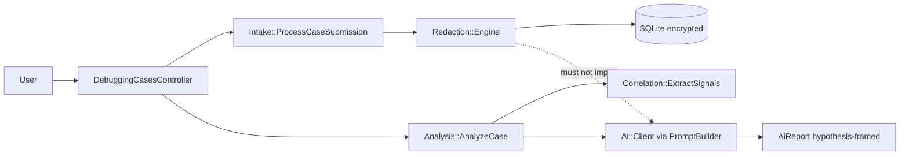

# SafeLog AI — Architecture Report

**Author:** Szymon Iwacz · **Stack:** Rails 8.1 monolith, SQLite, Devise, server-rendered ERB · **Demo:** https://safelog-ai.fly.dev/

**M4 synthesis (four lesson artifacts):** M4L2 repo map → M4L3 intake flow research → M4L4 ranked refactors → M4L5 domain distillation + invariant/ACL plans. This report is a concise two-pager built from those artifacts, not a single-prompt dump.

## 1. System shape (M4L2 — repo map)

SafeLog AI helps engineers debug production incidents from **multiple pasted log sources** without leaking secrets. **Deterministic redaction runs in memory before any persistence or AI call**; raw paste and placeholder mappings exist only for the request lifetime.

**Territory:** product logic in `app/services/{intake,redaction,correlation,analysis,ai}/`; thin controllers; security oracles in `spec/requests/*_security*`. High activity in `context/changes/` is **documentation workflow**, not runtime — a catalog illusion called out in [`repo-map.md`](../map/repo-map.md).

**Structure:** Ruby services form a **DAG** (no cycles). Verified boundary: **`redaction ⊥ ai`** — constant scan + dependency analysis ([`artifact-2-structure.md`](../map/artifact-2-structure.md)). E2E layer stays black-box (`depcruise:validate` — 0 violations).

---

## 2. Intake flow and refactor direction (M4L3–M4L4)

**Researched path:** `POST /debugging_cases` → `Intake::CaseSubmission` → `Intake::ProcessCaseSubmission` (transaction, redaction, persist) → show with sanitized evidence and redaction summary ([`case-submission-flow-analysis/research.md`](../../10x-archive/case-submission-flow-analysis/research.md), ast-grep verified).

**Key findings:**

- Single production path from paste to persist; no parallel intake shortcuts.
- `redaction_findings.create!` has one call-site — implicit contract between `Redaction::Engine` and persistence.
- Tests prove raw substrings never reach SQLite; AI prompts use placeholders only.

**Ranked refactor opportunities** ([`refactor-opportunities/research.md`](../changes/refactor-opportunities/research.md) — exploration only for M4):

| Rank | ID | Opportunity | Rationale |
|------|-----|-------------|-----------|
| 1 | TD-2 | Typed finding persist boundary | Closes implicit hash contract (partially shipped: `RedactionFinding.build_from_engine_finding`) |
| 2 | IMPL-1 | Extract persist object from `ProcessCaseSubmission` | Composes with TD-2; clearer rollback surface |
| 3 | TD-5 | CRLF normalization in `Redaction::Engine` | Low blast radius; paste correctness |

M4 scope was **research and ranking**, not mandatory production refactor for the Architect badge.

---

## 3. Domain model and planned hardening (M4L5)

**Ubiquitous language** ([`01-domain-distillation.md`](../domain/01-domain-distillation.md)): debugging case, log source, redaction finding, correlation signal, hypothesis report. Subdomains: **Intake & Redaction** (core), **Correlation** (pure extraction), **Analysis & AI** (hypothesis generation behind adapter).

**Invariant INV-G1:** no diagnostic content persists until in-memory redaction; raw paste and mappings never stored. Enforced today procedurally in `ProcessCaseSubmission`, schema absence of `raw_*` columns, and test oracles — **not** yet by a structural aggregate type.

**Plan-only hardening** (M4L5 deliverables — implementation optional post-MVP):

1. **`SanitizedCaseDraft` aggregate guardian** — typed gate before AR persistence ([`02-invariant-aggregate-refactor.md`](../domain/02-invariant-aggregate-refactor.md)).
2. **`HypothesisGenerator` port + ACL** — isolate provider details; domain depends on port, adapter wraps `Ai::Client` ([`03-anti-corruption-layer.md`](../domain/03-anti-corruption-layer.md)).

---

## 4. Quality and security (cross-cutting)

| Concern | Mechanism |
|---------|-----------|
| Tests | 280 RSpec + system/Playwright; fake AI in CI; security oracles on intake and analyze |
| CI | `bin/ci` ↔ GHA parity (RuboCop, Brakeman, bundler-audit, RSpec) |
| Encryption | Active Record Encryption on sanitized logs, reports, correlation payloads |
| Access | `current_user.debugging_cases.find` → 404 cross-user |

**Reviewer narrative:** transient raw intake → encrypted sanitized evidence → scoped ownership → sanitized-only prompts → hypothesis-framed reports with uncertainty notes.

**Source artifacts:** [`repo-map.md`](../map/repo-map.md) (M4L2) · [`case-submission-flow-analysis/research.md`](../../10x-archive/case-submission-flow-analysis/research.md) (M4L3) · [`refactor-opportunities/research.md`](../changes/refactor-opportunities/research.md) (M4L4) · [`context/domain/`](../domain/) (M4L5).
