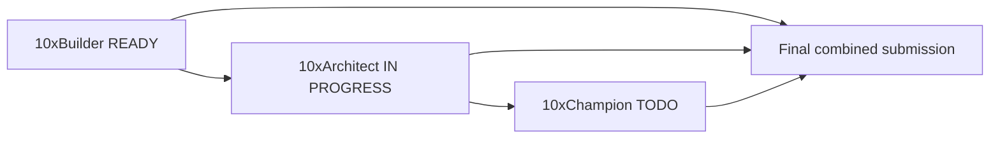

# 10xDevs Certification Readiness

> **Source of truth** for certification progress across all three badges.
> Update this file as evidence accrues. Do not invent Architect or Champion proof — use `TODO` / `NOT VERIFIED` until artifacts exist.

## Current Status

| Badge | Modules | Verdict | Summary |
|-------|---------|---------|---------|
| **10xBuilder** | M1–M3 | **READY** | MVP shipped; 135 RSpec + system + Playwright; Fly.io live at https://safelog-ai.fly.dev/; submission screenshots captured; local `bin/ci` + remote GHA green on `main` (2026-06-09). |
| **10xArchitect** | M4 | **IN PROGRESS** | M4L2-1–3 done — [`artifact-1-territory.md`](../map/artifact-1-territory.md), [`artifact-2-structure.md`](../map/artifact-2-structure.md), [`artifact-3-contributors.md`](../map/artifact-3-contributors.md); pending `repo-map.md`, Architect review. |
| **10xChampion** | M5 | **NOT STARTED** | No M5 prompts, automation workflows, or Champion review artifacts in repository. |

**Overall:** Builder ready to submit (including submission screenshots). Architect **in progress** (territory map done). Champion not started. Additional module work required before a **single combined submission** is ready.

---

## Roadmap: Builder → Architect → Champion



| Phase | Goal | Remaining before final submission |
|-------|------|-----------------------------------|
| **Builder** | Working MVP + context + tests + CI + deploy | None — ready to submit |
| **Architect** | Large-repo architecture literacy + evidence | Map artifacts 1–3 done; remaining: `repo-map.md` synthesis, Architect review |
| **Champion** | AI-assisted team workflow + automation | M5 exercises; CI/CD AI integration; automation evidence — **none in repo yet** |
| **Final package** | One submission, three badges | All sections below populated; demo script; screenshots |

---

## 10xBuilder

**Verdict: READY** (evidence: `context/reviews/m1-m3-builder-readiness-review.md`, `context/reviews/m1-m3-final-impl-review.md`)

### Checklist

| Item | Status | Evidence |
|------|--------|----------|
| Access control — Devise auth, gated routes | **PASS** | `AuthenticatedController`; `spec/requests/devise/*` |
| Access control — per-user isolation | **PASS** | `debugging_cases_authorization_spec.rb` |
| CRUD — create, read (index/show), archive | **PASS** | Request specs; no edit/destroy (intentional MVP) |
| Business logic — redaction, intake, correlation, analyze, export | **PASS** | `app/services/*`; service + request specs |
| Context documents — PRD, roadmap, test-plan, infra, deploy-plan | **PASS** | `context/foundation/*` |
| Tests — meaningful coverage | **PASS** | 135 RSpec + 7 system + 5 Playwright |
| CI/CD — local gate | **PASS** | `mise exec -- bin/ci` green 2026-06-09 |
| CI/CD — GitHub Actions config | **PASS** | `.github/workflows/ci.yml` parity with `config/ci.rb` |
| CI/CD — remote GHA on latest `main` | **PASS** | [Run 27228714749](https://github.com/szymoniwacz/safelog-ai/actions/runs/27228714749) on `3c92dcb` (2026-06-09); all four jobs green; 135 RSpec examples |
| Public URL | **PASS** | https://safelog-ai.fly.dev/ — live; deploy verified 2026-06-09 |
| Deployment evidence | **PASS** | `deploy-plan.md` § Deployment status + lessons learned; manual E2E verification (2026-06-09) |
| Demo flow — local | **PASS** | README demo section; **Load demo case** + manual intake; system + Playwright specs |
| Demo flow — public | **PASS** | Manual intake → analyze → archive on Fly (2026-06-09); **no load_demo** — see [Public demo vs local](#public-demo-vs-local-load_demo) |
| Submission screenshots | **PASS** | [`context/certification/screenshots/`](screenshots/) — 7 PNGs from live Fly (2026-06-09) |
| Security evidence | **PASS** | Security checklist in builder readiness review; log guard, encryption, AI boundary specs |

### Evidence

| Type | Location |
|------|----------|
| Readiness audit | [`context/reviews/m1-m3-builder-readiness-review.md`](../reviews/m1-m3-builder-readiness-review.md) |
| Impl-review (M1–M3) | [`context/reviews/m1-m3-final-impl-review.md`](../reviews/m1-m3-final-impl-review.md) |
| Historical impl-review | [`context/reviews/mvp-impl-review.md`](../reviews/mvp-impl-review.md) |
| PRD / roadmap / test-plan | [`context/foundation/`](../foundation/) |
| Deploy plan | [`context/deployment/deploy-plan.md`](../deployment/deploy-plan.md) |
| Submission screenshots | [`context/certification/screenshots/`](screenshots/) |
| Health check | [`context/foundation/health-check.md`](../foundation/health-check.md) |

### Commands (verified 2026-06-09)

```bash
mise exec -- bin/ci                              # 135 examples — PASS
mise exec -- bundle exec rspec spec/system       # 7 examples — PASS
mise exec -- bin/e2e                             # 5 Playwright tests — PASS
mise exec -- bin/dev                             # local demo
```

### CI evidence

- Local: `config/ci.rb` — setup, RuboCop, bundler-audit, importmap audit, Brakeman, RSpec.
- GHA: four jobs (`scan_ruby`, `scan_js`, `lint`, `test`); same tools.
- Remote: latest `main` verified 2026-06-09 — [run 27228714749](https://github.com/szymoniwacz/safelog-ai/actions/runs/27228714749) (`3c92dcb`; lint, scan_ruby, scan_js, test all success).
- Playwright: optional (`bin/e2e`); not in `bin/ci` (see `test-plan.md` §6.9).

---

## 10xArchitect

**Verdict: IN PROGRESS** — territory, structure, and contributors maps complete; `repo-map.md` synthesis and review pending.

Module 4 course prompts exist (repo map / large-context workflow):

| Prompt | Expected artifact | Status |
|--------|-------------------|--------|
| `.cursor/prompts/m4l2-1-territory-git-history.md` | `context/map/artifact-1-territory.md` | **PASS** |
| `.cursor/prompts/m4l2-2-structure-dependency-cruiser.md` | `context/map/artifact-2-structure.md` | **PASS** |
| `.cursor/prompts/m4l2-repo-map-synthesis.md` | `context/map/repo-map.md` | **TODO** |

### Checklist (Module 4 outcomes — placeholders)

| Item | Status | Notes |
|------|--------|-------|
| Architecture work — repo map / territory analysis | **PARTIAL** | All three map artifacts done; pending `repo-map.md` synthesis |
| Large-context workflows — map synthesis | **TODO** | No synthesis artifact yet |
| Refactoring exercises — documented change | **TODO** | Post-MVP refactors not opened as M4 changes |
| Modernization work — evidence | **TODO** | Roadmap parked items (Postgres, observability) not started |
| Architecture evidence — diagrams / boundaries | **PARTIAL** | Pre-M4: `architecture-alignment` archive; `shape-notes.md`; not M4 certification packet |
| Review artifacts — Architect impl/plan review | **TODO** | No `context/reviews/*architect*` artifact |

### Evidence

| Artifact | Status | Location |
|----------|--------|----------|
| Territory map (M4L2-1) | **PASS** | [`context/map/artifact-1-territory.md`](../map/artifact-1-territory.md) |
| Structure map (M4L2-2) | **PASS** | [`context/map/artifact-2-structure.md`](../map/artifact-2-structure.md) |
| Contributors map | **PASS** | [`context/map/artifact-3-contributors.md`](../map/artifact-3-contributors.md) |
| Repo map synthesis | **TODO** | `context/map/repo-map.md` |
| Architect review | **TODO** | `context/reviews/*architect*` |

---

## 10xChampion

**Verdict: NOT STARTED** — no Module 5 prompts or Champion artifacts in repository.

### Checklist (Module 5 outcomes — placeholders)

| Item | Status | Notes |
|------|--------|-------|
| AI-assisted team workflow | **TODO** | No documented team/agent workflow beyond `AGENTS.md` |
| CI/CD AI integration | **TODO** | No AI in GHA; no Cursor automation in CI |
| Automation workflows — hooks / bots | **PARTIAL** | `.cursor/hooks.json` exists; not Champion certification evidence |
| Quality gates — extended automation | **TODO** | Playwright optional; no post-merge deploy bot |
| Champion exercises | **TODO** | No M5 prompt files in `.cursor/prompts/` |
| Review artifacts — Champion review | **TODO** | No Champion review document |

### Evidence (when complete)

- Documented automation (workflows, hooks, SDK scripts if used)
- CI integration proof (runs, configs, screenshots)
- Champion review under `context/reviews/`

---

## Final Submission Package

Single packet for **Builder + Architect + Champion** when all badges are ready.

| Artifact | Builder | Architect | Champion |
|----------|---------|-----------|----------|
| Project summary | README + PRD | TODO — architecture narrative from repo map | TODO |
| Demo script | See [Demo flow](#demo-flow) | TODO | TODO |
| Screenshots | [`context/certification/screenshots/`](screenshots/) (7 PNGs, Fly 2026-06-09) | TODO | TODO |
| Deployment URL | https://safelog-ai.fly.dev/ | Same URL + architecture notes | Same + automation proof |
| Review documents | `m1-m3-*` reviews | TODO | TODO |
| CI evidence | `bin/ci` + GHA config | TODO — include map/structure gates if added | TODO — AI/automation CI |
| Certification notes | This file | Update Architect section | Update Champion section |

### Demo flow (Builder — verified locally and on Fly)

**For reviewers opening https://safelog-ai.fly.dev/:** see [Public demo vs local `load_demo`](#public-demo-vs-local-load_demo) below — the Fly URL does **not** offer **Load demo case**.

1. Register or sign in at `/` (local or https://safelog-ai.fly.dev/).
2. **New case** with multiple pasted sources (fake secrets). On Fly, use manual intake — **Load demo case** is dev/test only.
3. Confirm placeholders on show — raw paste not visible; **Redaction summary** visible.
4. **Analyze case** → hypothesis report + correlation signals.
5. **Download** Markdown report.
6. **Archive** → **Archived** filter on case index.

Security narrative: transient raw intake; encrypted `sanitized_content`; scoped `find` → 404; FakeClient in CI.

### Public demo vs local `load_demo`

Reviewers and course staff often compare the README demo (which mentions **Load demo case**) with the public Fly URL. They are **not the same entry path**; everything after case creation is the same pipeline.

| | **Local** (`mise exec -- bin/dev`) | **Public Fly** (`https://safelog-ai.fly.dev/`) |
|---|-----------------------------------|------------------------------------------------|
| **Environment** | `development` | `production` |
| **Load demo case** | **Yes** — dashboard button; one-click checkout-timeout fixture (`Demo::LoadCase`) | **No** — button hidden; `POST /debugging_cases/load_demo` returns **404** (by design) |
| **How to start a case** | **Load demo case** *or* **New case** + manual paste | **New case** only — paste ≥2 log sources (Rails, CloudWatch, browser console, etc.) |
| **Redaction / analyze / export / archive** | Same services and UI | Same services and UI |
| **AI output** | Fake client if `OPENAI_API_KEY` unset (notice on case page) | Same |
| **Submission screenshots** | N/A | Captured via manual intake on Fly — see [`screenshots/04-new-case-intake.png`](screenshots/04-new-case-intake.png) |

**Why production has no load_demo:** `Demo::LoadCase.available?` is true only in development and test (`app/services/demo/load_case.rb`). Production keeps the demo surface minimal and avoids a dev-only shortcut on a public URL.

**Reviewer checklist (Fly, after `fly deploy`):**

1. Confirm app is up: `curl -sf https://safelog-ai.fly.dev/up`
2. Register a new account (or sign in) — screenshots [`01-sign-in.png`](screenshots/01-sign-in.png), [`02-sign-up.png`](screenshots/02-sign-up.png)
3. **New case** → paste multiple sources with fake secrets (e.g. email, token, shared `request_id`)
4. Verify show page: placeholders only, **Redaction summary** present — [`05-case-redaction-summary.png`](screenshots/05-case-redaction-summary.png)
5. **Analyze case** → hypothesis report — [`06-hypothesis-report.png`](screenshots/06-hypothesis-report.png)
6. Optional: download report, archive, **Archived** tab — [`07-archived-cases.png`](screenshots/07-archived-cases.png)

Do **not** expect a **Load demo case** button on Fly; that is not a deploy bug.

### Commands reference

```bash
# Setup
mise install && mise exec -- bundle install && mise exec -- bin/setup --skip-server

# Gates
mise exec -- bin/ci
mise exec -- bundle exec rspec spec/system
mise exec -- bin/e2e

# Demo
mise exec -- bin/dev

# Production health check
curl -sf https://safelog-ai.fly.dev/up

# Re-capture submission screenshots (Fly must be running)
PLAYWRIGHT_SKIP_WEBSERVER=1 PLAYWRIGHT_BASE_URL=https://safelog-ai.fly.dev \
  PLAYWRIGHT_CAPTURE_SCREENSHOTS=1 npx playwright test e2e/capture-submission-screenshots.spec.ts
```

---

## Known Gaps

### Builder

| Gap | Severity | Action |
|-----|----------|--------|
| Fake AI default without `OPENAI_API_KEY` | Accepted | Document in demo; optional Fly secret |

### Architect

| Gap | Action |
|-----|--------|
| M4 map sequence incomplete | Complete `repo-map.md` synthesis |
| No Architect review document | Run course Architect review workflow when M4 work ships |
| No post-MVP modernization change | Pick from roadmap Parked or course exercise |

### Champion

| Gap | Action |
|-----|--------|
| No M5 course artifacts in repo | Complete Module 5 exercises per course |
| No CI/CD AI or team automation evidence | Implement and document per M5 requirements |
| Playwright not in GHA | Optional Champion gate if course requires browser CI |

---

## Related documents (audit trail)

| File | Role |
|------|------|
| `context/reviews/m1-m3-builder-readiness-review.md` | Point-in-time Builder audit (2026-06-09) |
| `context/reviews/m1-m3-final-impl-review.md` | Six-dimension Builder impl-review |
| `context/reviews/builder-certification-submission-checklist.md` | **Superseded** — merged here; kept for link stability |

**Maintenance:** After each module milestone, update the badge section and [Current Status](#current-status). Archive point-in-time reviews under `context/reviews/`; do not fork multiple living checklists.
