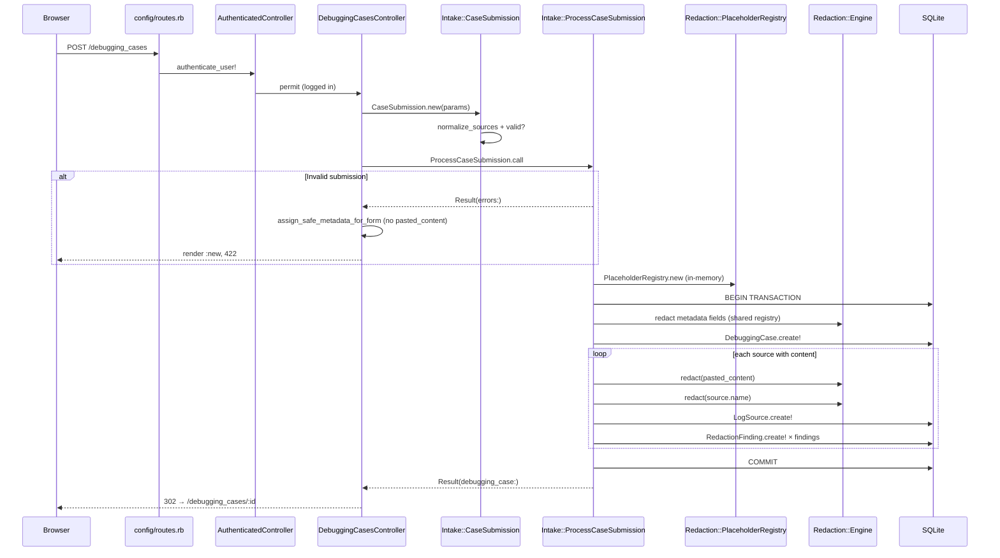

# Research: Case submission flow analysis

**Date**: 2026-06-10
**Researcher**: Composer (3 sub-agents: e2e trace, test gaps, blast radius)
**Git Commit**: `ac9793d4f33f588f2fdaae5fe81c7817cfe4ba1c`
**Branch**: main
**Repository**: safelog-ai
**Mapa terytorium**: [`context/map/repo-map.md`](../../map/repo-map.md)

## Research Question

Jak wygląda przepływ tworzenia debugging case od `POST /debugging_cases` przez `Intake::ProcessCaseSubmission` i `Redaction::Engine` do zapisu w SQLite? Jakie są granice transakcji, guardrails bezpieczeństwa, pokrycie testami i blast radius zmian — w kontekście stref ryzyka z repo-map?

**Zakres:** tylko intake + persist. **Poza zakresem:** `Analysis::AnalyzeCase`, AI, correlation.

## Summary

Przepływ jest cienkim HTTP slice (`DebuggingCasesController#create`) delegującym do jednego orchestratora domenowego (`Intake::ProcessCaseSubmission`), który jest **jedynym runtime callerem** `Redaction::Engine`. Surowy `pasted_content` istnieje wyłącznie w pamięci procesu na czas requestu; do DB trafiają wyłącznie sanityzowane pola (`sanitized_content`, metadata po redakcji, `redaction_findings` bez raw values). Wspólny `PlaceholderRegistry` deduplikuje placeholdery między metadata i wszystkimi źródłami.

Security oracles (`spec/requests/debugging_cases_security_spec.rb`) są silne dla głównej ścieżki. Największe luki: brak testów rollbacku transakcji przy awarii `log_sources.create!` / `redaction_findings.create!` w pętli, brak weryfikacji `sources: nil`, brak testu strong params (mass assignment).

Blast radius: **31 plików** runtime + testów (bez 3 migracji); w historii gita `process_case_submission.rb` ma 5 commitów — **3** z nich dotyka też `debugging_cases_security_spec.rb` w tym samym commicie.

---

## AST-grep verification (m4l3-2)

Weryfikacja twierdzeń strukturalnych z raportu (ast-grep 0.43.0, `-l ruby`, zakres `app/` / `spec/` o ile nie zaznaczono).

| # | Twierdzenie | Werdykt | Dowód |
|---|-------------|---------|-------|
| V-01 | `Redaction::Engine.redact` — jedyny runtime caller to `ProcessCaseSubmission` | **Potwierdzone** (`app/`) | `process_case_submission.rb:36`, `:61` — jedyne 2 call-site'y w `app/` |
| V-02 | `ProcessCaseSubmission.call` — 2 runtime callery | **Potwierdzone** | `debugging_cases_controller.rb:30`, `demo/load_case.rb:23` |
| V-03 | `CaseSubmission.new` — 2 runtime callery | **Potwierdzone** | `debugging_cases_controller.rb:29`, `demo/load_case.rb:22` |
| V-04 | `PlaceholderRegistry.new` — prod path tylko `process_case_submission.rb:23` | **Doprecyzowane** | Explicit prod: `:23`. Dodatkowo `engine.rb:5` — default arg `registry: PlaceholderRegistry.new` (używany gdy `redact` bez registry; w submission zawsze przekazywany registry). Spec: `engine_spec.rb:61`, `:71` |
| V-05 | `DebuggingCase.transaction` — jeden blok w aplikacji | **Potwierdzone** | `process_case_submission.rb:27–49` |
| V-06 | `redaction_findings.create!(finding)` — jeden call-site | **Potwierdzone** | `process_case_submission.rb:46` |
| V-07 | `redact_metadata` — 4× metadata case + 1× per source w pętli | **Potwierdzone** | `:29–32` (4×), `:40` (1× w pętli; N× per source) |
| V-08 | `Patterns::ALL` — 9 wzorców MVP | **Potwierdzone** | `patterns.rb:11–66` — 9 hashy w tablicy `ALL` |
| V-09 | `Patterns::ALL` używany tylko w `Engine` | **Potwierdzone** | `engine.rb:28` — jedyne odniesienie w `app/` |
| V-10 | Brak kolumn `raw_content` / `pasted_content` / `original_content` w schemacie | **Potwierdzone** | `db/schema.rb` — brak dopasowań |
| V-11 | `encrypts` na submission path — `customer_reference`, `sanitized_content` | **Potwierdzone** | `debugging_case.rb:5`, `log_source.rb:6` |
| V-12 | `process_case_submission_spec.rb` — 12 examples | **Potwierdzone** | 12 bloków `it` |
| V-13 | `debugging_cases_security_spec.rb` — 9 kontekstów POST→show | **Obalone → 10** | 10 bloków `it`; wszystkie używają POST create, część testuje też analyze prompts |
| V-14 | `assert_no_raw_substring_in_persisted_data` — 10+ użyć na submission path | **Doprecyzowane → 15** | 6× `debugging_cases_security_spec.rb` + 9× `process_case_submission_spec.rb` (poza zakresem submission: 2× `analyze_security_spec.rb`) |
| V-15 | `SOURCE_SLOT_COUNT = 3` | **Potwierdzone** | `debugging_cases_helper.rb:4`; użycie w `new.html.erb:42` |
| V-16 | Blast radius ~27 plików | **Doprecyzowane → 31** | Lista w § Blast radius (bez 3 migracji) |
| V-17 | Git co-change proc ↔ security spec: 8 commitów | **Obalone → 3** | `process_case_submission.rb` ma 5 commitów w historii; 3 commity dotykają oba pliki w jednym diffie |
| V-18 | Git co-change proc ↔ service spec: 7 commitów | **Obalone → 3** | Jak V-17 |
| V-19 | `e2e/helpers.ts` fan-in 4 | **Potwierdzone** (import) | 4 specy importują `./helpers`: `authentication`, `debugging-case-flow`, `capture-submission-screenshots`, `demo-case` |
| V-20 | `fillLogSourceSlot` fan-in 4 | **Obalone → 2** | Używany tylko w `debugging-case-flow.spec.ts`, `capture-submission-screenshots.spec.ts` (+ definicja w `helpers.ts`) |
| V-21 | `Engine.redact` w specach przez `described_class.redact` | **Doprecyzowane** | 6 wywołań w `engine_spec.rb:13,49,62,63,73,77` — nie matchują wzorca `Redaction::Engine.redact` |

---

## Feature overview

### Cel produktowy

Użytkownik wkleja logi w formularzu (`new.html.erb`), wysyła `POST /debugging_cases`. Backend redaguje w pamięci, zapisuje tylko sanityzowane dowody i metadane, po czym przekierowuje na `show`. Surowe logi **nigdy** nie trafiają do DB, HTML (po błędzie walidacji), logów Rails ani AI.

### Wejście HTTP

| Element | Lokalizacja | Opis |
|---------|-------------|------|
| Route | `config/routes.rb:13` | `resources :debugging_cases, only: [:index, :new, :create, :show]` |
| Auth | `app/controllers/authenticated_controller.rb:5` | `before_action :authenticate_user!` — gość dostaje 302 → sign_in |
| Strong params | `debugging_cases_controller.rb:91–99` | `title`, `description`, `customer_reference`, `environment`, `sources: [source_type, name, pasted_content]` |
| Filter params | `config/initializers/filter_parameter_logging.rb:6–12` | Wszystkie pola intake filtrowane w logach |

### Warstwa walidacji — `Intake::CaseSubmission`

Value object (`ActiveModel::Model`) normalizuje źródła w `initialize`:

- `normalize_sources` — strip whitespace, puste `pasted_content` zostają w tablicy ale są pomijane przez `sources_with_content`
- `validates :title, presence: true`
- `at_least_one_source_with_content` — min. jedno źródło z niepustym paste
- `source_types_are_valid` — enum z `LogSource.source_types`

Nieudana walidacja → `ProcessCaseSubmission` zwraca `Result(errors:)` **bez** alokacji registry, **bez** transakcji DB.

### Orchestracja — `Intake::ProcessCaseSubmission`

```27:49:app/services/intake/process_case_submission.rb
      DebuggingCase.transaction do
        debugging_case = @user.debugging_cases.create!(
          title: redact_metadata(@submission.title, registry),
          description: redact_metadata(@submission.description, registry),
          environment: redact_metadata(@submission.environment, registry),
          customer_reference: redact_metadata(@submission.customer_reference, registry)
        )

        @submission.sources_with_content.each_with_index do |source, index|
          result = Redaction::Engine.redact(source.pasted_content, registry: registry)

          log_source = debugging_case.log_sources.create!(
            source_type: source.source_type,
            name: redact_metadata(source.name, registry),
            position: index,
            sanitized_content: result.sanitized_text
          )

          result.findings.each do |finding|
            log_source.redaction_findings.create!(finding)
          end
        end
      end
```

Kluczowe właściwości:

1. **Jeden `PlaceholderRegistry` na request** — wspólny dla metadata i wszystkich źródeł (cross-source correlation).
2. **Jedna transakcja AR** — `DebuggingCase` + N×`LogSource` + M×`RedactionFinding` atomowo.
3. **`redact_metadata`** — blank → `nil`, bez wywołania engine; inaczej `Engine.redact(...).sanitized_text`.

### Redakcja — `Redaction::Engine`

- Split linii: `text.to_s.split(/\n/, -1)` (zachowuje puste linie)
- Per linia: `Patterns::ALL.reduce` + `gsub` — 9 wzorców (auth header, email, request_id, session_id, customer_id, ip, phone, card_last4, token)
- Output: `Redaction::Result` z `sanitized_text` i `findings` (hash: `finding_type`, `line_number`, `placeholder`, `risk_level` — **bez raw value**)
- Findings przekazywane bezpośrednio do `redaction_findings.create!(finding)` — kształt hash = kontrakt DB

### Persist — co trafia do SQLite

| Tabela | Kolumny (submission) | Szyfrowanie |
|--------|---------------------|-------------|
| `debugging_cases` | `title`, `description`, `environment`, `customer_reference`, `user_id` | `customer_reference` — AR Encryption |
| `log_sources` | `source_type`, `name`, `position`, `sanitized_content`, `debugging_case_id` | `sanitized_content` — AR Encryption |
| `redaction_findings` | `finding_type`, `line_number`, `placeholder`, `risk_level`, `log_source_id` | Brak (tylko placeholdery) |

Brak kolumn `raw_content`, `pasted_content`, `original_content` w schemacie.

### Odpowiedź HTTP

| Ścieżka | Status | Zachowanie |
|---------|--------|------------|
| Sukces | 302 | `redirect_to debugging_case_path(result.debugging_case)` |
| Walidacja | 422 | `render :new` + `assign_safe_metadata_for_form` — **tylko metadata**, bez `pasted_content` |
| Gość | 302 | Devise redirect przed `#create` |
| `RecordInvalid` w transakcji | 422 | Rescue → `Result(errors: error.record.errors)` |

### Drugi caller (poza HTTP)

`Demo::LoadCase` (`app/services/demo/load_case.rb`) — ten sam kontrakt `CaseSubmission` + `ProcessCaseSubmission.call`. Zmiana API intake łamie też demo loader.

### Diagram sekwencji (e2e trace)



### Powiązanie z repo-map

| Strefa repo-map §4 | Zastosowanie |
|--------------------|--------------|
| **#4 Intake + Redaction** | Core tego flow — „jedyny moment kontaktu z surowym paste" |
| **#1 Security oracles** | `debugging_cases_security_spec.rb` — 10 examples na POST create (część obejmuje też analyze) |
| **#3 HTTP slice** | Controller + `new.html.erb` + routes — najciasniejszy co-change |
| **#5 e2e/helpers.ts** | Import fan-in 4; `fillLogSourceSlot` fan-in 2 — locator contract z view |
| **#2 AnalyzeCase** | Pośrednio — `PromptBuilder` czyta persisted `sanitized_content` i metadata |

---

## E2e trace — kroki z file:line

| # | Krok | Plik:linia |
|---|------|------------|
| 1 | Route `POST /debugging_cases` | `config/routes.rb:13` |
| 2 | `authenticate_user!` | `authenticated_controller.rb:5` |
| 3 | Filter params w logach | `filter_parameter_logging.rb:6–12` |
| 4 | `CaseSubmission.new(case_submission_params)` | `debugging_cases_controller.rb:29` |
| 5 | Strong params permit | `debugging_cases_controller.rb:91–99` |
| 6 | `normalize_sources` + walidacje | `case_submission.rb:16–53` |
| 7 | Early return jeśli `!submission.valid?` | `process_case_submission.rb:21` |
| 8 | `PlaceholderRegistry.new` | `process_case_submission.rb:23` |
| 9 | `DebuggingCase.transaction` | `process_case_submission.rb:27` |
| 10 | `redact_metadata` × 4 pola case | `process_case_submission.rb:29–32, 58–62` |
| 11 | `DebuggingCase.create!` | `process_case_submission.rb:28–33` |
| 12 | Pętla `sources_with_content` | `process_case_submission.rb:35` |
| 13 | `Redaction::Engine.redact(pasted_content)` | `process_case_submission.rb:36`, `engine.rb:13–23` |
| 14 | `Patterns::ALL` per linia | `patterns.rb:11–66`, `engine.rb:27–45` |
| 15 | `LogSource.create!` | `process_case_submission.rb:38–43` |
| 16 | `RedactionFinding.create!` per finding | `process_case_submission.rb:45–47` |
| 17 | Commit transakcji | `process_case_submission.rb:27–49` |
| 18 | `Result` success / rescue `RecordInvalid` | `process_case_submission.rb:51–53, 64–70` |
| 19 | Redirect 302 lub render 422 | `debugging_cases_controller.rb:32–38` |
| 20 | `assign_safe_metadata_for_form` (bez paste) | `debugging_cases_controller.rb:103–109` |

### Transformacje danych

| Input | Transformacja | Persisted |
|-------|---------------|-----------|
| `pasted_content` | `Engine.redact` → encrypted `sanitized_content` | Tylko placeholder-y w treści |
| `title`, `description`, `environment` | `redact_metadata` | Plaintext, ale zredagowany |
| `customer_reference` | `redact_metadata` + `encrypts` | Ciphertext |
| `source.name` | `redact_metadata` | Plaintext, zredagowany |
| Finding | Hash bez raw | `redaction_findings` row |

---

## Pokrycie testami

### Macierz pokrycia

| Komponent | Spec(y) | Co testują |
|-----------|---------|------------|
| `DebuggingCasesController#create` | `debugging_cases_spec.rb`, `debugging_cases_security_spec.rb` | Redirect, 422, metadata preserved, paste NOT re-rendered, raw NOT in response |
| `Intake::CaseSubmission` | Przez `process_case_submission_spec.rb`, request specs | Title, sources, source_type — brak dedykowanego unit spec |
| `ProcessCaseSubmission` | `process_case_submission_spec.rb` (12 ex.) | Multi-source, cross-registry, all MVP patterns, metadata per field, rollback na `debugging_cases.create!` |
| `Redaction::Engine` | `engine_spec.rb` | Per-pattern, no raw in findings, shared registry |
| `PlaceholderRegistry` | `placeholder_registry_spec.rb` | Increment, reuse, cross-type |
| Encryption | `encryption_at_rest_spec.rb` | Raw SQL: `customer_reference`, `sanitized_content` = ciphertext |
| System | `debugging_case_flow_spec.rb`, `debugging_case_validation_spec.rb` | Capybara happy + validation path |
| E2E | `debugging-case-flow.spec.ts`, `capture-submission-screenshots.spec.ts` | Playwright happy path only |
| Security oracle | `security_persistence_helpers.rb` | `assert_no_raw_substring_in_persisted_data` — 15 wywołań na submission path (6 request + 9 service) |

### Security oracles — werdykt

| Oracle | Pokrycie | Luka |
|--------|----------|------|
| Raw never in DB (AR layer) | **Silne** — wszystkie 3 tabele, wszystkie metadata fields | Brak raw-SQL audit dla plaintext columns (`title`, `description`, `environment`, `name`) |
| Raw never in HTTP body | **Silne** — POST success + 422 + show | Headers (`Location:`) nie sprawdzane |
| Raw never in test.log | **Dobre** — `assert_no_raw_substring_in_appended_test_log` | Tylko jedna kombinacja secretów; SQL bind logging wyłączone z scanu |
| Raw never to AI | N/A na submission path | Poprawnie scoped do analyze |

### Luki (wg severity)

| ID | Luka | Severity |
|----|------|----------|
| G-01 | Brak testu rollbacku gdy `log_sources.create!` fail w pętli | **HIGH** |
| G-02 | Brak testu rollbacku gdy `redaction_findings.create!` fail | **HIGH** |
| G-03 | `sources: nil` (brak klucza w POST) — ścieżka niezweryfikowana | **HIGH** |
| G-04 | Strong params — brak testu mass assignment (`user_id`, `archived_at`) | MEDIUM |
| G-05 | `Source` struct passthrough w `normalize_sources` — dead branch w testach | MEDIUM |
| G-06 | Wiele invalid source types w jednym submission | MEDIUM |
| G-07 | Windows `\r\n` line endings w `Engine` | MEDIUM |
| G-08 | Brak regression spec dla known gap (standalone `sk-xxx`) | MEDIUM |
| G-09 | `position` values (0, 1, …) nie assertowane explicite | MEDIUM |
| G-10 | Plaintext columns — brak baseline encryption audit | MEDIUM |
| G-11 | Wiele patternów na jednej linii — nie testowane w `Engine` | MEDIUM |
| G-12 | Brak `spec/models/redaction_finding_spec.rb` | LOW |
| G-13 | Empty/nil input do `Engine.redact` | LOW |
| G-14 | E2E: brak validation-failure path | LOW |
| G-15 | E2E: zawsze 3 sloty, brak single-source | LOW |

---

## Blast radius

### Pliki MUST-change-together (31, bez migracji)

**HTTP:** `routes.rb`, `debugging_cases_controller.rb`, `debugging_cases_helper.rb`, `new.html.erb`, `show.html.erb`, `_redaction_summary.html.erb`

**Services:** `case_submission.rb`, `process_case_submission.rb`, `engine.rb`, `placeholder_registry.rb`, `patterns.rb`, `result.rb`, `demo/load_case.rb`, `demo/case_fixture.rb`

**Models:** `debugging_case.rb`, `log_source.rb`, `redaction_finding.rb`

**Schema:** 3 migracje + `schema.rb`

**Config:** `filter_parameter_logging.rb`

**Specs:** `process_case_submission_spec.rb`, `debugging_cases_security_spec.rb`, `debugging_cases_spec.rb`, `engine_spec.rb`, `placeholder_registry_spec.rb`, `security_persistence_helpers.rb`, `encryption_at_rest_spec.rb`, 2× system specs

**E2E:** `debugging-case-flow.spec.ts`, `helpers.ts`, `capture-submission-screenshots.spec.ts`

### Static scan — callers

| Symbol | Runtime callers |
|--------|-----------------|
| `ProcessCaseSubmission.call` | `debugging_cases_controller.rb:30`, `demo/load_case.rb:23` (2× `app/`; +15 plików `spec/` jako setup factory) |
| `Redaction::Engine.redact` | **Tylko** `process_case_submission.rb:36, 61` w `app/` (spec: `described_class.redact` w `engine_spec.rb`) |
| `PlaceholderRegistry.new` | Explicit prod: `process_case_submission.rb:23`; implicit default: `engine.rb:5` (nieużywany gdy registry przekazany) |

### Git co-change (wzorce z historii)

| Para plików | Commits razem | Wzorzec |
|-------------|---------------|---------|
| `process_case_submission.rb` ↔ `debugging_cases_security_spec.rb` | **3** same-commit (z 5 commitów pliku) | Zmiana intake często ciągnie security oracle |
| `process_case_submission.rb` ↔ `process_case_submission_spec.rb` | **3** same-commit | TDD slice |
| `controller` ↔ `routes` | **6** shared w historii | HTTP vertical slice |
| `controller` ↔ `new.html.erb` | **2** shared w historii | Form + controller |
| `process_case_submission.rb` ↔ `prompt_builder.rb` | 1 (`8b5af8d`) | Downstream analyze |

> **Uwaga:** Wcześniejsze szacunki (8/7) były zawyżone — `process_case_submission.rb` istnieje w repo od ~5 commitów. Wspólna historia plików (niekoniecznie ten sam commit): proc ∩ security = 3, proc ∩ service_spec = 3.

Oryginalny slice S-02 (3 fazy): engine → intake service → controller+views+routes+filter+request spec.

### Szwy interfejsowe

| Seam | Kontrakt | Koszt zmiany |
|------|----------|--------------|
| HTTP params | `permit(...)` + form field names + `SOURCE_SLOT_COUNT=3` | +filter_param_logging, +E2E locators |
| `CaseSubmission` → `ProcessCaseSubmission` | ActiveModel validations, `Source` struct | +view, +demo fixture |
| `Engine#redact` → `create!(finding)` | Hash keys = DB columns | **Krytyczny** — mismatch = runtime error |
| Encrypted columns | `encrypts :customer_reference`, `encrypts :sanitized_content` | +encryption_at_rest_spec |

### Tabela blast radius per change type

| Typ zmiany | Min. plików | Co-change wysokiego ryzyka |
|------------|-------------|----------------------------|
| Nowe pole metadata | 7+ | security spec, `assign_safe_metadata_for_form`, `PromptBuilder` |
| Nowe pole per-source | 8+ | `e2e/helpers.ts`, `fillLogSourceSlot` |
| Nowy pattern redakcji | 2+ | `process_case_submission_spec`, security spec |
| Zmiana kształtu `findings` hash | 4 | **Krytyczny** — `create!(finding)` direct pass |
| Zmiana formatu `[TYPE_N]` | 4+ | Wszystkie security assertions, E2E |
| Zmiana `SOURCE_SLOT_COUNT` | 2+ | E2E slot numbers |

---

## Technical debt

### TD-1: Transakcja — testowana tylko na outer `create!`

Rollback jest testowany wyłącznie gdy `debugging_cases.create!` rzuca `RecordInvalid` (`process_case_submission_spec.rb`). Awaria w pętli (`log_sources` lub `redaction_findings`) — **niezweryfikowana** atomowość. Kod używa `DebuggingCase.transaction`, więc rollback powinien działać, ale brak oracle = ryzyko regresji przy zmianie walidacji modelu.

**Rekomendacja:** dodać 2 specy ze stubem `create!` na `log_sources` / `redaction_findings` — assert zero `DebuggingCase` po failure.

### TD-2: `findings` hash jako implicit DB contract

`log_source.redaction_findings.create!(finding)` przekazuje hash z engine bezpośrednio do AR. Brak warstwy mapowania/DTO. Każda zmiana kluczy w `Engine#redact_line` (linia 36–41) łamie persist bez migracji.

**Rekomendacja:** przy rozszerzaniu findings — explicit mapper lub `RedactionFinding.new(...)` z named args.

### TD-3: Brak unit spec dla `Intake::CaseSubmission`

Walidacja testowana wyłącznie przez integration (`ProcessCaseSubmission`) i request specs. Gałęzie jak `Source` passthrough, `sources: nil`, multiple invalid types — słabo pokryte.

**Rekomendacja:** `spec/services/intake/case_submission_spec.rb` — szybkie, bez DB.

### TD-4: Strong params bez testu

`case_submission_params` nigdy nie jest assertowany przeciwko mass assignment (`user_id`, `archived_at`). Wizualny review ≠ oracle.

**Rekomendacja:** jeden request spec z extra fields → assert nie zmieniają case.

### TD-5: `\r\n` i edge cases redakcji

`split(/\n/, -1)` zostawia `\r` na końcu linii z Windows paste. Brak testu = nieznane zachowanie `line_number` i pattern matching w real-world paste.

**Rekomendacja:** normalizacja `\r\n` → `\n` przed split lub test dokumentujący obecne zachowanie.

### TD-6: Known pattern gap bez regression spec

`Patterns::ALL` dokumentuje, że standalone `sk-xxx` bez `Authorization: Bearer` nie jest matchowany. Brak positive/negative spec = brak safety net przy refaktorze patterns.

### TD-7: Plaintext metadata columns

`title`, `description`, `environment`, `log_sources.name` — redagowane, ale nie szyfrowane. `encryption_at_rest_spec.rb` audytuje tylko encrypted columns. Threat model MVP akceptuje to (redacted plaintext), ale brak baseline testu utrudnia przyszłą decyzję o encryption.

### TD-8: E2E pokrywa tylko happy path

`debugging-case-flow.spec.ts` — signup → 3 sloty → submit → show. Brak: validation 422, single-source minimum, paste-not-rerendered w browserze. Fan-in `helpers.ts` (repo-map risk #5) oznacza, że zmiana locatorów w `new.html.erb` łamie cały E2E bez wczesnego sygnału z validation path.

### TD-9: Silent security invariant — `filter_parameter_logging`

Nowe pole intake dodane do formularza bez wpisu w `filter_parameter_logging.rb` → leak w production logs. Test oracle łapie to tylko w `log/test.log` w test env, nie w prod.

**Rekomendacja:** checklist w AGENTS.md / change template: nowe intake param → filter list.

### TD-10: `Demo::LoadCase` jako ukryty coupling

Drugi caller `ProcessCaseSubmission` — zmiana kontraktu `CaseSubmission` wymaga sync `demo/case_fixture.rb`. Nie widać w repo-map jako osobna strefa, ale jest w blast radius.

### Priorytetyzacja długu

| Priorytet | ID | Effort | Impact |
|-----------|-----|--------|--------|
| P0 | TD-1 (G-01, G-02) | Niski | Wysoki — integralność transakcji |
| P0 | G-03 (`sources: nil`) | Niski | Wysoki — attacker-controlled input |
| P1 | TD-4 (G-04) | Niski | Średni — mass assignment |
| P1 | TD-3 | Niski | Średni — szybsze feedback na walidację |
| P2 | TD-5, TD-6, TD-8 | Średni | Średni — real-world paste + E2E |
| P3 | TD-7, TD-9, TD-10 | Niski–średni | Niski–średni — dokumentacja / threat model |

---

## Code References

- `app/controllers/debugging_cases_controller.rb` — HTTP entry, strong params, safe re-render
- `app/services/intake/case_submission.rb` — value object, validation
- `app/services/intake/process_case_submission.rb` — orchestrator, transaction, redaction
- `app/services/redaction/engine.rb` — line-by-line redaction
- `app/services/redaction/patterns.rb` — 9 MVP patterns
- `app/services/redaction/placeholder_registry.rb` — in-memory only registry
- `app/models/debugging_case.rb`, `log_source.rb`, `redaction_finding.rb` — persistence
- `spec/requests/debugging_cases_security_spec.rb` — canonical security oracle
- `spec/support/security_persistence_helpers.rb` — DB scan helper
- `context/map/repo-map.md` — strefy ryzyka §4, coupling table §3

## Related Research

- `context/archive/2026-06-02-testing-environment-metadata-redaction/research.md` — environment redaction gap (zamknięty; obecny kod redaguje environment)
- `context/foundation/prd.md` — guardrails: redaction before persist, no raw columns
- `context/foundation/test-plan.md` — security oracle conventions

## Open Questions

1. Czy normalizować `\r\n` w `Engine` czy dokumentować obecne zachowanie jako accepted?
2. Czy plaintext metadata (`title`, `description`, `environment`) wymaga encryption w threat model post-MVP?
3. Czy dodać limit rozmiaru `pasted_content` (brak walidacji — nieznane zachowanie przy dużych blobach)?
