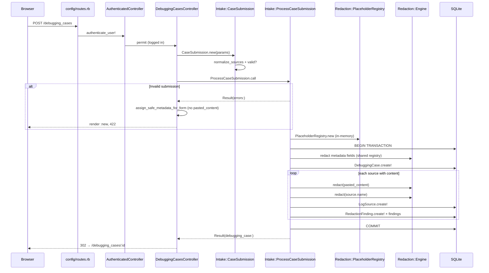

# Research: Case submission flow analysis

**Date**: 2026-06-10
**Researcher**: Composer (3 sub-agents: e2e trace, test gaps, blast radius)
**Git Commit**: `ac9793d4f33f588f2fdaae5fe81c7817cfe4ba1c`
**Branch**: main
**Repository**: safelog-ai
**Territory map**: [`context/map/repo-map.md`](../../map/repo-map.md)

> **Phase 7 update (2026-06-24):** Documented test gaps G-01–G-04, G-06–G-15 and related TD items were closed in Phase 7 (228 → 240 RSpec examples): transaction rollback specs (`persist_redacted_case_spec.rb`), `sources: nil` and multi invalid types (`case_submission_spec.rb`), mass-assignment request spec, CRLF normalization in `Engine`, standalone `sk-` regression (`patterns_spec.rb`), position/multi-pattern/nil-empty engine coverage, plaintext metadata baseline (`encryption_at_rest_spec.rb`), E2E validation + single-source paths. **Still open:** G-05 (Source struct passthrough), TD-9 (filter_parameter_logging checklist), TD-10 (demo coupling). TD-2 partially addressed via `RedactionFinding.build_from_engine_finding`.

## Research Question

How does the debugging case creation flow work from `POST /debugging_cases` through `Intake::ProcessCaseSubmission` and `Redaction::Engine` to SQLite persistence? What are the transaction boundaries, security guardrails, test coverage, and change blast radius — in the context of risk zones from repo-map?

**Scope:** intake + persist only. **Out of scope:** `Analysis::AnalyzeCase`, AI, correlation.

## Summary

The flow is a thin HTTP slice (`DebuggingCasesController#create`) delegating to a single domain orchestrator (`Intake::ProcessCaseSubmission`), which is the **only runtime caller** of `Redaction::Engine`. Raw `pasted_content` exists only in process memory for the duration of the request; only sanitized fields reach the DB (`sanitized_content`, post-redaction metadata, `redaction_findings` without raw values). A shared `PlaceholderRegistry` deduplicates placeholders across metadata and all sources.

Security oracles (`spec/requests/debugging_cases_security_spec.rb`) are strong for the main path. At research time (2026-06-10), the largest gaps were missing transaction rollback tests for `log_sources.create!` / `redaction_findings.create!` failures in the loop, unverified `sources: nil` handling, and no strong-params (mass assignment) test. **Most of these were closed in Phase 7 (2026-06-24)** — see note above.

Blast radius: **31 files** across runtime + tests (excluding 3 migrations); in git history `process_case_submission.rb` has 5 commits — **3** of them also touch `debugging_cases_security_spec.rb` in the same commit.

---

## AST-grep verification (m4l3-2)

Structural claims from the report verified (ast-grep 0.43.0, `-l ruby`, scope `app/` / `spec/` unless noted).

| # | Claim | Verdict | Evidence |
|---|-------------|---------|-------|
| V-01 | `Redaction::Engine.redact` — only runtime caller is `ProcessCaseSubmission` | **Confirmed** (`app/`) | `process_case_submission.rb:36`, `:61` — only 2 call sites in `app/` |
| V-02 | `ProcessCaseSubmission.call` — 2 runtime callers | **Confirmed** | `debugging_cases_controller.rb:30`, `demo/load_case.rb:23` |
| V-03 | `CaseSubmission.new` — 2 runtime callers | **Confirmed** | `debugging_cases_controller.rb:29`, `demo/load_case.rb:22` |
| V-04 | `PlaceholderRegistry.new` — prod path only `process_case_submission.rb:23` | **Refined** | Explicit prod: `:23`. Also `engine.rb:5` — default arg `registry: PlaceholderRegistry.new` (used when `redact` called without registry; in submission registry is always passed). Spec: `engine_spec.rb:61`, `:71` |
| V-05 | `DebuggingCase.transaction` — one block in application | **Confirmed** | `process_case_submission.rb:27–49` |
| V-06 | `redaction_findings.create!(finding)` — one call site | **Confirmed** | `process_case_submission.rb:46` |
| V-07 | `redact_metadata` — 4× case metadata + 1× per source in loop | **Confirmed** | `:29–32` (4×), `:40` (1× in loop; N× per source) |
| V-08 | `Patterns::ALL` — 9 MVP patterns | **Confirmed** | `patterns.rb:11–66` — 9 hashes in `ALL` array |
| V-09 | `Patterns::ALL` used only in `Engine` | **Confirmed** | `engine.rb:28` — only reference in `app/` |
| V-10 | No `raw_content` / `pasted_content` / `original_content` columns in schema | **Confirmed** | `db/schema.rb` — no matches |
| V-11 | `encrypts` on submission path — `customer_reference`, `sanitized_content` | **Confirmed** | `debugging_case.rb:5`, `log_source.rb:6` |
| V-12 | `process_case_submission_spec.rb` — 12 examples | **Confirmed** (at research time; **13** post–Phase 7) | 12 `it` blocks at research commit |
| V-13 | `debugging_cases_security_spec.rb` — 9 POST→show contexts | **Refuted → 10** | 10 `it` blocks; all use POST create, some also test analyze prompts |
| V-14 | `assert_no_raw_substring_in_persisted_data` — 10+ uses on submission path | **Refined → 15** | 6× `debugging_cases_security_spec.rb` + 9× `process_case_submission_spec.rb` (outside submission scope: 2× `analyze_security_spec.rb`) |
| V-15 | `SOURCE_SLOT_COUNT = 3` | **Confirmed** | `debugging_cases_helper.rb:4`; used in `new.html.erb:42` |
| V-16 | Blast radius ~27 files | **Refined → 31** | List in § Blast radius (excluding 3 migrations) |
| V-17 | Git co-change proc ↔ security spec: 8 commits | **Refuted → 3** | `process_case_submission.rb` has 5 commits in history; 3 commits touch both files in one diff |
| V-18 | Git co-change proc ↔ service spec: 7 commits | **Refuted → 3** | Same as V-17 |
| V-19 | `e2e/helpers.ts` fan-in 4 | **Confirmed** (import) | 4 specs import `./helpers`: `authentication`, `debugging-case-flow`, `capture-submission-screenshots`, `demo-case` |
| V-20 | `fillLogSourceSlot` fan-in 4 | **Refuted → 2** | Used only in `debugging-case-flow.spec.ts`, `capture-submission-screenshots.spec.ts` (+ definition in `helpers.ts`) |
| V-21 | `Engine.redact` in specs via `described_class.redact` | **Refined** | 6 calls in `engine_spec.rb:13,49,62,63,73,77` — do not match pattern `Redaction::Engine.redact` |

---

## Feature overview

### Product goal

The user pastes logs in the form (`new.html.erb`), submits `POST /debugging_cases`. The backend redacts in memory, persists only sanitized evidence and metadata, then redirects to `show`. Raw logs **never** reach the DB, HTML (after validation error), Rails logs, or AI.

### HTTP input

| Element | Location | Description |
|---------|-------------|------|
| Route | `config/routes.rb:13` | `resources :debugging_cases, only: [:index, :new, :create, :show]` |
| Auth | `app/controllers/authenticated_controller.rb:5` | `before_action :authenticate_user!` — guest gets 302 → sign_in |
| Strong params | `debugging_cases_controller.rb:91–99` | `title`, `description`, `customer_reference`, `environment`, `sources: [source_type, name, pasted_content]` |
| Filter params | `config/initializers/filter_parameter_logging.rb:6–12` | All intake fields filtered in logs |

### Validation layer — `Intake::CaseSubmission`

Value object (`ActiveModel::Model`) normalizes sources in `initialize`:

- `normalize_sources` — strip whitespace, empty `pasted_content` entries remain in array but are skipped by `sources_with_content`
- `validates :title, presence: true`
- `at_least_one_source_with_content` — at least one source with non-empty paste
- `source_types_are_valid` — enum from `LogSource.source_types`

Failed validation → `ProcessCaseSubmission` returns `Result(errors:)` **without** allocating registry, **without** DB transaction.

### Orchestration — `Intake::ProcessCaseSubmission`

```27:49:app/services/intake/process_case_submission.rb
      DebuggingCase.transaction do
        debugging_case = @user.debugging_cases.create!(
          title: redact_metadata(@submission.title, registry),
          description: redact_metadata(@submission.description, registry),
          environment: redact_metadata(@submission.environment, registry),
          customer_reference: redact_metadata(@submission.customer_reference, registry)
        )

        @submission.sources_with_content.each_with_index do |source, index|
          result = Redaction::Engine.redact(source.pasted_content, registry: registry)

          log_source = debugging_case.log_sources.create!(
            source_type: source.source_type,
            name: redact_metadata(source.name, registry),
            position: index,
            sanitized_content: result.sanitized_text
          )

          result.findings.each do |finding|
            log_source.redaction_findings.create!(finding)
          end
        end
      end
```

Key properties:

1. **One `PlaceholderRegistry` per request** — shared across metadata and all sources (cross-source correlation).
2. **One AR transaction** — `DebuggingCase` + N×`LogSource` + M×`RedactionFinding` atomically.
3. **`redact_metadata`** — blank → `nil`, no engine call; otherwise `Engine.redact(...).sanitized_text`.

### Redaction — `Redaction::Engine`

- Line split: `text.to_s.split(/\n/, -1)` (preserves empty lines)
- Per line: `Patterns::ALL.reduce` + `gsub` — 9 patterns (auth header, email, request_id, session_id, customer_id, ip, phone, card_last4, token)
- Output: `Redaction::Result` with `sanitized_text` and `findings` (hash: `finding_type`, `line_number`, `placeholder`, `risk_level` — **without raw value**)
- Findings passed directly to `redaction_findings.create!(finding)` — hash shape = DB contract

### Persist — what reaches SQLite

| Table | Columns (submission) | Encryption |
|--------|---------------------|-------------|
| `debugging_cases` | `title`, `description`, `environment`, `customer_reference`, `user_id` | `customer_reference` — AR Encryption |
| `log_sources` | `source_type`, `name`, `position`, `sanitized_content`, `debugging_case_id` | `sanitized_content` — AR Encryption |
| `redaction_findings` | `finding_type`, `line_number`, `placeholder`, `risk_level`, `log_source_id` | None (placeholders only) |

No `raw_content`, `pasted_content`, or `original_content` columns in schema.

### HTTP response

| Path | Status | Behavior |
|---------|--------|------------|
| Success | 302 | `redirect_to debugging_case_path(result.debugging_case)` |
| Validation | 422 | `render :new` + `assign_safe_metadata_for_form` — **metadata only**, no `pasted_content` |
| Guest | 302 | Devise redirect before `#create` |
| `RecordInvalid` in transaction | 422 | Rescue → `Result(errors: error.record.errors)` |

### Second caller (outside HTTP)

`Demo::LoadCase` (`app/services/demo/load_case.rb`) — same `CaseSubmission` + `ProcessCaseSubmission.call` contract. Intake API changes also break the demo loader.

### Sequence diagram (e2e trace)



### Link to repo-map

| Repo-map zone §4 | Application |
|--------------------|--------------|
| **#4 Intake + Redaction** | Core of this flow — "only point of contact with raw paste" |
| **#1 Security oracles** | `debugging_cases_security_spec.rb` — 10 examples on POST create (some also cover analyze) |
| **#3 HTTP slice** | Controller + `new.html.erb` + routes — tightest co-change |
| **#5 e2e/helpers.ts** | Import fan-in 4; `fillLogSourceSlot` fan-in 2 — locator contract with view |
| **#2 AnalyzeCase** | Indirect — `PromptBuilder` reads persisted `sanitized_content` and metadata |

---

## E2e trace — steps with file:line

| # | Step | File:line |
|---|------|------------|
| 1 | Route `POST /debugging_cases` | `config/routes.rb:13` |
| 2 | `authenticate_user!` | `authenticated_controller.rb:5` |
| 3 | Filter params in logs | `filter_parameter_logging.rb:6–12` |
| 4 | `CaseSubmission.new(case_submission_params)` | `debugging_cases_controller.rb:29` |
| 5 | Strong params permit | `debugging_cases_controller.rb:91–99` |
| 6 | `normalize_sources` + validations | `case_submission.rb:16–53` |
| 7 | Early return if `!submission.valid?` | `process_case_submission.rb:21` |
| 8 | `PlaceholderRegistry.new` | `process_case_submission.rb:23` |
| 9 | `DebuggingCase.transaction` | `process_case_submission.rb:27` |
| 10 | `redact_metadata` × 4 case fields | `process_case_submission.rb:29–32, 58–62` |
| 11 | `DebuggingCase.create!` | `process_case_submission.rb:28–33` |
| 12 | `sources_with_content` loop | `process_case_submission.rb:35` |
| 13 | `Redaction::Engine.redact(pasted_content)` | `process_case_submission.rb:36`, `engine.rb:13–23` |
| 14 | `Patterns::ALL` per line | `patterns.rb:11–66`, `engine.rb:27–45` |
| 15 | `LogSource.create!` | `process_case_submission.rb:38–43` |
| 16 | `RedactionFinding.create!` per finding | `process_case_submission.rb:45–47` |
| 17 | Transaction commit | `process_case_submission.rb:27–49` |
| 18 | `Result` success / rescue `RecordInvalid` | `process_case_submission.rb:51–53, 64–70` |
| 19 | Redirect 302 or render 422 | `debugging_cases_controller.rb:32–38` |
| 20 | `assign_safe_metadata_for_form` (no paste) | `debugging_cases_controller.rb:103–109` |

### Data transformations

| Input | Transformation | Persisted |
|-------|---------------|-----------|
| `pasted_content` | `Engine.redact` → encrypted `sanitized_content` | Placeholders only in content |
| `title`, `description`, `environment` | `redact_metadata` | Plaintext, but redacted |
| `customer_reference` | `redact_metadata` + `encrypts` | Ciphertext |
| `source.name` | `redact_metadata` | Plaintext, redacted |
| Finding | Hash without raw | `redaction_findings` row |

---

## Test coverage

### Coverage matrix

| Component | Spec(s) | What they test |
|-----------|---------|------------|
| `DebuggingCasesController#create` | `debugging_cases_spec.rb`, `debugging_cases_security_spec.rb` | Redirect, 422, metadata preserved, paste NOT re-rendered, raw NOT in response |
| `Intake::CaseSubmission` | Via `process_case_submission_spec.rb`, request specs; **+ dedicated `case_submission_spec.rb` (Phase 7)** | Title, sources, source_type |
| `ProcessCaseSubmission` | `process_case_submission_spec.rb` (13 ex.), `persist_redacted_case_spec.rb` (3 ex.) | Multi-source, cross-registry, all MVP patterns, metadata per field, rollback on outer + inner `create!` failures |
| `Redaction::Engine` | `engine_spec.rb`, `patterns_spec.rb` | Per-pattern, no raw in findings, shared registry, CRLF, multi-match, nil/empty |
| `PlaceholderRegistry` | `placeholder_registry_spec.rb` | Increment, reuse, cross-type |
| Encryption | `encryption_at_rest_spec.rb` | Raw SQL: encrypted columns = ciphertext; plaintext metadata baseline (Phase 7) |
| System | `debugging_case_flow_spec.rb`, `debugging_case_validation_spec.rb` | Capybara happy + validation path |
| E2E | `debugging-case-flow.spec.ts`, `capture-submission-screenshots.spec.ts`, `debugging-case-validation.spec.ts`, `single-source-minimum.spec.ts` | Playwright happy path, validation 422, single-source minimum |
| Security oracle | `security_persistence_helpers.rb` | `assert_no_raw_substring_in_persisted_data` — 15 calls on submission path (6 request + 9 service) |

### Security oracles — verdict

| Oracle | Coverage | Gap |
|--------|----------|------|
| Raw never in DB (AR layer) | **Strong** — all 3 tables, all metadata fields | No raw-SQL audit for plaintext columns (`title`, `description`, `environment`, `name`) — **baseline documented Phase 7** |
| Raw never in HTTP body | **Strong** — POST success + 422 + show | Headers (`Location:`) not checked |
| Raw never in test.log | **Good** — `assert_no_raw_substring_in_appended_test_log` | Only one secret combination; SQL bind logging excluded from scan |
| Raw never to AI | N/A on submission path | Correctly scoped to analyze |

### Gaps (by severity)

| ID | Gap | Severity | Status |
|----|------|----------|--------|
| G-01 | Missing rollback test when `log_sources.create!` fails in loop | **HIGH** | **Closed (Phase 7)** — `persist_redacted_case_spec.rb` |
| G-02 | Missing rollback test when `redaction_findings.create!` fails | **HIGH** | **Closed (Phase 7)** — `persist_redacted_case_spec.rb` |
| G-03 | `sources: nil` (missing key in POST) — path unverified | **HIGH** | **Closed (Phase 7)** — `case_submission_spec.rb` |
| G-04 | Strong params — no mass assignment test (`user_id`, `archived_at`) | MEDIUM | **Closed (Phase 7)** — `debugging_cases_spec.rb` |
| G-05 | `Source` struct passthrough in `normalize_sources` — dead branch in tests | MEDIUM | **Open** |
| G-06 | Multiple invalid source types in one submission | MEDIUM | **Closed (Phase 7)** — `case_submission_spec.rb` |
| G-07 | Windows `\r\n` line endings in `Engine` | MEDIUM | **Closed (Phase 7)** — CRLF normalization in `engine.rb` |
| G-08 | Missing regression spec for known gap (standalone `sk-xxx`) | MEDIUM | **Closed (Phase 7)** — `patterns_spec.rb` |
| G-09 | `position` values (0, 1, …) not asserted explicitly | MEDIUM | **Closed (Phase 7)** — `process_case_submission_spec.rb` |
| G-10 | Plaintext columns — no baseline encryption audit | MEDIUM | **Closed (Phase 7)** — `encryption_at_rest_spec.rb` |
| G-11 | Multiple patterns on one line — not tested in `Engine` | MEDIUM | **Closed (Phase 7)** — `engine_spec.rb` |
| G-12 | Missing `spec/models/redaction_finding_spec.rb` | LOW | **Closed (Phase 7)** |
| G-13 | Empty/nil input to `Engine.redact` | LOW | **Closed (Phase 7)** — `engine_spec.rb` |
| G-14 | E2E: no validation-failure path | LOW | **Closed (Phase 7)** — `debugging-case-validation.spec.ts` |
| G-15 | E2E: always 3 slots, no single-source | LOW | **Closed (Phase 7)** — `single-source-minimum.spec.ts` |

---

## Blast radius

### Files MUST-change-together (31, excluding migrations)

**HTTP:** `routes.rb`, `debugging_cases_controller.rb`, `debugging_cases_helper.rb`, `new.html.erb`, `show.html.erb`, `_redaction_summary.html.erb`

**Services:** `case_submission.rb`, `process_case_submission.rb`, `engine.rb`, `placeholder_registry.rb`, `patterns.rb`, `result.rb`, `demo/load_case.rb`, `demo/case_fixture.rb`

**Models:** `debugging_case.rb`, `log_source.rb`, `redaction_finding.rb`

**Schema:** 3 migrations + `schema.rb`

**Config:** `filter_parameter_logging.rb`

**Specs:** `process_case_submission_spec.rb`, `debugging_cases_security_spec.rb`, `debugging_cases_spec.rb`, `engine_spec.rb`, `placeholder_registry_spec.rb`, `security_persistence_helpers.rb`, `encryption_at_rest_spec.rb`, 2× system specs

**E2E:** `debugging-case-flow.spec.ts`, `helpers.ts`, `capture-submission-screenshots.spec.ts`

### Static scan — callers

| Symbol | Runtime callers |
|--------|-----------------|
| `ProcessCaseSubmission.call` | `debugging_cases_controller.rb:30`, `demo/load_case.rb:23` (2× `app/`; +15 files `spec/` as setup factory) |
| `Redaction::Engine.redact` | **Only** `process_case_submission.rb:36, 61` in `app/` (spec: `described_class.redact` in `engine_spec.rb`) |
| `PlaceholderRegistry.new` | Explicit prod: `process_case_submission.rb:23`; implicit default: `engine.rb:5` (unused when registry passed) |

### Git co-change (patterns from history)

| File pair | Commits together | Pattern |
|-------------|---------------|---------|
| `process_case_submission.rb` ↔ `debugging_cases_security_spec.rb` | **3** same-commit (of 5 file commits) | Intake change often pulls security oracle |
| `process_case_submission.rb` ↔ `process_case_submission_spec.rb` | **3** same-commit | TDD slice |
| `controller` ↔ `routes` | **6** shared in history | HTTP vertical slice |
| `controller` ↔ `new.html.erb` | **2** shared in history | Form + controller |
| `process_case_submission.rb` ↔ `prompt_builder.rb` | 1 (`8b5af8d`) | Downstream analyze |

> **Note:** Earlier estimates (8/7) were inflated — `process_case_submission.rb` has existed in the repo for ~5 commits. Shared file history (not necessarily same commit): proc ∩ security = 3, proc ∩ service_spec = 3.

Original slice S-02 (3 phases): engine → intake service → controller+views+routes+filter+request spec.

### Interface seams

| Seam | Contract | Change cost |
|------|----------|--------------|
| HTTP params | `permit(...)` + form field names + `SOURCE_SLOT_COUNT=3` | +filter_param_logging, +E2E locators |
| `CaseSubmission` → `ProcessCaseSubmission` | ActiveModel validations, `Source` struct | +view, +demo fixture |
| `Engine#redact` → `create!(finding)` | Hash keys = DB columns | **Critical** — mismatch = runtime error |
| Encrypted columns | `encrypts :customer_reference`, `encrypts :sanitized_content` | +encryption_at_rest_spec |

### Blast radius table by change type

| Change type | Min. files | High-risk co-change |
|------------|-------------|----------------------------|
| New metadata field | 7+ | security spec, `assign_safe_metadata_for_form`, `PromptBuilder` |
| New per-source field | 8+ | `e2e/helpers.ts`, `fillLogSourceSlot` |
| New redaction pattern | 2+ | `process_case_submission_spec`, security spec |
| Change `findings` hash shape | 4 | **Critical** — `create!(finding)` direct pass |
| Change `[TYPE_N]` format | 4+ | All security assertions, E2E |
| Change `SOURCE_SLOT_COUNT` | 2+ | E2E slot numbers |

---

## Technical debt

### TD-1: Transaction — tested only on outer `create!`

Rollback was tested only when `debugging_cases.create!` raises `RecordInvalid` (`process_case_submission_spec.rb`). Failure in the loop (`log_sources` or `redaction_findings`) — **unverified atomicity**. Code uses `DebuggingCase.transaction`, so rollback should work, but missing oracle = regression risk when model validations change.

**Recommendation:** add 2 specs stubbing `create!` on `log_sources` / `redaction_findings` — assert zero `DebuggingCase` after failure.

**Status (Phase 7):** **Closed** — `persist_redacted_case_spec.rb` (G-01, G-02).

### TD-2: `findings` hash as implicit DB contract

`log_source.redaction_findings.create!(finding)` passes hash from engine directly to AR. No mapping/DTO layer. Any key change in `Engine#redact_line` (lines 36–41) breaks persist without migration.

**Recommendation:** when extending findings — explicit mapper or `RedactionFinding.new(...)` with named args.

**Status (Phase 7):** **Partially closed** — `RedactionFinding.build_from_engine_finding` + `redaction_finding_spec.rb`; persist path uses mapper in `PersistRedactedCase`.

### TD-3: Missing unit spec for `Intake::CaseSubmission`

Validation tested only via integration (`ProcessCaseSubmission`) and request specs. Branches such as `Source` passthrough, `sources: nil`, multiple invalid types — weakly covered.

**Recommendation:** `spec/services/intake/case_submission_spec.rb` — fast, no DB.

**Status (Phase 7):** **Closed** — `case_submission_spec.rb` (7 examples); G-05 passthrough branch still open.

### TD-4: Strong params without test

`case_submission_params` never asserted against mass assignment (`user_id`, `archived_at`). Visual review ≠ oracle.

**Recommendation:** one request spec with extra fields → assert they do not change the case.

**Status (Phase 7):** **Closed** — `debugging_cases_spec.rb` mass-assignment example (G-04).

### TD-5: `\r\n` and redaction edge cases

`split(/\n/, -1)` leaves `\r` at end of lines from Windows paste. Missing test = unknown `line_number` and pattern matching behavior for real-world paste.

**Recommendation:** normalize `\r\n` → `\n` before split or add test documenting current behavior.

**Status (Phase 7):** **Closed** — CRLF normalization in `engine.rb` + characterization spec (G-07).

### TD-6: Known pattern gap without regression spec

`Patterns::ALL` documents that standalone `sk-xxx` without `Authorization: Bearer` is not matched. Missing positive/negative spec = no safety net during pattern refactors.

**Status (Phase 7):** **Closed** — `patterns_spec.rb` (G-08).

### TD-7: Plaintext metadata columns

`title`, `description`, `environment`, `log_sources.name` — redacted but not encrypted. `encryption_at_rest_spec.rb` audited only encrypted columns. MVP threat model accepts this (redacted plaintext), but missing baseline test makes future encryption decision harder.

**Status (Phase 7):** **Partially closed** — plaintext baseline assertions in `encryption_at_rest_spec.rb` (G-10).

### TD-8: E2E covers only happy path

`debugging-case-flow.spec.ts` — signup → 3 slots → submit → show. Missing: validation 422, single-source minimum, paste-not-rerendered in browser. Fan-in `helpers.ts` (repo-map risk #5) means locator changes in `new.html.erb` break entire E2E without early signal from validation path.

**Status (Phase 7):** **Partially closed** — `debugging-case-validation.spec.ts`, `single-source-minimum.spec.ts` (G-14, G-15); paste-not-rerendered still covered by request specs only.

### TD-9: Silent security invariant — `filter_parameter_logging`

New intake field added to form without entry in `filter_parameter_logging.rb` → leak in production logs. Test oracle catches this only in `log/test.log` in test env, not in prod.

**Recommendation:** checklist in AGENTS.md / change template: new intake param → filter list.

**Status:** **Open**.

### TD-10: `Demo::LoadCase` as hidden coupling

Second caller of `ProcessCaseSubmission` — `CaseSubmission` contract change requires sync with `demo/case_fixture.rb`. Not visible in repo-map as a separate zone, but in blast radius.

**Status:** **Open**.

### Debt prioritization

| Priority | ID | Effort | Impact | Status |
|-----------|-----|--------|--------|--------|
| P0 | TD-1 (G-01, G-02) | Low | High — transaction integrity | **Closed (Phase 7)** |
| P0 | G-03 (`sources: nil`) | Low | High — attacker-controlled input | **Closed (Phase 7)** |
| P1 | TD-4 (G-04) | Low | Medium — mass assignment | **Closed (Phase 7)** |
| P1 | TD-3 | Low | Medium — faster validation feedback | **Closed (Phase 7)** |
| P2 | TD-5, TD-6, TD-8 | Medium | Medium — real-world paste + E2E | **Mostly closed (Phase 7)** |
| P3 | TD-7, TD-9, TD-10 | Low–medium | Low–medium — documentation / threat model | TD-7 partial; TD-9/10 open |

---

## Code References

- `app/controllers/debugging_cases_controller.rb` — HTTP entry, strong params, safe re-render
- `app/services/intake/case_submission.rb` — value object, validation
- `app/services/intake/process_case_submission.rb` — orchestrator, transaction, redaction
- `app/services/redaction/engine.rb` — line-by-line redaction
- `app/services/redaction/patterns.rb` — 9 MVP patterns
- `app/services/redaction/placeholder_registry.rb` — in-memory only registry
- `app/models/debugging_case.rb`, `log_source.rb`, `redaction_finding.rb` — persistence
- `spec/requests/debugging_cases_security_spec.rb` — canonical security oracle
- `spec/support/security_persistence_helpers.rb` — DB scan helper
- `context/map/repo-map.md` — risk zones §4, coupling table §3

## Related Research

- `context/archive/2026-06-02-testing-environment-metadata-redaction/research.md` — environment redaction gap (closed; current code redacts environment)
- `context/foundation/prd.md` — guardrails: redaction before persist, no raw columns
- `context/foundation/test-plan.md` — security oracle conventions

## Open Questions

1. ~~Should `\r\n` be normalized in `Engine` or should current behavior be documented as accepted?~~ **Resolved (Phase 7):** normalize in `Engine`.
2. Do plaintext metadata columns (`title`, `description`, `environment`) require encryption in the post-MVP threat model?
3. Should a `pasted_content` size limit be added (no validation — unknown behavior with large blobs)?
