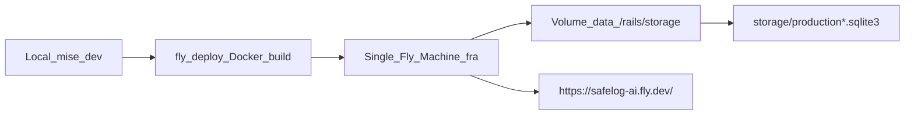
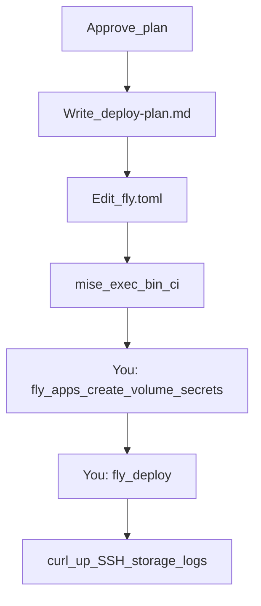

# SafeLog AI — Fly.io Deployment

## Deployment status

**Completed and verified:** 2026-06-09 (initial), **2026-06-22** (certification redeploy)
**Runtime policy:** App may be **intentionally suspended** when not needed for demo or review. The URL is not expected to respond while suspended; run `fly deploy --app safelog-ai` (or start machines) before a public demo.

| Item | Status |
|------|--------|
| Public URL | https://safelog-ai.fly.dev/ |
| App boot | Machine starts; Thruster + Puma serve on port 8080 |
| SQLite volume | `data` mounted at `/rails/storage`; `db:prepare` on boot |
| Health checks | `GET /up` returns 200 (Fly internal + public) when running |
| End-to-end | Sign-in, case flow, and deploy process verified manually (2026-06-09; redeploy 2026-06-22) |
| Current runtime | **Running** after 2026-06-22 redeploy for certification submission |

Deploy method: GitHub Actions auto deploy on push to `main`; manual `fly deploy --app safelog-ai` remains available as a fallback.

---

## Scope (original plan)

Deploy the **full MVP** (F-01–S-06) to Fly.io as a **public course demo** using:

- Docker image from [`Dockerfile`](../../Dockerfile)
- SQLite files on a Fly Volume mounted at `/rails/storage`
- Single Machine in **`fra`** (Frankfurt), `min_machines_running = 1`
- Devise auth, encrypted diagnostic schema, safe intake, analyze, export, archive
- **Manual** `fly deploy` remains available for emergency restores and maintenance; auto-deploy on `main` is configured in `.github/workflows/fly-deploy.yml`.

**Out of scope for this deploy:** staging app, Postgres, Redis, LiteFS, backups automation, custom domain/DNS.



---

## Preconditions (before any Fly commands)

| Check | Why |
|-------|-----|
| Local app boots | `mise exec -- bin/rails db:prepare` succeeds; SQLite under `storage/` |
| CI gates pass | `mise exec -- bin/ci` green (RuboCop, Brakeman, bundler-audit) |
| `config/master.key` exists locally | Required for `RAILS_MASTER_KEY` secret (gitignored; never commit) |
| Fly account + billing | No permanent free tier; expect ~$6–8/mo always-on |
| `flyctl` installed on host | **Not** via mise — host-only tool |

---

## Files to check or change

### Must change (before first deploy)

| File | Current state | Required change |
|------|---------------|-----------------|
| [`fly.toml`](../../fly.toml) | `primary_region = "fra"`, `min_machines_running = 1`, `HTTP_PORT = "8080"` | ✅ Applied |
| [`config/environments/production.rb`](../../config/environments/production.rb) | `config.hosts`, SSL, AR encryption env, `/up` host-auth exclusion | ✅ Applied |
| [`Dockerfile`](../../Dockerfile) | `ENV HTTP_PORT="8080"`, `EXPOSE 8080` | ✅ Applied |

### Verify (likely OK; fix only if deploy fails)

| File | What to verify |
|------|----------------|
| [`fly.toml`](../../fly.toml) | `[mounts] source = "data"` → `destination = "/rails/storage"` matches [`config/database.yml`](../../config/database.yml) paths (`storage/*.sqlite3` → `/rails/storage/*.sqlite3`) |
| [`fly.toml`](../../fly.toml) | `internal_port = 8080` + `[env] PORT` and `HTTP_PORT` = `"8080"` — Thruster listens on `HTTP_PORT`; Puma on `TARGET_PORT` (default 3000) behind Thruster |
| [`bin/docker-entrypoint`](../../bin/docker-entrypoint) | Runs `db:prepare` before server — args `./bin/thrust ./bin/rails server` still match `${@: -2:1}` / `${@: -1:1}` check |
| [`Dockerfile`](../../Dockerfile) | Ruby `3.4.9`, `sqlite3`/`libsqlite3-dev`, no mise; production bundle path is image-local (`/usr/local/bundle`) — separate from dev `vendor/bundle` |
| [`.dockerignore`](../../.dockerignore) | Excludes `config/master.key`, local `storage/*.sqlite3` (correct — DB created on volume at boot) |
| [`config/environments/production.rb`](../../config/environments/production.rb) | `safelog-ai.fly.dev` in hosts; SSL; AR encryption from Fly env |
| [`db/schema.rb`](../../db/schema.rb) | Full MVP schema — `db:prepare` on boot creates/migrates on volume |

### Optional follow-ups (not blocking shell deploy)

| File | Note |
|------|------|
| [`.dockerignore`](../../.dockerignore) | `/vendor/bundle` excluded | ✅ Applied |
| [`.github/workflows/fly-deploy.yml`](../../.github/workflows/fly-deploy.yml) | GitHub Actions auto-deploy on successful `main` branch pushes |

### Do not change for this deploy

- Local `.bundle/config` / `vendor/bundle` setup
- Dockerfile production `BUNDLE_PATH` (intentionally different from local dev)

---

## Required Fly.io setup (first-time)

**Use `fly apps create` + `fly deploy`, not `fly launch`** — `fly launch` can overwrite existing [`fly.toml`](../../fly.toml).

### 1. Install and authenticate

```bash
# macOS
brew install flyctl
# or: curl -L https://fly.io/install.sh | sh

fly auth login
fly orgs list   # note your org slug (often personal)
```

### 2. Create the app (manual — you must do this)

```bash
fly apps create safelog-ai --org personal
```

Replace `personal` with your org if different. Confirm name is free; if taken, pick e.g. `safelog-ai-demo` and update `app = "..."` in `fly.toml`.

### 3. Create persistent volume (same region as `primary_region`)

Volume name **must** match `[mounts] source`:

```bash
fly volumes create data --region fra --size 1 --app safelog-ai
```

- **1 GB** is enough for MVP demo SQLite + Active Storage
- Volume is **single-region**, **single-Machine** — no horizontal scale without LiteFS/Postgres

### 4. Set secrets

#### Required now (shell deploy)

```bash
fly secrets set RAILS_MASTER_KEY="$(cat config/master.key)" --app safelog-ai
```

Rails 8 derives `SECRET_KEY_BASE` from credentials via `RAILS_MASTER_KEY` — no separate `SECRET_KEY_BASE` secret needed if credentials are configured.

#### Required for GitHub Actions auto-deploy

Set the repository secret `FLY_API_TOKEN` in GitHub so `.github/workflows/fly-deploy.yml` can deploy on `main`.

#### Required before first MVP deploy (not just `/up`)

```bash
fly secrets set RAILS_MASTER_KEY="$(cat config/master.key)" --app safelog-ai

# Required — encrypted diagnostic fields fail without these:
fly secrets set \
  RAILS_ACTIVE_RECORD_ENCRYPTION_PRIMARY_KEY="..." \
  RAILS_ACTIVE_RECORD_ENCRYPTION_DETERMINISTIC_KEY="..." \
  RAILS_ACTIVE_RECORD_ENCRYPTION_KEY_DERIVATION_SALT="..." \
  --app safelog-ai
```

Generate encryption keys locally:

```bash
mise exec -- bin/rails db:encryption:init
```

#### Optional — real AI analyze (default: FakeClient + UI notice)

Without `OPENAI_API_KEY`, production uses `Ai::FakeClient` — analyze succeeds with deterministic sample hypotheses. The dashboard and case show page display a demo-AI callout so reviewers know output is not from OpenAI.

Set the secret only when you want live provider output:

```bash
fly secrets set OPENAI_API_KEY="..." --app safelog-ai
```

CI and `RAILS_ENV=test` always use `FakeClient` regardless of this secret.

#### Optional — Load demo case for certification reviewers (default off)

```bash
fly secrets set SAFELOG_ENABLE_DEMO_LOADER=true --app safelog-ai
```

Shows the dashboard **Load demo case** button on production only while this secret is set. Remove or unset for default public behavior.

#### Previously shell-only (now superseded)

```bash
# OPENAI_API_KEY and AR encryption were listed as "before product features"
# — both are required for a working MVP demo with persisted cases.
```

#### Not needed for SQLite MVP

- `DATABASE_URL` — file SQLite on volume only

---

## SQLite volume setup (how it works)

| Layer | Path |
|-------|------|
| Fly mount | `destination = "/rails/storage"` |
| Rails production DBs | `storage/production.sqlite3`, `production_cache.sqlite3`, `production_queue.sqlite3`, `production_cable.sqlite3` |
| Boot behavior | [`bin/docker-entrypoint`](../../bin/docker-entrypoint) → `db:prepare` creates/migrates DB files on the volume |

**Important Fly constraints:**

- `release_command` **cannot** access the volume — migrations must run at **container boot** (already handled by entrypoint)
- Ephemeral container FS is wiped on deploy; only `/rails/storage` persists
- No automated backups in MVP — accept demo data loss risk

---

## Exact command sequence (after config fixes)

Run from repo root. **Do not use `mise exec` for Fly commands** — flyctl is host-only.

```bash
# 0. fly.toml edits applied (fra region, min_machines_running = 1)

# 1. Pre-flight local
mise exec -- bin/ci

# 2. Fly one-time setup (manual)
fly auth login
fly apps create safelog-ai --org personal
fly volumes create data --region fra --size 1 --app safelog-ai
fly secrets set RAILS_MASTER_KEY="$(cat config/master.key)" --app safelog-ai

# 3. Deploy
fly deploy --app safelog-ai

# 4. Post-deploy verification (below)
```

Subsequent deploys:

```bash
fly deploy --app safelog-ai
fly logs --app safelog-ai
```

---

## Manual steps you must do (cannot be automated by agent alone)

1. **Create Fly.io account** and add a payment method (trial is limited; demo needs paid always-on if `min_machines_running = 1`)
2. **Install `flyctl`** on your Mac and run `fly auth login`
3. **Create app** — `fly apps create safelog-ai` (pick org; resolve name collision if needed)
4. **Create volume** in `fra` — must happen **before** first deploy that references `[mounts]`
5. **Copy `RAILS_MASTER_KEY`** from local `config/master.key` into Fly secrets (you hold the key; agent must never commit it)
6. **Run first `fly deploy`** and watch build logs for Docker/Ruby errors
7. **Open public URL** in browser — confirm demo is reachable
8. **Optional demo week:** accept ~$6–8/mo for `min_machines_running = 1`; scale to `0` later to save cost at the cost of cold starts

---

## Verification steps after deploy

### Automated / CLI

```bash
fly status --app safelog-ai
fly checks list --app safelog-ai          # if available on your flyctl version
fly logs --app safelog-ai --no-tail

curl -sf "https://safelog-ai.fly.dev/up" && echo "OK"
# Expect HTTP 200

fly ssh console --app safelog-ai -C "ls -la /rails/storage"
# Expect production*.sqlite3 files after first boot

fly ssh console --app safelog-ai -C "bin/rails runner 'puts ActiveRecord::Base.connection.adapter_name'"
# Expect: SQLite
```

### Browser / functional

- Visit `https://safelog-ai.fly.dev/` — sign up / sign in; dashboard loads (**no Load demo case** button in production)
- Create a case via **New debugging case** — paste multiple log sources manually (load_demo is dev/test only; see `context/certification/certification-readiness.md` § Public demo vs local load_demo)
- Analyze (demo AI notice if no `OPENAI_API_KEY`), export report, archive
- Visit `https://safelog-ai.fly.dev/up` — health check 200
- Fly dashboard: Machine **started**, volume **attached**, health check **passing**

### Failure triage quick reference

| Symptom | Likely fix |
|---------|------------|
| Region error / cannot deploy to `waw` | Change `primary_region` to `fra` |
| Volume mount failed | Create `data` volume in same region as app |
| Health check failing | Verify `HTTP_PORT=8080` in fly.toml and Dockerfile; Thruster defaults to :80 (permission denied as non-root) |
| 403 / blocked host on `/up` | Enable `config.host_authorization = { exclude: ->(request) { request.path == "/up" } }` — Fly probes with machine IP as Host |
| 403 / blocked host (browser) | Add `safelog-ai.fly.dev` to `config.hosts` in production.rb |
| DB missing after deploy | Confirm entrypoint runs `db:prepare`; SSH and inspect `/rails/storage` |
| Missing credentials | Set `RAILS_MASTER_KEY` secret; redeploy |

---

## Risks and MVP trade-offs (accepted)

| Risk | Impact | Mitigation for demo |
|------|--------|---------------------|
| Single Machine + SQLite | No HA; write contention if traffic grows | MVP/demo only; Postgres later |
| Volume tied to one Machine | Cannot `fly scale count 2` without LiteFS | Keep `count = 1` |
| No backup strategy | Demo data loss on corruption/bad migration | Manual `fly ssh` + file copy before risky migrations |
| `min_machines_running = 0` | Cold starts break live demos | Use `1` for demo period |
| Deprecated `waw` region | Deploy failure | Use `fra` |
| Public URL with Devise auth | Unauthenticated users see sign-in only; register open for course demo | Accept for course demo; restrict registration later if needed |
| AR Encryption keys required | App boot may fail or diagnostic writes error without Fly encryption secrets | Set all three `RAILS_ACTIVE_RECORD_ENCRYPTION_*` before demo |
| Manual deploy only | Drift between local and prod until CI deploy added | Document deploy commands; add GH Action later |
| Synchronous Analyze in request | Long OpenAI calls may hit Fly/proxy request timeouts | Keep FakeClient for demos; set reasonable `OPENAI_API_KEY` model; async Analyze is post-MVP (`roadmap.md` Parked) |
| Estimated cost ~$6–8/mo | Not zero-cost | Budget for course demo window |

---

## Deployment lessons learned (2026-06-09)

Issues encountered and resolved during first production deploy:

1. **`fly launch` is unsafe for this repo** — The scanner attempted to add `dockerfile-rails`, overwrite `config/database.yml` with `DATABASE_URL`, regenerate binstubs, and replace `fly.toml` with a generated app name. Existing `Dockerfile`, `fly.toml`, and binstubs were largely correct; use `fly apps create` + `fly deploy` instead.

2. **Volume required before deploy** — `[mounts] source = "data"` requires `fly volumes create data --region fra` in the same region as `primary_region` before the first deploy that references the mount.

3. **Thruster port binding (`HTTP_PORT`, not `PORT`)** — Thruster listens on `HTTP_PORT` (default **80**). The container runs as non-root (`USER 1000`), so binding :80 fails with `listen tcp :80: bind: permission denied`. Fix: set `HTTP_PORT=8080` in `fly.toml` `[env]` and `Dockerfile` `ENV`. `PORT=8080` alone only affects Puma when Rails runs without Thruster.

4. **Fly health check host authorization** — Internal Consul health checks hit `/up` with `Host: <machine-ip>:8080`, not `safelog-ai.fly.dev`. Rails blocked these with 403 until `config.host_authorization` excluded `/up`.

5. **Manual verification** — Post-deploy checks confirmed machine start, volume mount, `/up` 200, and browser access at https://safelog-ai.fly.dev/.

---

## Suggested execution order


