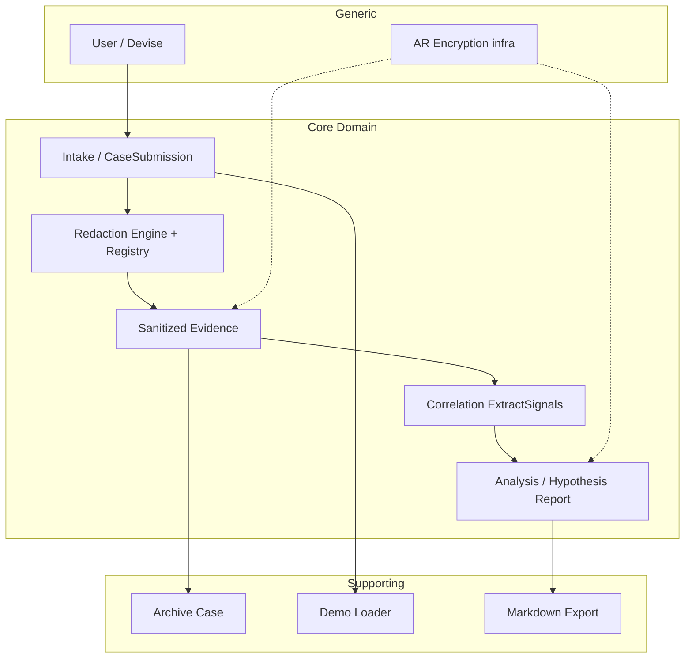

# Domain Distillation — SafeLog AI

Domain distillation artifact from foundation documents, README, AGENTS.md, and runtime code (`app/models/`, `app/services/`, `app/controllers/`). Line verification: working commit from 2026-06-10.

---

## STEP 0 — Project context

### Requirements sources

| Document | Role |
|----------|------|
| `context/foundation/prd.md` | Active PRD (v1, updated 2026-06-09) — vision, FR-001–FR-011, guardrails |
| `context/foundation/shape-notes.md` | Shape session — domain decisions, non-goals |
| `context/foundation/tech-stack.md` | MVP stack (Rails 8.1, SQLite, Devise, AR Encryption) |
| `README.md` | Operational flow description, security principles, service architecture |
| `AGENTS.md` | Hard agent rules (no raw persistence, encrypt diagnostic text) |
| `context/map/repo-map.md` | Repo map — where business logic lives |
| `context/changes/case-submission-flow-analysis/research.md` | Intake→redaction→persist analysis |
| `context/changes/refactor-opportunities/research.md` | Structural refactor candidates |

**Constraint:** no separate requirements document beyond foundation — based on PRD + shape-notes + code. Slice history in `context/archive/` used as supplementary material (e.g. S-02 intake plan).

### Stack and repo structure

| Layer | Location | Role |
|---------|-------------|------|
| HTTP / API | `app/controllers/` | Thin orchestration — params, auth, redirect/render |
| Business logic | `app/services/{intake,redaction,correlation,analysis,ai,demo}/` | Domain pipeline (PRD guardrails) |
| Persistence | `app/models/` + `db/schema.rb` | Active Record, encryption, associations |
| UI | `app/views/debugging_cases/` | Server-rendered ERB |
| Security oracles | `spec/requests/*_security_spec.rb`, `spec/services/` | Contract „raw never persists / never reaches AI" |

**Runtime flow (DAG):**

```
POST create → Intake::CaseSubmission (validation)
           → Intake::ProcessCaseSubmission (txn + Redaction::Engine)
           → show (sanitized evidence + redaction summary)

POST analyze → Analysis::AnalyzeCase
            → Correlation::ExtractSignals (pure)
            → Analysis::PromptBuilder → Ai::Client
            → Ai::ResponseValidator → persist AiReport
```

Security boundary: `Redaction::` does not import `Ai::` (repo-map, artifact-2).

---

## STEP 1 — Ubiquitous Language

### Core concepts (product)

| Concept | Definition | Source quote | In code |
|---------|-----------|----------------|----------|
| **Debugging case** | Container for a debugging incident: title, description, customer_reference, environment; aggregates log sources and analysis results | `context/foundation/prd.md:42` — „User creates a debugging case (title, short description, customer_reference, environment)" | `app/models/debugging_case.rb:2–24` |
| **Log source** | Single log source within a case (type, optional name, sanitized content) | `context/foundation/prd.md:43` — „multiple log sources in one request (source type, optional name, pasted raw text)" | `app/models/log_source.rb:1–16` |
| **Source type** | Source type enum: rails_log, aws_cloudwatch, new_relic, browser_console, customer_report, other | `context/foundation/prd.md:43` | `app/models/log_source.rb:8–15` |
| **Pasted raw text / pasted content** | Raw text pasted by the user — exists only transiently in the request | `context/foundation/prd.md:44` — „processes raw input in memory only" | `app/services/intake/case_submission.rb:8` (`pasted_content`); no column in DB (`db/schema.rb:44–53`) |
| **Redaction / sanitization** | Deterministic detection of sensitive patterns and replacement with placeholders in memory | `context/foundation/prd.md:139` — „deterministically redacts and pseudonymizes all log input in memory" | `app/services/redaction/engine.rb:13–23` |
| **Case-local placeholder** | Pseudonymized token (e.g. `[REQUEST_1]`) unique within one submission; same raw value → same placeholder cross-source | `context/foundation/prd.md:33` — „correlated by case-local placeholders (e.g. `[REQUEST_1]`)" | `app/services/redaction/placeholder_registry.rb:11–20` |
| **PlaceholderRegistry** | In-memory registry mapping (type, normalized_value) → placeholder; never persisted | `AGENTS.md:10` — „Raw-to-placeholder mappings must stay in memory only" | `app/services/redaction/placeholder_registry.rb:4–28` |
| **Sanitized content / sanitized evidence** | Log content after redaction — the only form of logs stored and shown in UI | `context/foundation/prd.md:44` — „persists sanitized content and redaction findings" | `app/models/log_source.rb:6` (`encrypts :sanitized_content`); `app/services/intake/process_case_submission.rb:42` |
| **Redaction finding** | Metadata for a single match: finding_type, line_number, placeholder, risk_level — without the original value | `context/foundation/prd.md:144` — „persist findings as type, line number, placeholder, risk level — never original values" | `app/models/redaction_finding.rb:1–5`; `app/services/redaction/engine.rb:36–41` |
| **Redaction / security summary** | Summary of finding counts by type and risk level | `context/foundation/prd.md:45` — „redaction/security summary (counts by type and risk level)" | `app/services/redaction/summary_counts.rb:13–18`; `app/controllers/debugging_cases_controller.rb:24` |
| **Correlation signal** | Extracted signal linking placeholders across sources (types, source_types, occurrence_count) | `context/foundation/prd.md:46` — „extracts correlation signals from sanitized content" | `app/services/correlation/extract_signals.rb:22–31`; `app/models/correlation_signal.rb:1–5` |
| **Analyze case** | User action: correlation signal extraction + AI report generation from sanitized evidence | `context/foundation/prd.md:46` | `app/controllers/debugging_cases_controller.rb:41–49`; `app/services/analysis/analyze_case.rb:22–44` |
| **AI debugging report / AI report** | Structured report (JSON + Markdown) with hypotheses, not certainty | `context/foundation/prd.md:47,60` — „hypothesis-framed AI report"; „hypotheses only — no false certainty" | `app/models/ai_report.rb:1–12`; `app/services/ai/report_schema.rb:4–15` |
| **Hypothesis-framed report** | Report describing likely causes as hypotheses with uncertainty_notes | `context/foundation/prd.md:134` — „describe likely issues and suspected causes as hypotheses" | `app/services/ai/response_validator.rb:38–40,73–82`; `app/services/analysis/prompt_builder.rb:30–32` |
| **Case submission** | One-time submission of case metadata + multiple sources in a single request | `context/foundation/prd.md:50` — „All log sources for a case must be added in the initial submission" | `app/services/intake/case_submission.rb:4–54`; `app/services/intake/process_case_submission.rb:4–71` |

### Supporting concepts

| Concept | Definition | Source quote | In code |
|---------|-----------|----------------|----------|
| **Archive (case)** | Hide case from default list; visible via Archived filter | `context/foundation/prd.md:48` | `app/models/debugging_case.rb:13–24`; `app/controllers/debugging_cases_controller.rb:67–72` |
| **Load demo case** | Predefined checkout-timeout scenario; dev/test only | `context/foundation/prd.md:54` | `app/services/demo/load_case.rb:7–24`; `app/controllers/debugging_cases_controller.rb:74–87` |
| **Markdown export** | Download report as `.md` | `context/foundation/prd.md:47` | `app/controllers/debugging_cases_controller.rb:52–65` |
| **Finding type** | Category of detected pattern (email, token, request_id, …) | `context/foundation/prd.md:144` | `app/services/redaction/patterns.rb:11–66`; `db/schema.rb:57` |
| **Risk level** | Finding risk level (high/medium) | `context/foundation/prd.md:144` | `app/services/redaction/patterns.rb:15,22,…`; `db/schema.rb:61` |
| **AI report status** | pending → processing → generated / failed | `context/foundation/prd.md:82` — „report status is `failed`" | `app/models/ai_report.rb:6–11`; `app/services/analysis/analyze_case.rb:23,34–42` |
| **Retry (AI validation)** | One retry on invalid structured response | `context/foundation/prd.md:46,82` | `app/services/analysis/analyze_case.rb:55–67` |
| **Fake AI client** | Deterministic stub in test/CI; no real API | `AGENTS.md:14` | `app/services/ai/client_resolver.rb:5–9`; `app/services/ai/fake_client.rb` |

### Generic concepts

| Concept | Definition | Source quote | In code |
|---------|-----------|----------------|----------|
| **User** | Email+password account (Devise minimal modules) | `context/foundation/prd.md:41,150` | `app/models/user.rb:1–5` |
| **Per-user ownership** | User sees only their own cases | `context/foundation/prd.md:61,151` | `app/controllers/debugging_cases_controller.rb:8,17,42` (`current_user.debugging_cases`) |
| **Encryption at rest** | Diagnostic text unreadable without AR Encryption keys | `context/foundation/prd.md:59,133` | `encrypts` in models — see STEP 4 (scope drift) |
| **Dashboard** | Home page after login | `README.md:51` | `config/routes.rb:25`; `app/controllers/dashboard_controller.rb` |

### PRD terms without a separate entity in code

| Concept | Quote | Status in code |
|---------|-------|-----------------|
| **Incident** | `context/foundation/prd.md:33` — „multi-source incident" | **MISSING** — metaphor; implementation = DebuggingCase |
| **DLP / exhaustive detection** | Non-goal implicit in `patterns.rb:5` — „heuristic regexes, not exhaustive DLP" | **MISSING** as concept — deliberate MVP gap |
| **Background job** | `context/foundation/prd.md:160` — non-goal MVP | **MISSING** — `app/jobs/application_job.rb` is scaffold |

---

## STEP 2 — Subdomain classification

| Area / concept | Classification | Rationale (product goal) |
|------------------|--------------|----------------------------|
| In-memory redaction + placeholder correlation | **Core** | Product insight core: „deterministic redaction must gate AI" (`shape-notes.md:14`, `prd.md:27–27`) |
| Sanitized evidence persistence | **Core** | Without this there is no safe audit trail after intake (`prd.md:44`) |
| Cross-source correlation signals | **Core** | Solves „correlating signals across sources is manual and slow" (`prd.md:25`) |
| Hypothesis-framed AI analysis | **Core** | Differentiator vs „paste into ChatGPT" — AI only on sanitized evidence (`roadmap.md:20`, `prd.md:60`) |
| Redaction findings + security summary | **Core** | Redaction transparency — FR-005, product trust |
| Case submission (multi-source, create-time only) | **Core** | Encapsulates MVP rule „all sources at initial submission" (`prd.md:50,159`) |
| Archive case | **Supporting** | User workflow organization; does not define product advantage (`prd.md:48`) |
| Demo case loader | **Supporting** | Course demo / README (`prd.md:54,126–128`) |
| Markdown export | **Supporting** | Report sharing (`FR-009`); does not change redaction logic |
| Authentication (Devise) | **Generic** | Standard scaffold; flat ownership sufficient (`prd.md:150–152`) |
| Active Record Encryption | **Generic** | Security infrastructure; NFR requirement, not domain logic |
| Health check `/up` | **Generic** | Fly.io operations (`config/routes.rb:7`) |
| Dashboard | **Generic** | Navigation; no incident logic |

---

## STEP 3 — Aggregate and invariant candidates

### 1. DebuggingCase (incident aggregate root)

| Invariant | Source quote | Status in code |
|-------------|----------------|-----------------|
| Case belongs to exactly one User | `context/foundation/prd.md:151` — „logged-in user can see and modify only their own debugging cases" | **Enforced** — `belongs_to :user` (`debugging_case.rb:3`); scope in controller (`debugging_cases_controller.rb:8,17`) |
| Title required | `context/foundation/prd.md:42` | **Enforced** — `validates :title, presence: true` (`debugging_case.rb:11`); submission validation (`case_submission.rb:12`) |
| All log sources added at creation (MVP) | `context/foundation/prd.md:50,159` | **Declared (no route)** — no add-source action; enforced by lack of API, not by model |
| Archived case has `archived_at` | `context/foundation/prd.md:48` | **Enforced** — `archive!` (`debugging_case.rb:20–23`); scopes `active`/`archived` (`:13–14`) |

**Internal entities (currently separate AR, without explicit aggregate root API):** LogSource, RedactionFinding (via LogSource), CorrelationSignal, AiReport.

### 2. SanitizedEvidence (LogSource + RedactionFinding)

| Invariant | Source quote | Status in code |
|-------------|----------------|-----------------|
| Only sanitized_content persisted; raw never | `context/foundation/prd.md:44,158` | **Enforced** — no raw columns (`schema.rb`); oracle specs |
| Findings without original values | `context/foundation/prd.md:144` | **Enforced** — hash keys without raw (`engine.rb:36–41`); DB columns (`schema.rb:55–63`) |
| Placeholders consistent cross-source in one submission | `context/foundation/prd.md:33,144` | **Enforced** — shared registry per submission (`process_case_submission.rb:23,36`) |
| Sanitized content encrypted at rest | `context/foundation/prd.md:59` | **Enforced** — `encrypts :sanitized_content` (`log_source.rb:6`) |
| At least one source with content | `context/foundation/prd.md:43` (implicit multi-source) | **Enforced** — `at_least_one_source_with_content` (`case_submission.rb:41–45`) |

### 3. RedactionSession (PlaceholderRegistry — value object, not DB entity)

| Invariant | Source quote | Status in code |
|-------------|----------------|-----------------|
| Registry in-memory only; never persisted/logged | `AGENTS.md:10`; `prd.md:58` | **Enforced** — class without AR (`placeholder_registry.rb:4–5`); no serialization |
| Redaction before any DB write | `context/foundation/prd.md:139` | **Enforced** — `Engine.redact` before `create!` (`process_case_submission.rb:36–46`) |
| Redaction before AI | `context/foundation/prd.md:139` | **Enforced** — `PromptBuilder` reads only persisted sanitized (`prompt_builder.rb:4–5,46–48`) |

### 4. AnalysisRun (CorrelationSignal + AiReport)

| Invariant | Source quote | Status in code |
|-------------|----------------|-----------------|
| AI receives only sanitized evidence | `context/foundation/prd.md:46,116` | **Enforced** — `PromptBuilder` + security specs analyze |
| Report must be hypothesis-framed with uncertainty | `context/foundation/prd.md:60,134` | **Enforced (validation layer)** — `ResponseValidator` (`response_validator.rb:38–40`); not in AiReport model |
| Invalid response → retry once → failed | `context/foundation/prd.md:46,82` | **Enforced** — `complete_with_retry` max 2 attempts (`analyze_case.rb:55–67`) |
| Analyze synchronous in session (MVP) | `context/foundation/prd.md:135` | **Enforced** — no jobs; POST analyze in controller |
| Correlation payload encrypted at rest | `context/foundation/prd.md:59` | **Enforced** — `encrypts :payload` (`correlation_signal.rb:4`) |

### 5. CaseSubmission (anti-corruption / intake boundary)

| Invariant | Source quote | Status in code |
|-------------|----------------|-----------------|
| Validation before registry allocation and transaction | Implied guardrail — do not redact invalid | **Enforced** — early return (`process_case_submission.rb:21`) |
| Raw pasted content not re-rendered after validation error | `AGENTS.md:7`; controller comment | **Enforced** — `assign_safe_metadata_for_form` skips pasted_content (`debugging_cases_controller.rb:101–108`) |
| Source type from allowed enum | `context/foundation/prd.md:43` | **Enforced** — `source_types_are_valid` (`case_submission.rb:47–52`) |

---

## STEP 4 — MODEL (documents) vs CODE drift

| # | Document says (X) | Code does (Y) | Evidence | Severity |
|---|-------------------|--------------|-------|----------|
| R-01 | „Diagnostic text remains unreadable at rest" — list: sanitized logs, customer_reference, correlation signals, AI report fields (`prd.md:59`) | `encrypts` only on `customer_reference`; **title, description, environment** in plaintext | `debugging_case.rb:5` (customer_reference only); columns `schema.rb:35–38` without encryption | Medium — metadata may contain sensitive data after redaction, but is not encrypted |
| R-02 | AGENTS: „Encrypt diagnostic text fields at rest" (`AGENTS.md:15`) | Same as R-01 — partial encryption | `grep encrypts` — none on title/description/environment | Medium |
| R-03 | Redaction findings persisted for all redacted content (`prd.md:144`) | Case/source metadata redacted via `redact_metadata`, which **discards findings** (only `sanitized_text`) | `process_case_submission.rb:58–61` vs persist loop `:45–47` | Low — log findings OK; metadata findings invisible in summary |
| R-04 | Consistent line numbers for pasted content | Engine splits only `\n`, does not normalize `\r\n` | `engine.rb:15` (`split(/\n/, -1)`) | Low–medium — wrong line_number for Windows paste (TD-5 in refactor research) |
| R-05 | Token/API key detection (PRD list: „API tokens") | Standalone `sk-…` without label does not match — documented gap | `patterns.rb:7–10` | Low — deliberate MVP gap |
| R-06 | No raw-to-placeholder maps in storage (`prd.md:58`) | No columns/map — OK, but no **explicit aggregate API** enforcing boundaries | Logic spread across `ProcessCaseSubmission` + AR models | Low (architecture) — no DDD aggregate root |
| R-07 | Findings as typed contract | Hash `{ finding_type, line_number, placeholder, risk_level }` as implicit DB contract | `engine.rb:36–41`; `process_case_submission.rb:46` | Low — runtime coupling (TD-2) |
| R-08 | Hypothesis framing as domain rule | Enforced only in `Ai::ResponseValidator`, not in `AiReport` model | `ai_report.rb:1–12` — no content validation; `response_validator.rb:27–42` | Low — correct for MVP, weak domain model |
| R-09 | Analyze case as step after intake | UI hides Archive for archived, but **Analyze always available**; no guard in `analyze` action | `show.html.erb:9–20`; `debugging_cases_controller.rb:41–43` — no `archived?` check | Low — UX/lifecycle rule inconsistency |
| R-10 | One consistent report per case (flow implies) | Each Analyze creates **new** AiReport; show takes `.last` | `analyze_case.rb:23`; `debugging_cases_controller.rb:22` | Low — multiple analyses allowed, undocumented |
| R-11 | „Adding sources after initial submission" — non-goal (`prd.md:159`) | No route/action — OK | `config/routes.rb:13` — create only, no update sources | **Aligned** (no drift) |
| R-12 | Raw logs never in application logs | Filter params + oracles | `filter_parameter_logging.rb`; `debugging_cases_security_spec.rb:70–78` | **Aligned** |

---

## STEP 5 — Refactor ranking (aggregates / invariants)

Score: **core value** (how close to core insight) × **weak enforcement risk** (how easy to break invariant today).

| Rank | Aggregate / seam candidate | Core value | Risk today | Priority |
|------|--------------------------|-------------------|-------------|-----------|
| **#1** | **RedactionSession + SanitizedEvidence** (`ProcessCaseSubmission` → explicit aggregate) | Highest — „redaction gates everything" | High — only moment of contact with raw paste; mixed responsibilities (IMPL-1); implicit findings contract (TD-2) | **Refactor #1** |
| **#2** | **DebuggingCase** as explicit aggregate root (ownership, archive, analyze lifecycle) | High — case boundaries and auth | Medium — ownership OK in HTTP, no domain API; analyze on archived (R-09) | #2 |
| **#3** | **AnalysisRun** (AiReport + CorrelationSignal as one unit) | High — hypothesis + sanitized-only AI | Medium — validation outside model (R-08); no txn like intake | #3 |
| **#4** | **Redaction::Engine** normalization (`\r\n`) | Medium — line_number/findings correctness | Low–medium — real-world paste edge case | #4 (TD-5, low cost) |
| **#5** | Encryption scope alignment (title/description/environment) | Medium — NFR compliance | Low runtime — data already redacted; product decision (TD-7) | #5 — requires product decision |

### Recommendation #1: RedactionSession / SanitizedEvidence boundary

**Why:** The only point where raw logs exist in the system (`case_submission.rb:35` → `engine.rb:13`). PRD guardrail „before any AI reasoning runs, redact in memory" (`prd.md:139`) is most exposed to regression here. `ProcessCaseSubmission` combines validation, registry lifecycle, transaction, metadata redaction, AR persist, and findings mapping (`process_case_submission.rb:20–62`) — lack of explicit aggregate boundary makes invariant enforcement and rollback testing hard (G-01, G-02 in case-submission research).

**Refactor direction (no code — from refactor-opportunities):**
1. Extract persist boundary for findings (TD-2)
2. Separate orchestration from `redact_metadata` + persist object (IMPL-1)
3. Optionally `\r\n` in Engine (TD-5)

**What NOT to refactor first:** Auth (Generic), demo loader (Supporting), encryption metadata columns (TD-7 — product decision).

---

## Context diagram (bounded contexts — logical)



---

## Artifact metadata

- **Method:** discovery (docs + code) → analysis (language, invariants) → classification (Core/Supporting/Generic)
- **Runtime files read:** models (6), intake/redaction/correlation/analysis/ai/demo services (key ones), debugging_cases controller, schema.rb, routes.rb
- **Not verified:** full spec suite line-by-line, ERB views beyond show fragment, historical migrations
