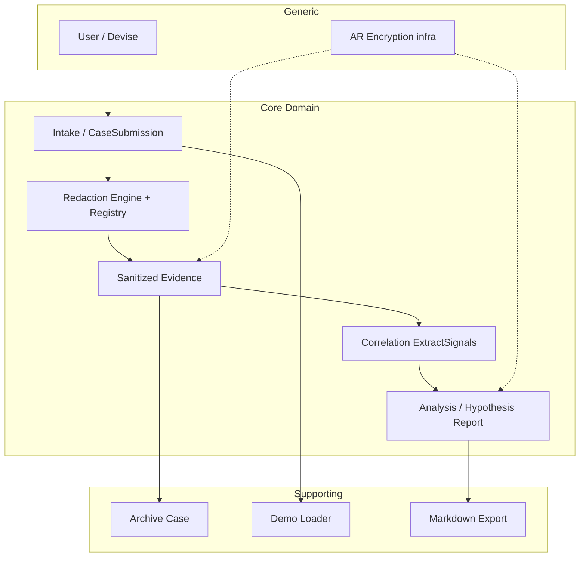

# Domain Distillation — SafeLog AI

Artefakt destylacji domeny z dokumentów foundation, README, AGENTS.md oraz kodu runtime (`app/models/`, `app/services/`, `app/controllers/`). Weryfikacja linii: commit roboczy z 2026-06-10.

---

## KROK 0 — Kontekst projektu

### Źródła wymagań

| Dokument | Rola |
|----------|------|
| `context/foundation/prd.md` | PRD aktywny (v1, updated 2026-06-09) — wizja, FR-001–FR-011, guardrails |
| `context/foundation/shape-notes.md` | Shape session — decyzje domenowe, non-goals |
| `context/foundation/tech-stack.md` | Stack MVP (Rails 8.1, SQLite, Devise, AR Encryption) |
| `README.md` | Operacyjny opis flow, security principles, architektura serwisów |
| `AGENTS.md` | Twarde reguły agentów (no raw persistence, encrypt diagnostic text) |
| `context/map/repo-map.md` | Mapa repo — gdzie żyje logika biznesowa |
| `context/changes/case-submission-flow-analysis/research.md` | Analiza intake→redaction→persist |
| `context/changes/refactor-opportunities/research.md` | Kandydaci refaktoru strukturalnego |

**Ograniczenie:** brak osobnego dokumentu wymagań poza foundation — oprarto się na PRD + shape-notes + kod. Historia slice'ów w `context/archive/` użyta jako materiał uzupełniający (np. S-02 intake plan).

### Stack i struktura repo

| Warstwa | Lokalizacja | Rola |
|---------|-------------|------|
| HTTP / API | `app/controllers/` | Cienka orchestracja — params, auth, redirect/render |
| Logika biznesowa | `app/services/{intake,redaction,correlation,analysis,ai,demo}/` | Pipeline domenowy (PRD guardrails) |
| Persystencja | `app/models/` + `db/schema.rb` | Active Record, encryption, asocjacje |
| UI | `app/views/debugging_cases/` | Server-rendered ERB |
| Oracles bezpieczeństwa | `spec/requests/*_security_spec.rb`, `spec/services/` | Kontrakt „raw never persists / never reaches AI” |

**Przepływ runtime (DAG):**

```
POST create → Intake::CaseSubmission (walidacja)
           → Intake::ProcessCaseSubmission (txn + Redaction::Engine)
           → show (sanitized evidence + redaction summary)

POST analyze → Analysis::AnalyzeCase
            → Correlation::ExtractSignals (pure)
            → Analysis::PromptBuilder → Ai::Client
            → Ai::ResponseValidator → persist AiReport
```

Granica bezpieczeństwa: `Redaction::` nie importuje `Ai::` (repo-map, artifact-2).

---

## KROK 1 — Ubiquitous Language

### Pojęcia rdzeniowe (produkt)

| Pojęcie | Definicja | Cytat źródłowy | W kodzie |
|---------|-----------|----------------|----------|
| **Debugging case** | Kontener incydentu debugowania: tytuł, opis, customer_reference, environment; agreguje źródła logów i wyniki analizy | `context/foundation/prd.md:42` — „User creates a debugging case (title, short description, customer_reference, environment)" | `app/models/debugging_case.rb:2–24` |
| **Log source** | Pojedyncze źródło logów w ramach case (typ, opcjonalna nazwa, sanityzowana treść) | `context/foundation/prd.md:43` — „multiple log sources in one request (source type, optional name, pasted raw text)" | `app/models/log_source.rb:1–16` |
| **Source type** | Enum typu źródła: rails_log, aws_cloudwatch, new_relic, browser_console, customer_report, other | `context/foundation/prd.md:43` | `app/models/log_source.rb:8–15` |
| **Pasted raw text / pasted content** | Surowy tekst wklejony przez użytkownika — istnieje tylko tranzyjnie w request | `context/foundation/prd.md:44` — „processes raw input in memory only" | `app/services/intake/case_submission.rb:8` (`pasted_content`); brak kolumny w DB (`db/schema.rb:44–53`) |
| **Redaction / sanitization** | Deterministyczne wykrycie wrażliwych wzorców i zamiana na placeholdery w pamięci | `context/foundation/prd.md:139` — „deterministically redacts and pseudonymizes all log input in memory" | `app/services/redaction/engine.rb:13–23` |
| **Case-local placeholder** | Pseudonimizowany token (np. `[REQUEST_1]`) unikalny w obrębie jednego submission; ten sam raw value → ten sam placeholder cross-source | `context/foundation/prd.md:33` — „correlated by case-local placeholders (e.g. `[REQUEST_1]`)" | `app/services/redaction/placeholder_registry.rb:11–20` |
| **PlaceholderRegistry** | Rejestr in-memory mapujący (type, normalized_value) → placeholder; nigdy nie persystowany | `AGENTS.md:10` — „Raw-to-placeholder mappings must stay in memory only" | `app/services/redaction/placeholder_registry.rb:4–28` |
| **Sanitized content / sanitized evidence** | Treść logu po redakcji — jedyna forma logów zapisywana i widoczna w UI | `context/foundation/prd.md:44` — „persists sanitized content and redaction findings" | `app/models/log_source.rb:6` (`encrypts :sanitized_content`); `app/services/intake/process_case_submission.rb:42` |
| **Redaction finding** | Metadane pojedynczego dopasowania: finding_type, line_number, placeholder, risk_level — bez oryginalnej wartości | `context/foundation/prd.md:144` — „persist findings as type, line number, placeholder, risk level — never original values" | `app/models/redaction_finding.rb:1–5`; `app/services/redaction/engine.rb:36–41` |
| **Redaction / security summary** | Podsumowanie liczby findings wg typu i poziomu ryzyka | `context/foundation/prd.md:45` — „redaction/security summary (counts by type and risk level)" | `app/services/redaction/summary_counts.rb:13–18`; `app/controllers/debugging_cases_controller.rb:24` |
| **Correlation signal** | Wyekstrahowany sygnał łączący placeholdery między źródłami (typy, source_types, occurrence_count) | `context/foundation/prd.md:46` — „extracts correlation signals from sanitized content" | `app/services/correlation/extract_signals.rb:22–31`; `app/models/correlation_signal.rb:1–5` |
| **Analyze case** | Akcja użytkownika: ekstrakcja sygnałów korelacji + generacja raportu AI z sanityzowanych dowodów | `context/foundation/prd.md:46` | `app/controllers/debugging_cases_controller.rb:41–49`; `app/services/analysis/analyze_case.rb:22–44` |
| **AI debugging report / AI report** | Strukturyzowany raport (JSON + Markdown) z hipotezami, nie pewnością | `context/foundation/prd.md:47,60` — „hypothesis-framed AI report"; „hypotheses only — no false certainty" | `app/models/ai_report.rb:1–12`; `app/services/ai/report_schema.rb:4–15` |
| **Hypothesis-framed report** | Raport opisujący prawdopodobne przyczyny jako hipotezy z uncertainty_notes | `context/foundation/prd.md:134` — „describe likely issues and suspected causes as hypotheses" | `app/services/ai/response_validator.rb:38–40,73–82`; `app/services/analysis/prompt_builder.rb:30–32` |
| **Case submission** | Jednorazowe złożenie metadanych case + wielu źródeł w jednym request | `context/foundation/prd.md:50` — „All log sources for a case must be added in the initial submission" | `app/services/intake/case_submission.rb:4–54`; `app/services/intake/process_case_submission.rb:4–71` |

### Pojęcia wspierające

| Pojęcie | Definicja | Cytat źródłowy | W kodzie |
|---------|-----------|----------------|----------|
| **Archive (case)** | Ukrycie case z domyślnej listy; widoczne przez filtr Archived | `context/foundation/prd.md:48` | `app/models/debugging_case.rb:13–24`; `app/controllers/debugging_cases_controller.rb:67–72` |
| **Load demo case** | Predefiniowany scenariusz checkout-timeout; tylko dev/test | `context/foundation/prd.md:54` | `app/services/demo/load_case.rb:7–24`; `app/controllers/debugging_cases_controller.rb:74–87` |
| **Markdown export** | Pobranie raportu jako `.md` | `context/foundation/prd.md:47` | `app/controllers/debugging_cases_controller.rb:52–65` |
| **Finding type** | Kategoria wykrytego wzorca (email, token, request_id, …) | `context/foundation/prd.md:144` | `app/services/redaction/patterns.rb:11–66`; `db/schema.rb:57` |
| **Risk level** | Poziom ryzyka finding (high/medium) | `context/foundation/prd.md:144` | `app/services/redaction/patterns.rb:15,22,…`; `db/schema.rb:61` |
| **AI report status** | pending → processing → generated / failed | `context/foundation/prd.md:82` — „report status is `failed`" | `app/models/ai_report.rb:6–11`; `app/services/analysis/analyze_case.rb:23,34–42` |
| **Retry (AI validation)** | Jedna ponowna próba przy invalid structured response | `context/foundation/prd.md:46,82` | `app/services/analysis/analyze_case.rb:55–67` |
| **Fake AI client** | Deterministyczny stub w test/CI; bez real API | `AGENTS.md:14` | `app/services/ai/client_resolver.rb:5–9`; `app/services/ai/fake_client.rb` |

### Pojęcia generyczne

| Pojęcie | Definicja | Cytat źródłowy | W kodzie |
|---------|-----------|----------------|----------|
| **User** | Konto email+hasło (Devise minimal modules) | `context/foundation/prd.md:41,150` | `app/models/user.rb:1–5` |
| **Per-user ownership** | Użytkownik widzi tylko własne cases | `context/foundation/prd.md:61,151` | `app/controllers/debugging_cases_controller.rb:8,17,42` (`current_user.debugging_cases`) |
| **Encryption at rest** | Diagnostic text nieczytelny bez kluczy AR Encryption | `context/foundation/prd.md:59,133` | `encrypts` w modelach — patrz KROK 4 (rozjazd zakresu) |
| **Dashboard** | Strona główna po zalogowaniu | `README.md:51` | `config/routes.rb:25`; `app/controllers/dashboard_controller.rb` |

### Terminy z PRD bez osobnej encji w kodzie

| Pojęcie | Cytat | Status w kodzie |
|---------|-------|-----------------|
| **Incident** | `context/foundation/prd.md:33` — „multi-source incident" | **BRAK** — metafora; implementacja = DebuggingCase |
| **DLP / exhaustive detection** | Non-goal implicit w `patterns.rb:5` — „heuristic regexes, not exhaustive DLP" | **BRAK** jako pojęcie — świadoma luka MVP |
| **Background job** | `context/foundation/prd.md:160` — non-goal MVP | **BRAK** — `app/jobs/application_job.rb` to scaffold |

---

## KROK 2 — Klasyfikacja subdomen

| Obszar / pojęcie | Klasyfikacja | Uzasadnienie (cel produktu) |
|------------------|--------------|----------------------------|
| In-memory redaction + placeholder correlation | **Core** | Rdzeń insightu produktu: „deterministic redaction must gate AI" (`shape-notes.md:14`, `prd.md:27–27`) |
| Sanitized evidence persistence | **Core** | Bez tego nie ma bezpiecznego audytu po intake (`prd.md:44`) |
| Cross-source correlation signals | **Core** | Rozwiązuje „correlating signals across sources is manual and slow" (`prd.md:25`) |
| Hypothesis-framed AI analysis | **Core** | Wyróżnik vs „paste into ChatGPT" — AI tylko na sanityzowanych dowodach (`roadmap.md:20`, `prd.md:60`) |
| Redaction findings + security summary | **Core** | Transparentność redakcji — FR-005, trust w produkt |
| Case submission (multi-source, create-time only) | **Core** | Enkapsuluje regułę MVP „all sources at initial submission" (`prd.md:50,159`) |
| Archive case | **Supporting** | Organizacja pracy użytkownika; nie definiuje przewagi produktu (`prd.md:48`) |
| Demo case loader | **Supporting** | Prezentacja kursowa / README (`prd.md:54,126–128`) |
| Markdown export | **Supporting** | Udostępnianie raportu (`FR-009`); nie zmienia logiki redakcji |
| Authentication (Devise) | **Generic** | Standardowy scaffold; flat ownership wystarczy (`prd.md:150–152`) |
| Active Record Encryption | **Generic** | Infrastruktura bezpieczeństwa; wymóg NFR, nie logika domenowa |
| Health check `/up` | **Generic** | Operacje Fly.io (`config/routes.rb:7`) |
| Dashboard | **Generic** | Nawigacja; brak logiki incydentu |

---

## KROK 3 — Kandydaci na agregaty i niezmienniki

### 1. DebuggingCase (korzeń agregatu incydentu)

| Niezmiennik | Cytat źródłowy | Status w kodzie |
|-------------|----------------|-----------------|
| Case należy do dokładnie jednego User | `context/foundation/prd.md:151` — „logged-in user can see and modify only their own debugging cases" | **Egzekwuje** — `belongs_to :user` (`debugging_case.rb:3`); scope w kontrolerze (`debugging_cases_controller.rb:8,17`) |
| Tytuł wymagany | `context/foundation/prd.md:42` | **Egzekwuje** — `validates :title, presence: true` (`debugging_case.rb:11`); walidacja submission (`case_submission.rb:12`) |
| Wszystkie log sources dodawane przy tworzeniu (MVP) | `context/foundation/prd.md:50,159` | **Deklaruje (brak route)** — brak akcji add-source; egzekwowane przez brak API, nie przez model |
| Archived case ma `archived_at` | `context/foundation/prd.md:48` | **Egzekwuje** — `archive!` (`debugging_case.rb:20–23`); scopes `active`/`archived` (`:13–14`) |

**Encje wewnętrzne (obecnie osobne AR, bez jawnego aggregate root API):** LogSource, RedactionFinding (przez LogSource), CorrelationSignal, AiReport.

### 2. SanitizedEvidence (LogSource + RedactionFinding)

| Niezmiennik | Cytat źródłowy | Status w kodzie |
|-------------|----------------|-----------------|
| Tylko sanitized_content persystowane; raw nigdy | `context/foundation/prd.md:44,158` | **Egzekwuje** — brak kolumn raw (`schema.rb`); oracle specs |
| Findings bez oryginalnych wartości | `context/foundation/prd.md:144` | **Egzekwuje** — hash keys bez raw (`engine.rb:36–41`); kolumny DB (`schema.rb:55–63`) |
| Placeholdery spójne cross-source w jednym submission | `context/foundation/prd.md:33,144` | **Egzekwuje** — wspólny registry per submission (`process_case_submission.rb:23,36`) |
| Sanitized content encrypted at rest | `context/foundation/prd.md:59` | **Egzekwuje** — `encrypts :sanitized_content` (`log_source.rb:6`) |
| Co najmniej jedno źródło z treścią | `context/foundation/prd.md:43` (implicit multi-source) | **Egzekwuje** — `at_least_one_source_with_content` (`case_submission.rb:41–45`) |

### 3. RedactionSession (PlaceholderRegistry — obiekt wartości, nie encja DB)

| Niezmiennik | Cytat źródłowy | Status w kodzie |
|-------------|----------------|-----------------|
| Registry tylko in-memory; nigdy persystowany/logowany | `AGENTS.md:10`; `prd.md:58` | **Egzekwuje** — klasa bez AR (`placeholder_registry.rb:4–5`); brak serializacji |
| Redaction przed jakimkolwiek zapisem do DB | `context/foundation/prd.md:139` | **Egzekwuje** — `Engine.redact` przed `create!` (`process_case_submission.rb:36–46`) |
| Redaction przed AI | `context/foundation/prd.md:139` | **Egzekwuje** — `PromptBuilder` czyta tylko persisted sanitized (`prompt_builder.rb:4–5,46–48`) |

### 4. AnalysisRun (CorrelationSignal + AiReport)

| Niezmiennik | Cytat źródłowy | Status w kodzie |
|-------------|----------------|-----------------|
| AI otrzymuje tylko sanitized evidence | `context/foundation/prd.md:46,116` | **Egzekwuje** — `PromptBuilder` + security specs analyze |
| Raport musi być hypothesis-framed ze uncertainty | `context/foundation/prd.md:60,134` | **Egzekwuje (warstwa walidacji)** — `ResponseValidator` (`response_validator.rb:38–40`); nie w modelu AiReport |
| Invalid response → retry once → failed | `context/foundation/prd.md:46,82` | **Egzekwuje** — `complete_with_retry` max 2 attempts (`analyze_case.rb:55–67`) |
| Analyze synchroniczny w sesji (MVP) | `context/foundation/prd.md:135` | **Egzekwuje** — brak jobów; POST analyze w kontrolerze |
| Correlation payload encrypted at rest | `context/foundation/prd.md:59` | **Egzekwuje** — `encrypts :payload` (`correlation_signal.rb:4`) |

### 5. CaseSubmission (anti-corruption / intake boundary)

| Niezmiennik | Cytat źródłowy | Status w kodzie |
|-------------|----------------|-----------------|
| Walidacja przed alokacją registry i transakcją | Implied guardrail — nie redact invalid | **Egzekwuje** — early return (`process_case_submission.rb:21`) |
| Raw pasted content nie re-renderowany po błędzie walidacji | `AGENTS.md:7`; controller comment | **Egzekwuje** — `assign_safe_metadata_for_form` pomija pasted_content (`debugging_cases_controller.rb:101–108`) |
| Source type z dozwolonego enum | `context/foundation/prd.md:43` | **Egzekwuje** — `source_types_are_valid` (`case_submission.rb:47–52`) |

---

## KROK 4 — Rozjazdy MODEL (dokumenty) vs KOD

| # | Dokument mówi (X) | Kod robi (Y) | Dowód | Severity |
|---|-------------------|--------------|-------|----------|
| R-01 | „Diagnostic text remains unreadable at rest" — lista: sanitized logs, customer_reference, correlation signals, AI report fields (`prd.md:59`) | `encrypts` tylko na `customer_reference`; **title, description, environment** w plaintext | `debugging_case.rb:5` (tylko customer_reference); kolumny `schema.rb:35–38` bez encryption | Średni — metadata może zawierać wrażliwe dane po redakcji, ale nie jest szyfrowane |
| R-02 | AGENTS: „Encrypt diagnostic text fields at rest" (`AGENTS.md:15`) | Jak R-01 — partial encryption | `grep encrypts` — brak na title/description/environment | Średni |
| R-03 | Redaction findings persisted for all redacted content (`prd.md:144`) | Metadata case/source redagowane przez `redact_metadata`, które **odrzuca findings** (tylko `sanitized_text`) | `process_case_submission.rb:58–61` vs persist loop `:45–47` | Niski — findings z logów OK; metadata findings niewidoczne w summary |
| R-04 | Spójne line numbers dla pasted content | Engine splituje tylko `\n`, nie normalizuje `\r\n` | `engine.rb:15` (`split(/\n/, -1)`) | Niski–średni — błędne line_number dla Windows paste (TD-5 w refactor research) |
| R-05 | Wykrywanie tokenów/API keys (PRD lista: „API tokens") | Standalone `sk-…` bez label nie matchuje — documented gap | `patterns.rb:7–10` | Niski — świadoma luka MVP |
| R-06 | Brak raw-to-placeholder maps w storage (`prd.md:58`) | Brak kolumn/map — OK, ale brak **jawnego aggregate API** egzekwującego granice | Logika rozproszona w `ProcessCaseSubmission` + modele AR | Niski (architektura) — brak DDD aggregate root |
| R-07 | Findings jako typed contract | Hash `{ finding_type, line_number, placeholder, risk_level }` jako implicit DB contract | `engine.rb:36–41`; `process_case_submission.rb:46` | Niski — runtime coupling (TD-2) |
| R-08 | Hypothesis framing jako reguła domenowa | Egzekwowane wyłącznie w `Ai::ResponseValidator`, nie w `AiReport` model | `ai_report.rb:1–12` — brak walidacji treści; `response_validator.rb:27–42` | Niski — poprawne dla MVP, słaby domain model |
| R-09 | Analyze case jako krok po intake | UI ukrywa Archive dla archived, ale **Analyze zawsze dostępny**; brak guard w `analyze` action | `show.html.erb:9–20`; `debugging_cases_controller.rb:41–43` — brak `archived?` check | Niski — niespójność UX/reguł lifecycle |
| R-10 | Jeden spójny raport na case (flow implikuje) | Każde Analyze tworzy **nowy** AiReport; show bierze `.last` | `analyze_case.rb:23`; `debugging_cases_controller.rb:22` | Niski — wielokrotna analiza dozwolona, niedokumentowana |
| R-11 | „Adding sources after initial submission" — non-goal (`prd.md:159`) | Brak route/action — OK | `config/routes.rb:13` — tylko create, brak update sources | **Zgodne** (brak rozjazdu) |
| R-12 | Raw logs never in application logs | Filter params + oracles | `filter_parameter_logging.rb`; `debugging_cases_security_spec.rb:70–78` | **Zgodne** |

---

## KROK 5 — Ranking refaktoru (agregaty / niezmienniki)

Ocena: **wartość rdzeniowa** (jak blisko core insight) × **ryzyko słabej egzekucji** (jak łatwo złamać niezmiennik dziś).

| Rank | Kandydat agregatu / seam | Wartość rdzeniowa | Ryzyko dziś | Priorytet |
|------|--------------------------|-------------------|-------------|-----------|
| **#1** | **RedactionSession + SanitizedEvidence** (`ProcessCaseSubmission` → explicit aggregate) | Najwyższa — „redaction gates everything" | Wysoki — jedyny moment kontaktu z raw paste; mixed responsibilities (IMPL-1); implicit findings contract (TD-2) | **Refaktor #1** |
| **#2** | **DebuggingCase** jako jawny aggregate root (ownership, archive, lifecycle analyze) | Wysoka — granice case i auth | Średni — ownership OK w HTTP, brak domain API; analyze na archived (R-09) | #2 |
| **#3** | **AnalysisRun** (AiReport + CorrelationSignal jako jednostka) | Wysoka — hypothesis + sanitized-only AI | Średni — walidacja poza modelem (R-08); brak txn jak w intake | #3 |
| **#4** | **Redaction::Engine** normalization (`\r\n`) | Średnia — poprawność line_number/findings | Niski–średni — real-world paste edge case | #4 (TD-5, niski koszt) |
| **#5** | Encryption scope alignment (title/description/environment) | Średnia — NFR compliance | Niski runtime — dane już redagowane; product decision (TD-7) | #5 — wymaga decyzji produktowej |

### Rekomendacja #1: RedactionSession / SanitizedEvidence boundary

**Dlaczego:** Jedyny punkt, gdzie surowe logi istnieją w systemie (`case_submission.rb:35` → `engine.rb:13`). PRD guardrail „before any AI reasoning runs, redact in memory" (`prd.md:139`) jest tu najbardziej narażony na regresję. `ProcessCaseSubmission` łączy walidację, lifecycle registry, transakcję, redakcję metadata, persist AR i mapowanie findings (`process_case_submission.rb:20–62`) — brak jawnej granicy agregatu utrudnia egzekwowanie niezmienników i testowanie rollbacku (G-01, G-02 w case-submission research).

**Kierunek refaktoru (bez kodu — z refactor-opportunities):**
1. Wydzielić persist boundary dla findings (TD-2)
2. Rozdzielić orchestrację od `redact_metadata` + persist object (IMPL-1)
3. Opcjonalnie `\r\n` w Engine (TD-5)

**Co NIE refaktorować najpierw:** Auth (Generic), demo loader (Supporting), encryption metadata columns (TD-7 — decyzja produktowa).

---

## Diagram kontekstu (bounded contexts — logiczne)



---

## Metadane artefaktu

- **Metoda:** discovery (docs + code) → analysis (language, invariants) → classification (Core/Supporting/Generic)
- **Pliki runtime przeczytane:** modele (6), serwisy intake/redaction/correlation/analysis/ai/demo (kluczowe), controller debugging_cases, schema.rb, routes.rb
- **Nie weryfikowano:** pełny suite spec line-by-line, widoki ERB poza fragmentem show, migracje historyczne
