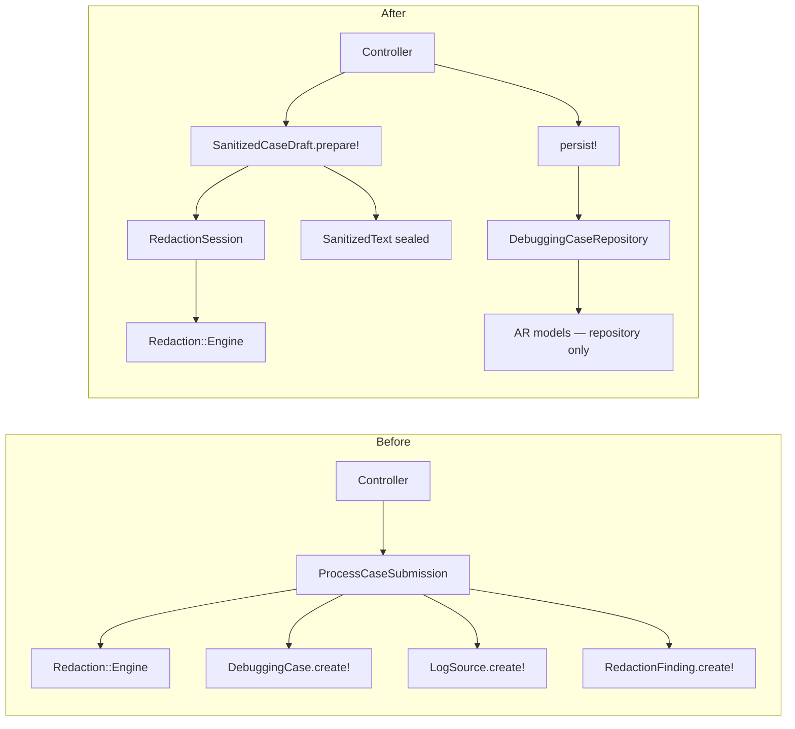

# Invariant Aggregate Guard Refactor Plan — SafeLog AI

DDD plan (no production code implementation). Based on `context/domain/01-domain-distillation.md`, PRD, AGENTS.md, and verified runtime code.

---

## STEP 0 — Context

### Documents and stack

| Source | Key sections |
|--------|-----------------|
| `context/foundation/prd.md` | Guardrails (`:58–62`), Business Logic (`:137–146`), FR-003–FR-004, NFR (`:130–135`) |
| `context/foundation/shape-notes.md` | Core insight: redaction gates AI (`:14`, `:149`) |
| `AGENTS.md` | No raw persistence (`:7–11`), encrypt diagnostic text (`:15`) |
| `README.md` | Security principles, `app/services/` architecture |
| `context/foundation/test-plan.md` | Risk #1–#4, security oracle patterns |
| `context/domain/01-domain-distillation.md` | Ubiquitous Language, refactor ranking #1 |

### Business logic layers

| Layer | Location | Role relative to invariants |
|---------|-------------|----------------------------|
| HTTP | `app/controllers/debugging_cases_controller.rb` | Parse params, auth scope, redirect; partial UI guard (no re-render raw) |
| Input validation | `app/services/intake/case_submission.rb` | Submission format/structure; **does not** enforce „sanitized-only" |
| Intake orchestration | `app/services/intake/process_case_submission.rb` | **Only** runtime path redaction→persist |
| Redaction (pure) | `app/services/redaction/{engine,placeholder_registry,patterns}.rb` | In-memory transformation |
| Persistence | `app/models/*.rb`, `db/schema.rb` | AR without „sanitized vs raw" type |
| Analysis | `app/services/analysis/prompt_builder.rb` | Comment convention — persisted sanitized only |
| Oracles | `spec/requests/*_security_spec.rb`, `spec/services/intake/process_case_submission_spec.rb` | Regression contract; not structural enforcement |

---

## STEP 1 — Business invariants

| ID | Invariant (MUST be true) | Source |
|----|----------------------------------|--------|
| **INV-G1** | **No diagnostic content may reach persistence until it has passed deterministic in-memory redaction; raw pasted content and raw→placeholder mappings are never persisted** | `prd.md:58,132,139,144`; `AGENTS.md:7–10`; `README.md:11–12` |
| INV-G2 | Redaction before any AI reasoning — model sees only sanitized evidence | `prd.md:46,116,139`; `prompt_builder.rb:4–5` |
| INV-G3 | Case-local placeholders: same raw value in one submission → same placeholder cross-source | `prd.md:33,144`; `placeholder_registry.rb:11–20` |
| INV-G4 | Redaction findings persisted without original values (type, line, placeholder, risk) | `prd.md:144`; `engine.rb:36–41` |
| INV-G5 | Atomic intake: case + all log sources in one transaction | `process_case_submission.rb:27–49`; implied FR-003 |
| INV-G6 | All log sources added only at case creation (MVP) | `prd.md:50,159` |
| INV-G7 | Case belongs to one User; no cross-user access | `prd.md:61,151`; `debugging_cases_controller.rb:17,42` |
| INV-G8 | AI report hypothesis-framed with uncertainty_notes; invalid → retry once → failed | `prd.md:60,82,134`; `analyze_case.rb:55–67` |
| INV-G9 | Diagnostic text encrypted at rest (sanitized logs, customer_reference, correlation, AI report) | `prd.md:59,133`; models `encrypts` |
| INV-G10 | Raw pasted content not re-rendered after validation error | `AGENTS.md:7`; `debugging_cases_controller.rb:101–108` |
| INV-G11 | At least one source with non-empty content | `case_submission.rb:41–45` |
| INV-G12 | Demo loader unavailable in production | `prd.md:54`; `load_case.rb:7–8,20` |

---

## STEP 2 — Classification and #1 selection

Axis scale: **Core** (1=low … 5=defines product), **Spread** (1=single layer … 5=many layers without central guard), **Enforcement** (E=enforced, D=declared/convention, N=violatable without test regression).

| ID | (a) Core | (b) Spread | (c) Enforcement | Notes |
|----|-----------|-------------------|---------------|-------|
| **INV-G1** | **5** | **5** | **D→N** | Product insight; rule in orchestrator + no raw columns + oracles; **AR models accept any string** |
| INV-G2 | 5 | 3 | D | Comment in PromptBuilder; no preconditions in AnalyzeCase |
| INV-G3 | 4 | 2 | E (within ProcessCaseSubmission) | Shared registry `:23`; easy to break at new call-site |
| INV-G4 | 4 | 3 | E (log sources) / D (metadata) | `redact_metadata` discards findings (`:58–61`) |
| INV-G5 | 4 | 2 | E | Single transaction in `process_case_submission.rb:27` |
| INV-G6 | 3 | 4 | D | No route = convention; UI 3 slots (`helper.rb:4`) |
| INV-G7 | 4 | 2 | E | Controller scope + FK |
| INV-G8 | 4 | 2 | E | ResponseValidator + retry |
| INV-G9 | 3 | 3 | D | Partial — title/description/environment without `encrypts` (`01-domain-distillation.md` R-01) |
| INV-G10 | 3 | 2 | E | Controller + filter params |
| INV-G11 | 3 | 1 | E | CaseSubmission validation |
| INV-G12 | 2 | 1 | E | Env gate in LoadCase |

### Selection: **INV-G1 — Persistence gate (sanitized-only)**

**Rationale:** This is the only Business Logic line in PRD (`prd.md:139`) and the core of shape-notes („deterministic redaction must gate AI"). Without INV-G1 the product becomes a generic „paste logs into AI". It is **structurally weakest enforced**: security oracles prove correctness of the current path, but **no domain type or aggregate root** prevents `LogSource.create!(sanitized_content: raw_secret)` (`log_source.rb:1–16` — no validation). The rule lives procedurally in `ProcessCaseSubmission` (5 responsibilities in one class — `01-domain-distillation.md` IMPL-1) and negatively in schema (no raw columns — `schema.rb:44–53`), not in a closed domain model. Meets criterion: **most core × weakest enforced**.

---

## STEP 3 — INV-G1 diagnosis

### Where the rule lives today

| Layer | File:line | Role |
|---------|------------|------|
| Documentation | `prd.md:139,144` | Business rule in one sentence |
| Agent contract | `AGENTS.md:7–10` | Hard rules for contributors |
| HTTP intake | `debugging_cases_controller.rb:28–30` | Delegation to ProcessCaseSubmission |
| Validation (pre-gate) | `case_submission.rb:20–21` | Valid before redaction — OK |
| **Orchestrator (only procedural enforcement)** | `process_case_submission.rb:23–47` | Registry → redact → persist sanitized |
| Redaction engine | `engine.rb:13–22` | Pure transform |
| Registry (in-memory) | `placeholder_registry.rb:4–5` | Comment „never persist" |
| Schema (negative enforcement) | `schema.rb:44–53` | No `pasted_content` / `raw_content` |
| AR model | `log_source.rb:6` | `encrypts :sanitized_content` — **does not** enforce provenance |
| AR model | `debugging_case.rb:5` | `encrypts :customer_reference` only |
| Analysis (downstream) | `prompt_builder.rb:46–48` | Reads `sanitized_content` from DB |
| Log filtering | `filter_parameter_logging.rb:9–11` | Filters `:pasted_content` in logs |
| UI (partial) | `debugging_cases_controller.rb:101–108` | Does not re-render raw after error |
| Demo path | `load_case.rb:22–23` | Same orchestrator |
| Test oracles | `debugging_cases_security_spec.rb:49–52`; `process_case_submission_spec.rb:103+` | Scan DB for raw substring |

### Enforcement gaps

| Problem | Evidence | Type |
|---------|-------|-----|
| **AR models do not distinguish raw vs sanitized** | `log_source.rb:1–16` — no content provenance validation | **Violatable** — console/spec factory can save raw |
| **No named domain error on violation** | `process_case_submission.rb:52–53` — `RecordInvalid` swallows semantics | **Swallowed** — persist error ≠ INV-G1 violation |
| **Metadata redaction without findings** | `process_case_submission.rb:58–61` — only `.sanitized_text` | **Inconsistent** — INV-G4 partially broken for metadata |
| **Convention instead of preconditions in AI path** | `prompt_builder.rb:4–5` — comment; `analyze_case.rb:22–30` — no check „case has sanitized sources" | **Declared** |
| **INV-G6 guard = no route** | `routes.rb:13` — `:create` only; no domain method `add_source!` | **Declared** — UI slot count (`helper.rb:4`) not enforced on server |
| **Registry lifecycle invisible outside orchestrator** | `engine.rb:5` — default `PlaceholderRegistry.new` when no arg | **Violatable** — separate registries break INV-G3 |
| **No inner persist rollback tests** | `case-submission-flow-analysis/research.md` G-01, G-02 | **Test gap** — INV-G5 atomicity weakly proven |

### Where UI is the only guard

- **INV-G6 (create-time only):** form has `SOURCE_SLOT_COUNT = 3` (`debugging_cases_helper.rb:4`); server does not reject theoretical `PATCH` with new sources (route does not exist — protection via HTTP surface, not domain).
- **INV-G10 (no re-render raw):** `assign_safe_metadata_for_form` (`debugging_cases_controller.rb:103–108`) — correct, but controller policy, not aggregate.

---

## STEP 4 — Aggregate guard design

### Goal

**The only legal way to materialize DebuggingCase in DB:** in-memory aggregate `Intake::SanitizedCaseDraft` built through redaction, saved via repository in one transaction. Raw `pasted_content` never leaves the intake layer as a persistable type.

### Aggregate boundaries

```
┌─────────────────────────────────────────────────────────┐
│ Intake::SanitizedCaseDraft          (AGGREGATE ROOT)    │
│  - metadata: SanitizedField × 4                         │
│  - sources: [SanitizedLogSource]                        │
│  - redaction_session_id: UUID (audit, not registry map) │
├─────────────────────────────────────────────────────────┤
│ SanitizedLogSource (entity in aggregate)                 │
│  - source_type, name: SanitizedField, position          │
│  - content: SanitizedText                               │
│  - findings: [RedactionFindingRecord]                   │
├─────────────────────────────────────────────────────────┤
│ SanitizedText (value object — sealed constructor)       │
│  - @value : String                                      │
│  - .pack!(redaction_result:) — internal factory       │
└─────────────────────────────────────────────────────────┘

Intake::RedactionSession (domain service, not persisted)
  - wraps PlaceholderRegistry
  - redact_raw!(text) → Redaction::Result
  - forbidden: #to_h, #serialize, #mapping
```

### Domain errors (fail-fast)

```ruby
module Intake
  class DomainError < StandardError; end

  class UnsanitizedContentError < DomainError
    # Attempt to create SanitizedText without RedactionSession
  end

  class RawPersistenceForbiddenError < DomainError
    # Attempt to persist object containing pasted_content / registry
  end

  class EmptyEvidenceError < DomainError
    # Zero sources after redaction (after submission validation)
  end

  class InvalidSubmissionError < DomainError
    # Wrap CaseSubmission validation — before redaction session
  end
end
```

**Rule:** no INV-G1 error ends in silent `update` or partial persist. `RawPersistenceForbiddenError` → transaction rollback, mapped to 422/500 without exposing raw.

### Aggregate API (signatures + pseudocode)

```ruby
module Intake
  class SanitizedCaseDraft
    # ONLY public factory — all redaction happens here
    def self.prepare!(submission:)
      raise InvalidSubmissionError, submission.errors unless submission.valid?

      session = RedactionSession.new  # new PlaceholderRegistry inside

      metadata = {
        title: session.redact_field!(submission.title, required: true),
        description: session.redact_field!(submission.description),
        environment: session.redact_field!(submission.environment),
        customer_reference: session.redact_field!(submission.customer_reference)
      }

      sources = submission.sources_with_content.map.with_index do |raw_source, index|
        result = session.redact_log!(raw_source.pasted_content)  # raises if blank

        SanitizedLogSource.new(
          source_type: raw_source.source_type,  # validated enum — fail-fast if invalid
          name: session.redact_field!(raw_source.name),
          position: index,
          content: SanitizedText.pack!(result),
          findings: result.findings.map { |h| RedactionFindingRecord.from_engine(h) }
        )
      end

      raise EmptyEvidenceError if sources.empty?

      new(metadata: metadata, sources: sources, session: session)
      # session.discard! — clear registry before return; mappings do not leave method
    end

    # No public initialize — prepare! only

    def persist!(user:)
      raise RawPersistenceForbiddenError if @session.nil?  # already discarded = OK

      DebuggingCaseRepository.save!(draft: self, user: user)
    end
  end

  class RedactionSession
    def redact_log!(raw_text)
      raise UnsanitizedContentError if raw_text.blank?
      Redaction::Engine.redact(raw_text, registry: @registry)
    end

    def redact_field!(text, required: false)
      return nil if text.blank? && !required
      redact_log!(text).sanitized_text  # metadata also generates findings — fix R-03
    end

    def discard!
      @registry = nil
    end
  end

  class SanitizedText
    private_class_method :new

    def self.pack!(redaction_result)
      # Precondition: result from RedactionSession (internal token or branded type)
      new(redaction_result.sanitized_text)
    end

    def to_persistence_string
      @value
    end
  end
end
```

### Repository (single transaction)

```ruby
module Intake
  class DebuggingCaseRepository
    def self.save!(draft:, user:)
      DebuggingCase.transaction do
        case_record = user.debugging_cases.create!(
          title: draft.metadata[:title].to_persistence_string,
          description: draft.metadata[:description]&.to_persistence_string,
          environment: draft.metadata[:environment]&.to_persistence_string,
          customer_reference: draft.metadata[:customer_reference]&.to_persistence_string
        )

        draft.sources.each do |source|
          log_source = case_record.log_sources.create!(
            source_type: source.source_type,
            name: source.name&.to_persistence_string,
            position: source.position,
            sanitized_content: source.content.to_persistence_string
          )

          source.findings.each do |finding|
            log_source.redaction_findings.create!(finding.to_h)
          end
        end

        case_record
      end
    end
  end
end
```

**Note:** `LogSource` / `DebuggingCase` AR remain persistence models, but **public `create!` with raw string** becomes an anti-pattern — eventually factories only via repository (RuboCop custom cop / review checklist optionally in phase 4).

### Thin HTTP (after refactor)

```ruby
# debugging_cases_controller.rb#create — target shape
def create
  submission = Intake::CaseSubmission.new(case_submission_params)
  draft = Intake::SanitizedCaseDraft.prepare!(submission: submission)
  debugging_case = draft.persist!(user: current_user)
  redirect_to debugging_case_path(debugging_case)
rescue Intake::InvalidSubmissionError => e
  assign_safe_metadata_for_form
  @errors = e.record.errors
  render :new, status: :unprocessable_entity
rescue Intake::DomainError
  # Safe generic message — never echo raw
  redirect_to new_debugging_case_path, alert: "Case could not be saved."
end
```

`Demo::LoadCase` (`load_case.rb:22–23`) → `SanitizedCaseDraft.prepare!` + `persist!` instead of `ProcessCaseSubmission.call`.

`ProcessCaseSubmission` → **deprecated facade** (phase 3) delegating to aggregate, then removed.

### INV-G2 enforcement (downstream, outside phase 1 scope)

`Analysis::AnalyzeCase` gets precondition in phase 2:

```ruby
def call
  raise Intake::UnsanitizedEvidenceError unless debugging_case.log_sources.exists?
  # existing flow...
end
```

Does not block INV-G1, but closes gap „analyze empty case".

---

## STEP 5 — Before/after, phase plan, tests

### Before / after — rule locations

| Location | Before (today) | After (target) |
|---------|---------------|------------------|
| `process_case_submission.rb:20–54` | Orchestrator + txn + redact + AR create! | **Removed** → `SanitizedCaseDraft` + `DebuggingCaseRepository` |
| `case_submission.rb` | Format validation | Unchanged — input DTO; pre-gate before `prepare!` |
| `redaction/engine.rb` | Pure redact | Unchanged — called only via `RedactionSession` |
| `placeholder_registry.rb` | Public `new` in orchestrator | Created only in `RedactionSession#initialize` |
| `log_source.rb` | Any `sanitized_content` | Persist only via repository; optionally `attr_readonly` / private API |
| `debugging_cases_controller.rb:28–38` | `ProcessCaseSubmission.call` | `prepare!` + `persist!` + rescue DomainError |
| `demo/load_case.rb:23` | `ProcessCaseSubmission.call` | Same aggregate |
| `spec/services/intake/process_case_submission_spec.rb` | Tests orchestrator | Moved / rename → `sanitized_case_draft_spec.rb` |
| Security oracles | Scan DB after HTTP | **Same semantics** — must stay green |

### Phase plan

| Phase | Scope | Test-first? | Gate |
|------|--------|-------------|------|
| **F1** | `RedactionFindingRecord` + `RedactionSession` + sealed `SanitizedText`; metadata findings (fix R-03) | **Yes** — `spec/services/intake/redaction_session_spec.rb` | `bin/ci` |
| **F2** | `SanitizedCaseDraft.prepare!` + unit tests (legal/illegal) | **Yes** — `spec/services/intake/sanitized_case_draft_spec.rb` | `bin/ci` |
| **F3** | `DebuggingCaseRepository.save!`; `ProcessCaseSubmission` → facade; controller + demo on new API | TDD — repository spec with rollback (G-01, G-02) | `bin/ci` + security specs |
| **F4** | Remove `ProcessCaseSubmission`; optionally `\r\n` in Engine (TD-5) | Engine spec first if TD-5 | `bin/ci` |
| **F5** (optional) | Analyze precondition; INV-G6 explicit error if update route added later | Request spec | `bin/ci` |

**Project discipline:** RSpec + `bin/ci` (RuboCop, Brakeman, bundler-audit) — each phase merge only on green suite (`test-plan.md` §4).

### INV-G1 test cases

#### Legal (must pass)

| # | Scenario | Expectation |
|---|------------|-------------|
| T-L1 | Multi-source submission with same request_id in two pastes | Same placeholder in both `sanitized_content`; INV-G3 |
| T-L2 | Secret in title + pasted_content | Both redacted; raw absent in DB (oracle) |
| T-L3 | Metadata-only secret in customer_reference | Sanitized + encrypted at rest |
| T-L4 | `prepare!` valid → `persist!` | One transaction; case + N sources + findings |
| T-L5 | Demo fixture via `LoadCase` | Identical pipeline to manual create |
| T-L6 | Validation failure (blank title) | `InvalidSubmissionError`; **no** registry, **no** DB writes |

#### Illegal (must fail-fast)

| # | Scenario | Expectation |
|---|------------|-------------|
| T-N1 | `SanitizedText.new("raw")` / public constructor | `NoMethodError` / `UnsanitizedContentError` |
| T-N2 | `SanitizedCaseDraft.new(...)` without `prepare!` | No public API |
| T-N3 | `DebuggingCaseRepository.save!` with object containing `pasted_content` | `RawPersistenceForbiddenError`; zero DB rows |
| T-N4 | Persist after `session.discard!` without prepare | `RawPersistenceForbiddenError` |
| T-N5 | Inner `log_sources.create!` failure in txn | Full rollback — no partial case (G-01) |
| T-N6 | Inner `redaction_findings.create!` failure | Full rollback (G-02) |
| T-N7 | POST create — raw never in `test.log` | Existing oracle (`debugging_cases_security_spec.rb:70–78`) |

### New load-bearing names (contract registry)

| Name | Type | Registry |
|-------|-----|---------|
| `Intake::SanitizedCaseDraft` | Aggregate root | This document; eventually mention in `AGENTS.md` §architecture |
| `Intake::RedactionSession` | Domain service | This document |
| `Intake::SanitizedText` | Value object (sealed) | This document |
| `Intake::SanitizedLogSource` | Entity | This document |
| `Intake::RedactionFindingRecord` | Value object / entity | `test-plan.md` risk #1 — typed finding boundary (TD-2) |
| `Intake::DebuggingCaseRepository` | Repository | This document |
| `Intake::UnsanitizedContentError` | Domain error | This document |
| `Intake::RawPersistenceForbiddenError` | Domain error | This document |
| `Intake::EmptyEvidenceError` | Domain error | This document |
| `Intake::InvalidSubmissionError` | Domain error | This document |

**Update after F3 merge:** one line in `AGENTS.md` — „Persist debugging cases only via `Intake::SanitizedCaseDraft#persist!`".

---

## Diagram: before → after



---

## Metadata

- **Selected invariant:** INV-G1 (persistence gate — sanitized-only)
- **Aggregate guard:** `Intake::SanitizedCaseDraft`
- **Link to distillation #1:** RedactionSession + SanitizedEvidence boundary
- **Out of scope:** encryption title/description (TD-7), analyze aggregate (INV-G8 — optional phase)
