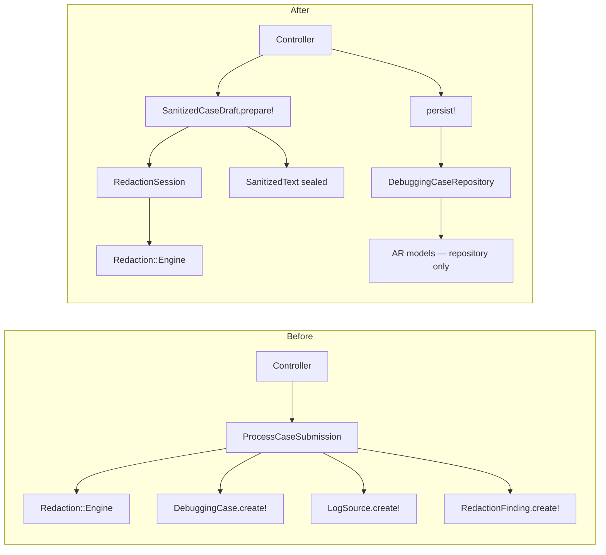

# Plan refaktoru agregatu-strażnika — SafeLog AI

Plan DDD (bez implementacji kodu produkcyjnego). Bazuje na `context/domain/01-domain-distillation.md`, PRD, AGENTS.md i zweryfikowanym kodzie runtime.

---

## KROK 0 — Kontekst

### Dokumenty i stack

| Źródło | Kluczowe sekcje |
|--------|-----------------|
| `context/foundation/prd.md` | Guardrails (`:58–62`), Business Logic (`:137–146`), FR-003–FR-004, NFR (`:130–135`) |
| `context/foundation/shape-notes.md` | Core insight: redaction gates AI (`:14`, `:149`) |
| `AGENTS.md` | No raw persistence (`:7–11`), encrypt diagnostic text (`:15`) |
| `README.md` | Security principles, architektura `app/services/` |
| `context/foundation/test-plan.md` | Risk #1–#4, security oracle patterns |
| `context/domain/01-domain-distillation.md` | Ubiquitous Language, ranking refaktoru #1 |

### Warstwy logiki biznesowej

| Warstwa | Lokalizacja | Rola względem niezmienników |
|---------|-------------|----------------------------|
| HTTP | `app/controllers/debugging_cases_controller.rb` | Parse params, auth scope, redirect; częściowy strażnik UI (brak re-render raw) |
| Walidacja wejścia | `app/services/intake/case_submission.rb` | Format/struktura submission; **nie** egzekwuje „sanitized-only" |
| Orchestracja intake | `app/services/intake/process_case_submission.rb` | **Jedyny** runtime path redaction→persist |
| Redaction (pure) | `app/services/redaction/{engine,placeholder_registry,patterns}.rb` | Transformacja in-memory |
| Persystencja | `app/models/*.rb`, `db/schema.rb` | AR bez typu „sanitized vs raw" |
| Analysis | `app/services/analysis/prompt_builder.rb` | Konwencja komentarza — tylko persisted sanitized |
| Oracles | `spec/requests/*_security_spec.rb`, `spec/services/intake/process_case_submission_spec.rb` | Kontrakt regresji; nie egzekucja strukturalna |

---

## KROK 1 — Niezmienniki biznesowe

| ID | Niezmiennik (MUSI być prawdziwy) | Źródło |
|----|----------------------------------|--------|
| **INV-G1** | **Żadna treść diagnostyczna nie może trafić do persystencji, dopóki nie przeszła deterministycznej redakcji in-memory; surowy pasted content i mapowania raw→placeholder nigdy nie są persystowane** | `prd.md:58,132,139,144`; `AGENTS.md:7–10`; `README.md:11–12` |
| INV-G2 | Redaction przed jakimkolwiek reasoningiem AI — model widzi wyłącznie sanityzowane dowody | `prd.md:46,116,139`; `prompt_builder.rb:4–5` |
| INV-G3 | Placeholdery case-local: ten sam raw value w jednym submission → ten sam placeholder cross-source | `prd.md:33,144`; `placeholder_registry.rb:11–20` |
| INV-G4 | Redaction findings persystowane bez oryginalnych wartości (type, line, placeholder, risk) | `prd.md:144`; `engine.rb:36–41` |
| INV-G5 | Intake atomowy: case + wszystkie log sources w jednej transakcji | `process_case_submission.rb:27–49`; implied FR-003 |
| INV-G6 | Wszystkie log sources dodawane wyłącznie przy tworzeniu case (MVP) | `prd.md:50,159` |
| INV-G7 | Case należy do jednego User; brak cross-user access | `prd.md:61,151`; `debugging_cases_controller.rb:17,42` |
| INV-G8 | AI report hypothesis-framed z uncertainty_notes; invalid → retry once → failed | `prd.md:60,82,134`; `analyze_case.rb:55–67` |
| INV-G9 | Diagnostic text encrypted at rest (sanitized logs, customer_reference, correlation, AI report) | `prd.md:59,133`; modele `encrypts` |
| INV-G10 | Raw pasted content nie re-renderowany po błędzie walidacji | `AGENTS.md:7`; `debugging_cases_controller.rb:101–108` |
| INV-G11 | Co najmniej jedno źródło z niepustą treścią | `case_submission.rb:41–45` |
| INV-G12 | Demo loader niedostępny w production | `prd.md:54`; `load_case.rb:7–8,20` |

---

## KROK 2 — Klasyfikacja i wybór #1

Skala osi: **Rdzeń** (1=niskie … 5=definiuje produkt), **Rozsmarowanie** (1=jedna warstwa … 5=wiele warstw bez centralnego strażnika), **Egzekucja** (E=egzekwowany, D=deklarowany/konwencja, N=naruszalny bez regresji testów).

| ID | (a) Rdzeń | (b) Rozsmarowanie | (c) Egzekucja | Uwagi |
|----|-----------|-------------------|---------------|-------|
| **INV-G1** | **5** | **5** | **D→N** | Insight produktu; reguła w orchestratorze + brak kolumn raw + oracles; **modele AR przyjmują dowolny string** |
| INV-G2 | 5 | 3 | D | Komentarz w PromptBuilder; brak preconditions w AnalyzeCase |
| INV-G3 | 4 | 2 | E (w obrębie ProcessCaseSubmission) | Wspólny registry `:23`; łatwo złamać przy nowym call-site |
| INV-G4 | 4 | 3 | E (log sources) / D (metadata) | `redact_metadata` odrzuca findings (`:58–61`) |
| INV-G5 | 4 | 2 | E | Jedna transakcja w `process_case_submission.rb:27` |
| INV-G6 | 3 | 4 | D | Brak route = konwencja; UI 3 sloty (`helper.rb:4`) |
| INV-G7 | 4 | 2 | E | Controller scope + FK |
| INV-G8 | 4 | 2 | E | ResponseValidator + retry |
| INV-G9 | 3 | 3 | D | Partial — title/description/environment bez `encrypts` (`01-domain-distillation.md` R-01) |
| INV-G10 | 3 | 2 | E | Controller + filter params |
| INV-G11 | 3 | 1 | E | CaseSubmission validation |
| INV-G12 | 2 | 1 | E | Env gate w LoadCase |

### Wybór: **INV-G1 — Gate persystencji (sanitized-only)**

**Uzasadnienie:** To jedyny wiersz Business Logic w PRD (`prd.md:139`) i rdzeń shape-notes („deterministic redaction must gate AI"). Bez INV-G1 produkt staje się generycznym „wklej logi do AI". Jest **najsłabiej egzekwowany strukturalnie**: security oracles dowodzą poprawności obecnej ścieżki, ale **żaden typ domenowy ani aggregate root** nie uniemożliwia `LogSource.create!(sanitized_content: raw_secret)` (`log_source.rb:1–16` — brak walidacji). Reguła żyje proceduralnie w `ProcessCaseSubmission` (5 odpowiedzialności w jednej klasie — `01-domain-distillation.md` IMPL-1) i w negatywie schematu (brak kolumn raw — `schema.rb:44–53`), nie w zamkniętym modelu domenowym. Spełnia kryterium: **najbardziej rdzeniowy × najsłabiej egzekowany**.

---

## KROK 3 — Diagnoza INV-G1

### Gdzie reguła żyje dziś

| Warstwa | Plik:linia | Rola |
|---------|------------|------|
| Dokumentacja | `prd.md:139,144` | Reguła biznesowa jednym zdaniem |
| Agent contract | `AGENTS.md:7–10` | Twarde reguły dla contributorów |
| HTTP intake | `debugging_cases_controller.rb:28–30` | Delegacja do ProcessCaseSubmission |
| Walidacja (pre-gate) | `case_submission.rb:20–21` | Valid before redaction — OK |
| **Orchestrator (jedyne egzekwowanie proceduralne)** | `process_case_submission.rb:23–47` | Registry → redact → persist sanitized |
| Redaction engine | `engine.rb:13–22` | Pure transform |
| Registry (in-memory) | `placeholder_registry.rb:4–5` | Komentarz „never persist" |
| Schema (negatywna egzekucja) | `schema.rb:44–53` | Brak `pasted_content` / `raw_content` |
| Model AR | `log_source.rb:6` | `encrypts :sanitized_content` — **nie** wymusza pochodzenia |
| Model AR | `debugging_case.rb:5` | `encrypts :customer_reference` only |
| Analysis (downstream) | `prompt_builder.rb:46–48` | Czyta `sanitized_content` z DB |
| Log filtering | `filter_parameter_logging.rb:9–11` | Filtruje `:pasted_content` w logach |
| UI (partial) | `debugging_cases_controller.rb:101–108` | Nie re-renderuje raw po błędzie |
| Demo path | `load_case.rb:22–23` | Ten sam orchestrator |
| Test oracles | `debugging_cases_security_spec.rb:49–52`; `process_case_submission_spec.rb:103+` | Skan DB pod raw substring |

### Luki egzekucji

| Problem | Dowód | Typ |
|---------|-------|-----|
| **AR modele nie rozróżniają raw vs sanitized** | `log_source.rb:1–16` — brak walidacji pochodzenia treści | **Naruszalny** — konsola/spec factory może zapisać raw |
| **Brak named domain error przy naruszeniu** | `process_case_submission.rb:52–53` — `RecordInvalid` połyka semantykę | **Połykanie** — błąd persist ≠ naruszenie INV-G1 |
| **Metadata redaction bez findings** | `process_case_submission.rb:58–61` — tylko `.sanitized_text` | **Niespójne** — INV-G4 częściowo łamane dla metadata |
| **Konwencja zamiast preconditions w AI path** | `prompt_builder.rb:4–5` — komentarz; `analyze_case.rb:22–30` — brak check „case ma sanitized sources" | **Deklarowany** |
| **INV-G6 strażnik = brak route** | `routes.rb:13` — tylko `:create`; brak domain method `add_source!` | **Deklarowany** — UI slot count (`helper.rb:4`) nie egzekwuje na serwerze |
| **Registry lifecycle niewidoczny poza orchestratorem** | `engine.rb:5` — default `PlaceholderRegistry.new` gdy brak arg | **Naruszalny** — osobne registry łamią INV-G3 |
| **Brak testów rollbacku inner persist** | `case-submission-flow-analysis/research.md` G-01, G-02 | **Luka testowa** — atomowość INV-G5 słabo udowodniona |

### Gdzie UI jest jedynym strażnikiem

- **INV-G6 (create-time only):** formularz ma `SOURCE_SLOT_COUNT = 3` (`debugging_cases_helper.rb:4`); serwer nie odrzuca teoretycznego `PATCH` z nowymi sources (route nie istnieje — ochrona przez HTTP surface, nie domenę).
- **INV-G10 (no re-render raw):** `assign_safe_metadata_for_form` (`debugging_cases_controller.rb:103–108`) — poprawne, ale to controller policy, nie aggregate.

---

## KROK 4 — Projekt agregatu-strażnika

### Cel

**Jedyny legalny sposób materializacji DebuggingCase w DB:** agregat in-memory `Intake::SanitizedCaseDraft` zbudowany przez redakcję, zapisany przez repozytorium w jednej transakcji. Raw `pasted_content` nigdy nie opuszcza warstwy intake jako typ persistowalny.

### Granice agregatu

```
┌─────────────────────────────────────────────────────────┐
│ Intake::SanitizedCaseDraft          (AGGREGATE ROOT)    │
│  - metadata: SanitizedField × 4                         │
│  - sources: [SanitizedLogSource]                        │
│  - redaction_session_id: UUID (audit, not registry map) │
├─────────────────────────────────────────────────────────┤
│ SanitizedLogSource (entity w agregacie)                 │
│  - source_type, name: SanitizedField, position          │
│  - content: SanitizedText                               │
│  - findings: [RedactionFindingRecord]                   │
├─────────────────────────────────────────────────────────┤
│ SanitizedText (value object — sealed constructor)       │
│  - @value : String                                      │
│  - .pack!(redaction_result:) — fabryka wewnętrzna       │
└─────────────────────────────────────────────────────────┘

Intake::RedactionSession (domain service, nie persistowany)
  - wraps PlaceholderRegistry
  - redact_raw!(text) → Redaction::Result
  - forbidden: #to_h, #serialize, #mapping
```

### Błędy domenowe (fail-fast)

```ruby
module Intake
  class DomainError < StandardError; end

  class UnsanitizedContentError < DomainError
    # Próba utworzenia SanitizedText bez RedactionSession
  end

  class RawPersistenceForbiddenError < DomainError
    # Próba persist z obiektem zawierającym pasted_content / registry
  end

  class EmptyEvidenceError < DomainError
    # Zero sources po redakcji (po walidacji submission)
  end

  class InvalidSubmissionError < DomainError
    # Wrap CaseSubmission validation — przed redaction session
  end
end
```

**Zasada:** żaden błąd INV-G1 nie kończy się cichym `update` ani partial persist. `RawPersistenceForbiddenError` → rollback transakcji, mapowanie na 422/500 bez ujawniania raw.

### API agregatu (sygnatury + pseudokod)

```ruby
module Intake
  class SanitizedCaseDraft
    # JEDYNY publiczny factory — cała redakcja dzieje się tutaj
    def self.prepare!(submission:)
      raise InvalidSubmissionError, submission.errors unless submission.valid?

      session = RedactionSession.new  # nowy PlaceholderRegistry w środku

      metadata = {
        title: session.redact_field!(submission.title, required: true),
        description: session.redact_field!(submission.description),
        environment: session.redact_field!(submission.environment),
        customer_reference: session.redact_field!(submission.customer_reference)
      }

      sources = submission.sources_with_content.map.with_index do |raw_source, index|
        result = session.redact_log!(raw_source.pasted_content)  # raises if blank

        SanitizedLogSource.new(
          source_type: raw_source.source_type,  # validated enum — fail-fast if invalid
          name: session.redact_field!(raw_source.name),
          position: index,
          content: SanitizedText.pack!(result),
          findings: result.findings.map { |h| RedactionFindingRecord.from_engine(h) }
        )
      end

      raise EmptyEvidenceError if sources.empty?

      new(metadata: metadata, sources: sources, session: session)
      # session.discard! — registry wyczyść przed return; mappings nie wychodzą z metody
    end

    # Brak publicznego initialize — tylko prepare!

    def persist!(user:)
      raise RawPersistenceForbiddenError if @session.nil?  # już discarded = OK

      DebuggingCaseRepository.save!(draft: self, user: user)
    end
  end

  class RedactionSession
    def redact_log!(raw_text)
      raise UnsanitizedContentError if raw_text.blank?
      Redaction::Engine.redact(raw_text, registry: @registry)
    end

    def redact_field!(text, required: false)
      return nil if text.blank? && !required
      redact_log!(text).sanitized_text  # metadata też generuje findings — fix R-03
    end

    def discard!
      @registry = nil
    end
  end

  class SanitizedText
    private_class_method :new

    def self.pack!(redaction_result)
      # Precondition: result pochodzi z RedactionSession (token wewnętrzny lub branded type)
      new(redaction_result.sanitized_text)
    end

    def to_persistence_string
      @value
    end
  end
end
```

### Repozytorium (jedna transakcja)

```ruby
module Intake
  class DebuggingCaseRepository
    def self.save!(draft:, user:)
      DebuggingCase.transaction do
        case_record = user.debugging_cases.create!(
          title: draft.metadata[:title].to_persistence_string,
          description: draft.metadata[:description]&.to_persistence_string,
          environment: draft.metadata[:environment]&.to_persistence_string,
          customer_reference: draft.metadata[:customer_reference]&.to_persistence_string
        )

        draft.sources.each do |source|
          log_source = case_record.log_sources.create!(
            source_type: source.source_type,
            name: source.name&.to_persistence_string,
            position: source.position,
            sanitized_content: source.content.to_persistence_string
          )

          source.findings.each do |finding|
            log_source.redaction_findings.create!(finding.to_h)
          end
        end

        case_record
      end
    end
  end
end
```

**Uwaga:** `LogSource` / `DebuggingCase` AR pozostają persistence models, ale **publiczne `create!` z raw stringiem** staje się antywzorcem — docelowo fabryki tylko z repozytorium (RuboCop custom cop / review checklist opcjonalnie w fazie 4).

### Cienkie HTTP (po refaktorze)

```ruby
# debugging_cases_controller.rb#create — docelowy kształt
def create
  submission = Intake::CaseSubmission.new(case_submission_params)
  draft = Intake::SanitizedCaseDraft.prepare!(submission: submission)
  debugging_case = draft.persist!(user: current_user)
  redirect_to debugging_case_path(debugging_case)
rescue Intake::InvalidSubmissionError => e
  assign_safe_metadata_for_form
  @errors = e.record.errors
  render :new, status: :unprocessable_entity
rescue Intake::DomainError
  # Safe generic message — never echo raw
  redirect_to new_debugging_case_path, alert: "Case could not be saved."
end
```

`Demo::LoadCase` (`load_case.rb:22–23`) → `SanitizedCaseDraft.prepare!` + `persist!` zamiast `ProcessCaseSubmission.call`.

`ProcessCaseSubmission` → **deprecated facade** (faza 3) delegujący do agregatu, potem usunięty.

### Egzekucja INV-G2 (downstream, poza scope fazy 1)

`Analysis::AnalyzeCase` dostaje precondition w fazie 2:

```ruby
def call
  raise Intake::UnsanitizedEvidenceError unless debugging_case.log_sources.exists?
  # existing flow...
end
```

Nie blokuje INV-G1, ale zamyka lukę „analyze pustego case".

---

## KROK 5 — Before/after, plan faz, testy

### Before / after — miejsca reguły

| Miejsce | Before (dziś) | After (docelowo) |
|---------|---------------|------------------|
| `process_case_submission.rb:20–54` | Orchestrator + txn + redact + AR create! | **Usunięty** → `SanitizedCaseDraft` + `DebuggingCaseRepository` |
| `case_submission.rb` | Walidacja formatu | Bez zmian — input DTO; pre-gate przed `prepare!` |
| `redaction/engine.rb` | Pure redact | Bez zmian — wołany tylko przez `RedactionSession` |
| `placeholder_registry.rb` | Publiczny `new` w orchestratorze | Tworzony wyłącznie w `RedactionSession#initialize` |
| `log_source.rb` | Dowolny `sanitized_content` | Persist tylko via repository; opcjonalnie `attr_readonly` / private API |
| `debugging_cases_controller.rb:28–38` | `ProcessCaseSubmission.call` | `prepare!` + `persist!` + rescue DomainError |
| `demo/load_case.rb:23` | `ProcessCaseSubmission.call` | Ten sam agregat |
| `spec/services/intake/process_case_submission_spec.rb` | Testuje orchestrator | Przeniesione / rename → `sanitized_case_draft_spec.rb` |
| Security oracles | Skan DB po HTTP | **Bez zmian semantyki** — muszą zostać green |

### Plan faz

| Faza | Zakres | Test-first? | Gate |
|------|--------|-------------|------|
| **F1** | `RedactionFindingRecord` + `RedactionSession` + sealed `SanitizedText`; metadata findings (fix R-03) | **Tak** — `spec/services/intake/redaction_session_spec.rb` | `bin/ci` |
| **F2** | `SanitizedCaseDraft.prepare!` + testy unit (legal/illegal) | **Tak** — `spec/services/intake/sanitized_case_draft_spec.rb` | `bin/ci` |
| **F3** | `DebuggingCaseRepository.save!`; `ProcessCaseSubmission` → facade; controller + demo na nowym API | TDD — repository spec z rollback (G-01, G-02) | `bin/ci` + security specs |
| **F4** | Usunięcie `ProcessCaseSubmission`; opcjonalnie `\r\n` w Engine (TD-5) | Engine spec first jeśli TD-5 | `bin/ci` |
| **F5** (opcjonalna) | Precondition analyze; INV-G6 explicit error jeśli kiedyś dodany update route | Request spec | `bin/ci` |

**Dyscyplina projektu:** RSpec + `bin/ci` (RuboCop, Brakeman, bundler-audit) — każda faza merge dopiero na green suite (`test-plan.md` §4).

### Przypadki testowe INV-G1

#### Legalne (must pass)

| # | Scenariusz | Oczekiwanie |
|---|------------|-------------|
| T-L1 | Multi-source submission z tym samym request_id w dwóch paste | Ten sam placeholder w obu `sanitized_content`; INV-G3 |
| T-L2 | Secret w title + pasted_content | Oba zredagowane; raw absent w DB (oracle) |
| T-L3 | Metadata-only secret w customer_reference | Sanitized + encrypted at rest |
| T-L4 | `prepare!` valid → `persist!` | Jedna transakcja; case + N sources + findings |
| T-L5 | Demo fixture przez `LoadCase` | Identyczny pipeline jak manual create |
| T-L6 | Validation failure (blank title) | `InvalidSubmissionError`; **brak** registry, **brak** DB writes |

#### Nielegalne (must fail-fast)

| # | Scenariusz | Oczekiwanie |
|---|------------|-------------|
| T-N1 | `SanitizedText.new("raw")` / public constructor | `NoMethodError` / `UnsanitizedContentError` |
| T-N2 | `SanitizedCaseDraft.new(...)` bez `prepare!` | Brak publicznego API |
| T-N3 | `DebuggingCaseRepository.save!` z obiektem zawierającym `pasted_content` | `RawPersistenceForbiddenError`; zero DB rows |
| T-N4 | Persist po `session.discard!` bez prepare | `RawPersistenceForbiddenError` |
| T-N5 | Inner `log_sources.create!` failure w txn | Full rollback — brak partial case (G-01) |
| T-N6 | Inner `redaction_findings.create!` failure | Full rollback (G-02) |
| T-N7 | POST create — raw never in `test.log` | Istniejący oracle (`debugging_cases_security_spec.rb:70–78`) |

### Nowe nazwy load-bearing (rejestr kontraktów)

| Nazwa | Typ | Rejestr |
|-------|-----|---------|
| `Intake::SanitizedCaseDraft` | Aggregate root | Ten dokument; docelowo wzmianka w `AGENTS.md` §architecture |
| `Intake::RedactionSession` | Domain service | Ten dokument |
| `Intake::SanitizedText` | Value object (sealed) | Ten dokument |
| `Intake::SanitizedLogSource` | Entity | Ten dokument |
| `Intake::RedactionFindingRecord` | Value object / entity | `test-plan.md` risk #1 — typed finding boundary (TD-2) |
| `Intake::DebuggingCaseRepository` | Repository | Ten dokument |
| `Intake::UnsanitizedContentError` | Domain error | Ten dokument |
| `Intake::RawPersistenceForbiddenError` | Domain error | Ten dokument |
| `Intake::EmptyEvidenceError` | Domain error | Ten dokument |
| `Intake::InvalidSubmissionError` | Domain error | Ten dokument |

**Aktualizacja po merge F3:** jedna linia w `AGENTS.md` — „Persist debugging cases only via `Intake::SanitizedCaseDraft#persist!`".

---

## Diagram: before → after



---

## Metadane

- **Wybrany niezmiennik:** INV-G1 (gate persystencji — sanitized-only)
- **Agregat-strażnik:** `Intake::SanitizedCaseDraft`
- **Powiązanie z distillation #1:** RedactionSession + SanitizedEvidence boundary
- **Nie w scope:** encryption title/description (TD-7), analyze aggregate (INV-G8 — faza opcjonalna)
