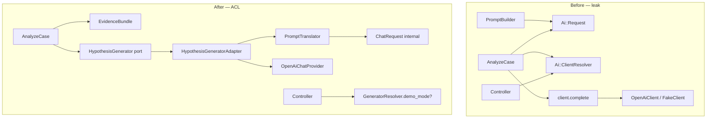

# Anti-Corruption Layer — AI adapter boundary

DDD refactor plan (no production code implementation). Focus: **provider-agnostic AI adapter** declared in PRD/shape-notes vs actual `Ai::` leaks into Analysis layer and HTTP.

---

## STEP 0 — Context

### Swappability declarations (intent)

| Document | Quote | File:line |
|----------|-------|------------|
| Shape notes | „Provider-agnostic AI adapter; OpenAI as first real provider" | `context/foundation/shape-notes.md:187` |
| Tech stack | „Provider-agnostic adapter \| `Ai::FakeClient` in test/CI; OpenAI optional via `OPENAI_API_KEY`" | `context/foundation/tech-stack.md:30` |
| README | „`Ai::` — Client contract, fake/OpenAI adapters, response validation" | `README.md:130` |
| Repo map (artifact-2) | „AI adapter swappable (FakeClient/OpenAI) without touching redaction" | `context/map/artifact-2-structure.md:74` |
| F-03 plan | „Provider-agnostic AI client under `app/services/ai/`" … „`Ai::Client` contract `#complete(request)`" | `context/archive/2026-05-27-ai-adapter-foundation/plan.md:5,28` |
| PRD guardrail | AI reports hypotheses only; analyze from sanitized evidence (`FR-007`, `FR-008`) | `context/foundation/prd.md:60,115–118` |
| AGENTS | Tests must use fake AI client; CI never calls real providers | `AGENTS.md:14` |

### Stack and external dependencies

| Layer | Technology | Manifest |
|---------|-------------|----------|
| Framework | Rails 8.1, server-rendered ERB | `Gemfile` |
| AI SDK | **`ruby-openai` 8.3.0** → `OpenAI::Client` | `Gemfile:24`, `Gemfile.lock:355` |
| Test HTTP stub | WebMock | `context/foundation/test-plan.md:86` |
| Code layers | HTTP → `Analysis::` → `Ai::` → HTTP OpenAI | `README.md:122–131` |

### Current `app/services/ai/` structure

| File | Role |
|------|------|
| `client.rb:4–7` | Port module `#complete` |
| `request.rb:9–47` | Request envelope (messages role/content — Chat Completions shape) |
| `completion_result.rb:4–18` | Adapter result (structured hash + markdown) |
| `open_ai_client.rb:14–58` | OpenAI adapter — only place with `OpenAI::Client` |
| `fake_client.rb:4–19` | Deterministic stub |
| `client_resolver.rb:4–14` | Env-gated factory |
| `response_validator.rb:6–107` | Hypothesis schema validation |
| `report_schema.rb:13–53` | Report JSON contract |

Redaction ⊥ AI security boundary is **preserved** — no `Redaction::` / `Intake::` imports in `app/services/ai/*.rb` (`artifact-2-structure.md:74`).

---

## STEP 1 — Leaking dependencies

### Z1 — `ruby-openai` / `OpenAI::Client` (OpenAI SDK)

| File | Line | How it „knows" |
|------|-------|-----------|
| `app/services/ai/open_ai_client.rb` | 15 | `OpenAI::Client.new(access_token: api_key)` |
| `app/services/ai/open_ai_client.rb` | 17, 19 | `@client.chat(parameters: …)` |
| `app/services/ai/open_ai_client.rb` | 35 | `response_format: { type: "json_object" }` — OpenAI-specific |
| `spec/services/ai/open_ai_client_spec.rb` | 8 | `instance_double(OpenAI::Client)` |

**Assessment:** SDK **well contained** in one runtime adapter. No leak to UI/controller.

---

### Z2 — `Ai::Request` (Chat Completions wire format)

Envelope `{ role:, content: }[]` — OpenAI API shape, adopted as cross-layer contract.

| File | Line | How it „knows" |
|------|-------|-----------|
| `app/services/analysis/prompt_builder.rb` | 4, 17–23 | Builds and returns `Ai::Request.new(messages: …)` |
| `app/services/ai/open_ai_client.rb` | 18, 31–36 | `#complete(request)` maps `request.messages` |
| `app/services/ai/fake_client.rb` | 9–10 | `@last_request = request` |
| `app/services/ai/request.rb` | 9–47 | Class definition |
| `spec/services/ai/request_spec.rb` | 5–36 | Shape tests |
| `spec/services/ai/open_ai_client_spec.rb` | 10–12 | Fixture request |
| `spec/services/ai/fake_client_spec.rb` | 9–11 | Fixture request |
| `spec/services/ai/sanitized_prompt_guard_spec.rb` | 22, 31, 40 | Direct constructions |

**Assessment:** **Analysis knows provider format** — classic ACL gap.

---

### Z3 — `Ai::Client` + `Ai::ClientResolver` (adapter port in orchestration and HTTP)

| File | Line | How it „knows" |
|------|-------|-----------|
| `app/services/analysis/analyze_case.rb` | 13, 17–19, 60 | Default `client: Ai::ClientResolver.current`; `@client.complete(request)` |
| `app/controllers/debugging_cases_controller.rb` | 25 | `@fake_ai_client_active = Ai::ClientResolver.fake_client_active?` |
| `app/services/ai/client_resolver.rb` | 4–14 | Implementation |
| `app/services/ai/client.rb` | 4–7 | Contract module |
| `app/services/ai/fake_client.rb` | 5 | `include Client` |
| `app/services/ai/open_ai_client.rb` | 5 | `include Client` |
| `spec/services/analysis/analyze_case_spec.rb` | 28, 53, 69, 84 | `Ai::FakeClient.new` |
| `spec/support/ai_test_clients.rb` | 5, 11, 27 | `include Ai::Client`; fallback FakeClient |
| `spec/requests/debugging_cases_security_spec.rb` | 84–87, 118–121, 182–185, 243–246 | Stub resolver → FakeClient |
| `spec/requests/debugging_cases_analyze_security_spec.rb` | 7, 13 | same |
| `spec/requests/debugging_cases_report_export_security_spec.rb` | 8, 14 | same |
| `spec/requests/debugging_cases_analyze_spec.rb` | 72 | Stub InvalidClient |
| `spec/requests/debugging_cases_authorization_spec.rb` | 82–83 | same |
| `spec/requests/debugging_cases_spec.rb` | 166 | Stub `fake_client_active?` |
| `spec/services/ai/client_resolver_spec.rb` | 5, 8 | Unit resolver |
| `spec/services/ai/sanitized_prompt_guard_spec.rb` | 8, 39 | Resolver + FakeClient |

**Assessment:** Adapter port **leaks to HTTP (UI flag)** and **to all request specs** — swapping provider requires touching controller and ~8 spec files.

---

### Z4 — `Ai::CompletionResult` (adapter result type in orchestration)

| File | Line | How it „knows" |
|------|-------|-----------|
| `app/services/analysis/analyze_case.rb` | 36–37 | `completion.structured`, `completion.markdown` |
| `app/services/ai/completion_result.rb` | 4–18 | Definition |
| `app/services/ai/open_ai_client.rb` | 23–26 | Creation |
| `app/services/ai/fake_client.rb` | 15–18 | Creation |
| `spec/support/ai_test_clients.rb` | 19, 39 | Invalid fixture |

---

### Z5 — `Ai::InvalidResponseError` + `Ai::ResponseValidator` (adapter semantics in orchestration)

| File | Line | How it „knows" |
|------|-------|-----------|
| `app/services/analysis/analyze_case.rb` | 41, 61, 63 | `rescue Ai::InvalidResponseError`; re-call `ResponseValidator` |
| `app/services/ai/open_ai_client.rb` | 21 | Validation in adapter |
| `app/services/ai/fake_client.rb` | 13 | Validation in fake |
| `app/services/ai/response_validator.rb` | 4, 6–107 | Definition |
| `app/services/ai/report_schema.rb` | 14–15 | Required keys |
| `spec/services/ai/response_validator_spec.rb` | 5–76 | Unit |
| `spec/services/ai/fake_client_spec.rb` | 23 | Fake output validation |

**Duplication:** validation in `OpenAiClient`/`FakeClient` **and** again in `AnalyzeCase#complete_with_retry` (`analyze_case.rb:61`).

---

### Z6 — `Ai::ReportSchema` (provider contract in tests and fake)

| File | Line | How it „knows" |
|------|-------|-----------|
| `app/services/ai/report_schema.rb` | 13–53 | Definition |
| `app/services/ai/response_validator.rb` | 32, 61 | REQUIRED_KEYS |
| `app/services/ai/fake_client.rb` | 12, 17 | Canonical fixture |
| `spec/services/ai/response_validator_spec.rb` | 8 | CANONICAL_STRUCTURED |
| `spec/services/ai/open_ai_client_spec.rb` | 14 | canonical_structured |

**Assessment:** Inside `Ai::` — OK; leak when tests build invalid payload knowing schema keys instead of domain port.

---

## STEP 2 — Classification and #1 selection

| ID | (a) Layers/files | (b) Provider swap cost | (c) Declared swappability | Verdict |
|----|-------------------|----------------------------|-------------------------------|---------|
| Z1 OpenAI SDK | 1 adapter + 1 spec | Low — intentionally here | Yes — aligned | **OK** |
| **Z2+Z3+Z4+Z5 (bundle)** | **Analysis (2) + HTTP (1) + Ai (8) + spec (~12)** | **High** — PromptBuilder, AnalyzeCase, controller, all request specs | **Drift** — „swappable without touching redaction" also implies Analysis | **#1 worst** |
| Z6 ReportSchema | Ai + specs | Medium | Partial | Part of Z2–Z5 bundle |

### Selection #1: **`Ai::` adapter contract leak into Analysis and HTTP context**

Combining Z2–Z5 as one ACL problem: **Analysis** and **HTTP** layers operate on **`Ai::Request`**, **`Ai::Client`**, **`Ai::CompletionResult`**, **`Ai::InvalidResponseError`**, **`Ai::ClientResolver`** types instead of domain port „generate hypothesis report from sanitized evidence".

**Rationale:**
- Documents explicitly declare **provider-agnostic** adapter (`shape-notes.md:187`, `tech-stack.md:30`), and F-03 plan assumes narrow `Ai::Client` — yet **S-03 (AnalyzeCase) and PromptBuilder were written „through" this contract**, not „beside" it with ACL.
- Swapping OpenAI → another provider (Anthropic Messages API, local LLM) today requires editing `PromptBuilder` (messages format), `AnalyzeCase` (client injection, error handling), controller (demo flag) and ~12 spec files — **contrary to artifact-2 intent**.
- SDK `OpenAI::` is isolated (Z1); **real swap cost sits in `Ai::` type leak**, not the gem.
- Controller calls `ClientResolver.fake_client_active?` (`debugging_cases_controller.rb:25`) — **UI layer knows AI implementation details**, not product state.

---

## STEP 3 — Diagnosis

### Intent vs code drift

**Intent** (`artifact-2-structure.md:74`): „AI adapter swappable (FakeClient/OpenAI) **without touching redaction**".

**Code:** redaction untouched ✓, but Analysis **must** touch `Ai::`:

```17:23:app/services/analysis/prompt_builder.rb
      Ai::Request.new(
        messages: [
          { role: "system", content: system_message },
          { role: "user", content: user_message }
        ],
        case_ref: @debugging_case.id.to_s
      )
```

```13:14:app/services/analysis/analyze_case.rb
    def self.call(debugging_case:, client: Ai::ClientResolver.current)
```

```25:25:app/controllers/debugging_cases_controller.rb
    @fake_ai_client_active = Ai::ClientResolver.fake_client_active?
```

### Validation duplication (triple gate)

1. `open_ai_client.rb:21` — `ResponseValidator.call(structured)`
2. `fake_client.rb:13` — same
3. `analyze_case.rb:61` — **repeated** validation after `@client.complete`

Orchestrator knows adapter error semantics:

```41:43:app/services/analysis/analyze_case.rb
    rescue Ai::InvalidResponseError
      ai_report&.update!(status: :failed, structured_json: nil, markdown_body: nil)
      failure(ai_report)
```

### UI as provider knowledge guard

`show.html.erb:17–18` renders notice based on `@fake_ai_client_active` — flag from OpenAI-env resolver (`client_resolver.rb:12–13`), not domain state „demo analysis mode".

### What works well (do not break)

| Element | Evidence |
|---------|-------|
| SDK only in adapter | `OpenAI::Client` — `open_ai_client.rb:15`; spec double — `open_ai_client_spec.rb:8` |
| No prompt persistence | No table; `FakeClient#last_request` in-memory (`fake_client.rb:7–10`) |
| Sanitized-only upstream | Comment + tests — `prompt_builder.rb:4–5`; `sanitized_prompt_guard_spec.rb` |
| Redaction ⊥ AI | No cross-imports (`artifact-2-structure.md:118`) |

### Open OpenAI contract question (resolved in ACL)

**Question:** Must provider response be `{ "structured": {...}, "markdown": "..." }` in one JSON?

**Decision (based on `open_ai_client.rb:45–55` and F-03 plan):** Yes **for OpenAI adapter** — enforced by `response_format: json_object` and parser in adapter. This is **infrastructure knowledge**, not domain. ACL maps this envelope to `Analysis::HypothesisReport` inside `Ai::`, never in `AnalyzeCase`.

**Alternative provider** may return markdown + JSON separately — translator in new adapter, without Analysis changes.

---

## STEP 4 — ACL design

### Context split

```
┌─────────────────────────────────────────────┐
│ Analysis (domain)                           │
│  EvidenceBundle, HypothesisReport (VO)      │
│  HypothesisGenerator (PORT)                 │
│  AnalyzeCase (orchestrator — knows PORT only)│
└──────────────────┬──────────────────────────┘
                   │ port
┌──────────────────▼──────────────────────────┐
│ Ai (ACL + infrastructure)                   │
│  HypothesisGeneratorAdapter (facade)        │
│  PromptTranslator → ChatRequest (internal)  │
│  OpenAiChatProvider (OpenAI::Client)        │
│  FakeHypothesisProvider                     │
│  ResponseValidator, ReportSchema (internal)   │
└─────────────────────────────────────────────┘
```

### Domain value objects (Analysis — only place knowing „what" we send/receive)

```ruby
module Analysis
  # Sanitized evidence bundle — zero Chat Completions knowledge
  class EvidenceBundle
    attr_reader :case_id, :title, :description, :environment,
                :customer_reference, :correlation_payload, :log_sources

    def self.from_debugging_case(debugging_case:, correlation_payload:)
      # maps AR → immutable structs (source_type, name, sanitized_content, position)
    end
  end

  # Hypothesis report — PRD FR-008 contract, not provider JSON
  class HypothesisReport
    attr_reader :summary, :hypotheses, :uncertainty_notes,
                :correlation_highlights, :markdown_body

    def to_persistence_json
      { summary:, hypotheses:, uncertainty_notes:,
        correlation_highlights: }.compact.to_json
    end
  end

  class ReportGenerationError < StandardError; end  # port failure — not Ai::InvalidResponseError
end
```

### Narrow port (domain interface)

```ruby
module Analysis
  module HypothesisGenerator
    # @param evidence [EvidenceBundle]
    # @return [HypothesisReport]
    # @raise [ReportGenerationError] — invalid/unusable provider output after retries
    def generate(evidence:)
      raise NotImplementedError
    end
  end
end
```

Rest of code (`AnalyzeCase`, controller, views) knows **only** `HypothesisGenerator` and `HypothesisReport`.

### ACL — adapter implementing port

```ruby
module Ai
  class HypothesisGeneratorAdapter
    include Analysis::HypothesisGenerator

    def initialize(provider: ProviderResolver.current, validator: ResponseValidator)
      @provider = provider
      @validator = validator
    end

    def generate(evidence:)
      chat_request = PromptTranslator.to_chat_request(evidence)  # internal Ai type
      raw = @provider.complete(chat_request)
      report = ResponseTranslator.to_hypothesis_report(raw, validator: @validator)
      report
    rescue InvalidResponseError => e
      raise Analysis::ReportGenerationError, e.message
    end
  end

  # INTERNAL — does not leave app/services/ai/
  class PromptTranslator
    def self.to_chat_request(evidence)
      ChatRequest.new(
        messages: [
          { role: "system", content: system_instructions },
          { role: "user", content: format_evidence(evidence) }
        ],
        case_ref: evidence.case_id.to_s
      )
    end
  end

  class OpenAiChatProvider
    def complete(chat_request)
      response = @client.chat(parameters: openai_parameters(chat_request))
      extract_payload(response)  # { structured:, markdown: } — OpenAI envelope
    end
  end

  class FakeHypothesisProvider
    # Deterministic report; optionally @last_evidence for tests
  end
end
```

**Planned rename:** `Ai::Request` → `Ai::ChatRequest` (internal); `Ai::Client#complete` → `Ai::ChatProvider#complete` — signals this is OpenAI wire, not domain contract.

### Orchestrator after ACL

```ruby
module Analysis
  class AnalyzeCase
    def self.call(debugging_case:, generator: GeneratorResolver.current)
      # ...
      evidence = EvidenceBundle.from_debugging_case(
        debugging_case: debugging_case,
        correlation_payload: correlation_payload
      )
      report = complete_with_retry { generator.generate(evidence: evidence) }
      ai_report.update!(
        status: :generated,
        structured_json: report.to_persistence_json,
        markdown_body: report.markdown_body
      )
    rescue ReportGenerationError
      # failed status — no reference to Ai::
    end
  end
end
```

`PromptBuilder` → **`EvidenceBundle.from_debugging_case`** (remove direct `Ai::Request.new`).

### Demo flag — from controller to application config

```ruby
# app/services/analysis/generator_resolver.rb
module Analysis
  class GeneratorResolver
    def self.current
      Ai::HypothesisGeneratorAdapter.new(provider: Ai::ProviderResolver.current)
    end

    def self.demo_mode_active?
      !Rails.env.test? && ENV["OPENAI_API_KEY"].blank?
    end
  end
end
```

Controller (`debugging_cases_controller.rb:25`) → `@demo_analysis_mode = Analysis::GeneratorResolver.demo_mode_active?` — **zero `Ai::` import in controller target**, or thin helper in `Analysis::` namespace.

---

## STEP 5 — Isolation proof + before/after

### Success criterion (grep)

After refactor:

| Grep pattern | Allowed locations | Forbidden after refactor |
|--------------|----------------------|--------------------------|
| `OpenAI::` | `app/services/ai/open_ai_chat_provider.rb` (rename) + `spec/services/ai/*` | Analysis, controllers, views |
| `Ai::Request` / `Ai::ChatRequest` | `app/services/ai/**` + `spec/services/ai/**` | `app/services/analysis/**`, `app/controllers/**` |
| `Ai::ClientResolver` | **Removed** → `Ai::ProviderResolver` (internal) + `Analysis::GeneratorResolver` | controllers, request specs |
| `Ai::FakeClient` | `app/services/ai/**` + optionally `spec/support` via adapter | `spec/requests/**` directly |
| `Ai::InvalidResponseError` | `app/services/ai/**` | `app/services/analysis/**` |
| `Analysis::HypothesisGenerator` | Analysis + test doubles | — |

### Before / after — duplicated locations

| Location | Before | After |
|---------|--------|-------|
| `prompt_builder.rb:17–23` | Builds `Ai::Request` | **`EvidenceBundle.from_debugging_case`** — logic moved from PromptBuilder |
| `analyze_case.rb:13,27–30,60–63` | `client.complete(Ai::Request)` + `Ai::ResponseValidator` | `generator.generate(evidence:)` → `HypothesisReport` |
| `analyze_case.rb:41` | `rescue Ai::InvalidResponseError` | `rescue Analysis::ReportGenerationError` |
| `debugging_cases_controller.rb:25` | `Ai::ClientResolver.fake_client_active?` | `Analysis::GeneratorResolver.demo_mode_active?` |
| `open_ai_client.rb:21` + `analyze_case.rb:61` | Double validation | Validation **only** in ACL (`HypothesisGeneratorAdapter`); retry in AnalyzeCase on `ReportGenerationError` |
| Request specs (8 files) | `allow(Ai::ClientResolver)... FakeClient` | Stub `Analysis::GeneratorResolver.current` → `Analysis::TestGenerators::CapturingGenerator` |
| `ai_test_clients.rb` | `include Ai::Client`; builds `CompletionResult` | `Analysis::TestGenerators::InvalidGenerator` implements port |
| `fake_client.rb` | Knows `ReportSchema`, `Request` | Becomes `FakeHypothesisProvider` — internal |
| UI `show.html.erb:17` | `@fake_ai_client_active` | `@demo_analysis_mode` — domain boolean |

### UI receives domain data

| Data | Before | After |
|------|--------|-------|
| Demo notice | Flag from OpenAI env resolver | `demo_mode_active?` — product semantics |
| Report on show | `ParseStructuredReport` parses JSON from DB | Unchanged — JSON from `HypothesisReport#to_persistence_json`, not OpenAI envelope |
| Analyze outcome | `AiReport` AR enum | Unchanged — orchestrator maps `HypothesisReport` → AR |

---

## STEP 6 — Phase plan

Per project convention: small phases, RSpec test-first, `bin/ci` green after each phase.

| Phase | Scope | Test-first | Files touched |
|------|--------|------------|----------------|
| **F1** | Introduce `Analysis::EvidenceBundle`, `HypothesisReport`, `ReportGenerationError`; `EvidenceBundle.from_debugging_case` (logic from `PromptBuilder`) | `spec/services/analysis/evidence_bundle_spec.rb` | `analysis/evidence_bundle.rb`, `prompt_builder.rb` (deprecate) |
| **F2** | Port `HypothesisGenerator`; `Ai::HypothesisGeneratorAdapter` delegating to current `FakeClient`/`OpenAiClient` via translator | `spec/services/ai/hypothesis_generator_adapter_spec.rb` | new files in `ai/`, rename internal |
| **F3** | `AnalyzeCase` on port; remove `Ai::` from orchestrator; retry on `ReportGenerationError` | `analyze_case_spec.rb` — update injection | `analyze_case.rb` |
| **F4** | `GeneratorResolver`; controller demo flag; remove `ClientResolver` from HTTP | request spec for notice | `generator_resolver.rb`, `debugging_cases_controller.rb` |
| **F5** | Test infrastructure: `Analysis::TestGenerators::*`; migrate stubs in request specs | security specs green | `spec/support/`, `spec/requests/*` |
| **F6** | Cleanup: rename `Request`→`ChatRequest`, `Client`→`ChatProvider`; remove duplicate validation in old path; deprecate `PromptBuilder.call` if redundant | full `bin/ci` | `app/services/ai/*` |

**Out of scope:** new provider (Anthropic), async analyze, prompt persistence.

### ACL test cases

| # | Scenario | Layer | Expectation |
|---|------------|---------|-------------|
| A-L1 | `EvidenceBundle.from_debugging_case` with 2 sources | Analysis unit | Contains only `sanitized_content`; no `pasted_content` key |
| A-L2 | `HypothesisGeneratorAdapter#generate` with FakeProvider | ACL unit | Returns `HypothesisReport` with hypotheses + uncertainty |
| A-L3 | AnalyzeCase end-to-end with injected generator | Service | `AiReport` generated; no `Ai::` reference in orchestrator |
| A-L4 | Request analyze — raw secret in intake | Request security | Prompt capture via `CapturingGenerator`; raw absent |
| A-N1 | Invalid provider output 2× | Service | `ReportGenerationError` → failed report; `FAILURE_MESSAGE` |
| A-N2 | Grep guard (custom spec) | Meta | `app/services/analysis/` does not contain `Ai::` |
| A-N3 | Controller does not import `Ai::ClientResolver` | Request | Demo notice works via `GeneratorResolver` |

### Load-bearing names (contract registry)

| Name | Registry |
|-------|---------|
| `Analysis::EvidenceBundle` | This document → after F1 mention in `README.md` Architecture |
| `Analysis::HypothesisReport` | This document; maps PRD FR-008 |
| `Analysis::HypothesisGenerator` | Port — `test-plan.md` risk #2 (instead of FakeClient capture) |
| `Analysis::ReportGenerationError` | This document |
| `Analysis::GeneratorResolver` | Replaces public `Ai::ClientResolver` |
| `Ai::HypothesisGeneratorAdapter` | ACL facade — only Analysis↔Ai bridge |
| `Ai::PromptTranslator` | Internal — Chat Completions mapping |
| `Ai::ChatRequest` | Internal (rename from `Ai::Request`) |
| `Ai::OpenAiChatProvider` | Internal (rename from `OpenAiClient`) |

---

## Diagram: flow before → after



---

## Metadata

- **Selected leak #1:** `Ai::` contract (Request/Client/CompletionResult/Errors/Resolver) in Analysis + HTTP
- **OpenAI SDK:** correctly isolated — problem is missing ACL over domain port
- **Link:** complements `02-invariant-aggregate-refactor.md` (INV-G2 sanitized-only AI) — ACL strengthens enforcement without mixing with intake aggregate
- **Not verified:** full line list in every spec file beyond grep; views beyond `show.html.erb:17`
