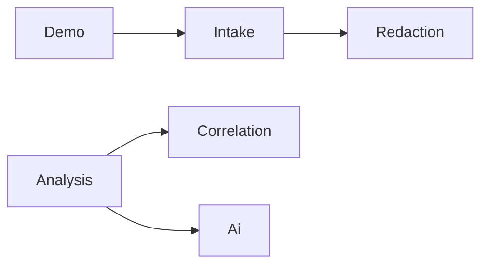
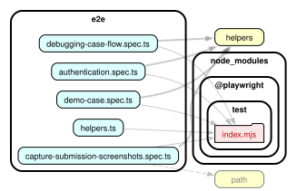

# Artifact 2 — Structure map (dependency analysis)

**Project:** SafeLog AI  
**Inputs:** [`artifact-1-territory.md`](artifact-1-territory.md) (active areas), Rails `app/` layout, Playwright `e2e/`  
**Tools:** [dependency-cruiser](https://github.com/sverweij/dependency-cruiser) v16 (TypeScript/E2E); Ruby constant-reference scan (Rails runtime — dependency-cruiser does not analyze Ruby)  
**Date:** 2026-06-09

## Executive summary

SafeLog AI is a **Rails 8 monolith** with a thin HTTP layer and a **pipeline-shaped service domain** (`intake → redaction → correlation → analysis → ai`). There are **no circular dependencies** in the Ruby service graph. Security boundaries hold: **`redaction` and `ai` do not cross-import**.

The course prompt targets a large JS monorepo (`webapp`); this repo’s **runtime structure lives in Ruby**. dependency-cruiser covers the **Playwright E2E subgraph** (star around `e2e/helpers.ts`); Ruby layer boundaries were verified with a **constant-reference scan** over `app/**/*.rb`.

Active territory from artifact-1 maps cleanly to intended architecture: **`debugging_cases_controller`** orchestrates HTTP; **`Analysis::AnalyzeCase`** is the main cross-domain orchestrator; **`spec/services`** mirrors service boundaries.

---

## Tooling setup

| Asset | Purpose |
|-------|---------|
| `.dependency-cruiser.cjs` | Rules: no cycles; E2E must not import `app/`, `config/`, `spec/` |
| `tsconfig.json` | TypeScript scope for `e2e/` + `playwright.config.ts` |
| `package.json` scripts | `npm run depcruise`, `npm run depcruise:validate`, `npm run depcruise:graph` |

**Commands (verified 2026-06-09):**

```bash
npm run depcruise:validate          # 9 modules, 11 deps — PASS
npm run depcruise -- --metrics      # fan-in/out for E2E graph
npm run depcruise:graph             # regenerate DOT + SVG
```

**Ruby scan (not dependency-cruiser):** static analysis of `Module::Class` references in `app/**/*.rb` (comments stripped), aligned with active areas from artifact-1.

---

## Top 3 exploration ideas (adapted for SafeLog AI)

| # | Question | Tool | Why it matters here |
|---|----------|------|---------------------|
| 1 | Does the **security pipeline** stay acyclic (`redaction` never reaches `ai`)? | Ruby constant scan | Core product guardrail — raw logs must not leak to AI |
| 2 | Where is **change amplification** highest (`analyze_case`, controller, E2E hub)? | Git territory + fan-out scan | Matches artifact-1 co-change corridor |
| 3 | Are **E2E tests** isolated from Rails imports (browser-only boundary)? | dependency-cruiser | Prevents accidental coupling of Playwright to app internals |

### Report types available

| Report | Command / method | Use in this repo |
|--------|------------------|------------------|
| Validation (errors) | `npm run depcruise:validate` | E2E boundary checks |
| Text dependency list | `npm run depcruise -- --output-type text` | Who imports `helpers.ts` |
| Metrics (fan-in/out) | `npm run depcruise -- --metrics` | E2E hub detection |
| DOT / SVG subgraph | `npm run depcruise:graph` | [`diagrams/e2e-helper-hub.svg`](diagrams/e2e-helper-hub.svg) |
| Ruby domain graph | Constant scan over `app/**/*.rb` | Service layer DAG + boundary rules |

---

## Cycles in active areas

### Key observations

1. **No Ruby service cycles** — domain graph is a DAG: `intake → redaction`, `demo → intake`, `analysis → correlation + ai`.
2. **No E2E cycles** — star topology: all specs → `helpers.ts` → `@playwright/test`.
3. **`Analysis::AnalyzeCase` is the only heavy orchestrator** — fans out to Correlation, Ai, and persistence; highest regression risk when changing analyze flow.
4. **Controller is a hub but not a cycle** — `DebuggingCasesController` calls six service domains; services never reference controllers.
5. **Comment-only cross-references do not form runtime cycles** — e.g. `Ai::Request` mentions `Analysis::PromptBuilder` in a comment only.

### Cycle analysis table

| Area | What we found | Evidence | Why it matters when changing | Link to artifact-1 | Check next |
|------|---------------|----------|------------------------------|-------------------|------------|
| `app/services/analysis/` | **No cycle**; orchestrates `Correlation` + `Ai` | `analyze_case.rb` → `Correlation::ExtractSignals`, `Ai::ClientResolver`, `Ai::ResponseValidator`; no reverse calls | Changing analyze touches correlation persistence + AI contract + retry logic | #6 active area (`app/services/ai/`); co-changes with `spec/services` | `spec/services/analysis/analyze_case_spec.rb` |
| `app/services/intake/` + `redaction/` | **Linear chain** intake → redaction | `ProcessCaseSubmission` → `Redaction::Engine` | Intake changes affect placeholder registry and all downstream sanitized content | Top runtime co-change: services + specs | `spec/requests/debugging_cases_security_spec.rb` |
| `app/services/ai/` | **Isolated adapter**; no runtime imports of Analysis/Redaction/Intake | Grep: no `Redaction::`, `Intake::`, `Analysis::` calls in `app/services/ai/*.rb` | AI adapter swappable (FakeClient/OpenAI) without touching redaction | artifact-1 Deep Focus candidate | `spec/services/ai/*` |
| `app/controllers/debugging_cases/` | **No cycle**; one-way controller → services | Controller references 6 domains; zero `Controller` refs in `app/services/` | HTTP slice changes ripple to views + request specs, not back into services | Tightest runtime triple: controller + routes + spec/requests | Request specs before refactor |
| `e2e/` | **No cycle**; hub-and-spoke | dependency-cruiser: 4 specs → `helpers.ts` → Playwright; fan-in **4** on helpers | Helper API change breaks all browser tests | June certification activity (Playwright) | `npm run test:e2e` |

**Service domain DAG (Ruby, code references only):**



---

## Layer boundaries

SafeLog AI intent (from `shape-notes.md`, `AGENTS.md`): **controllers = HTTP only**; **services = domain**; **models = persistence**; **AI sees sanitized evidence only**.

Mapped active areas from artifact-1:

| Intended layer | Paths | Expected dependencies |
|----------------|-------|------------------------|
| HTTP | `app/controllers/`, `config/routes.rb` | → services, models (via AR in thin queries) |
| Domain pipeline | `app/services/{intake,redaction,correlation,analysis,demo}` | → other services, models; **not** controllers |
| AI boundary | `app/services/ai/` | → external HTTP (OpenAI); **not** redaction/intake |
| Persistence | `app/models/` | → ActiveRecord only |
| Presentation | `app/views/debugging_cases/` | Render only; logic in helpers/services |
| Tests | `spec/requests/`, `spec/services/` | Mirror HTTP and service layers |

### Key observations

1. **Controllers stay thin** — `DebuggingCasesController` delegates create/analyze/archive to services.
2. **Security boundary intact** — `redaction/` has zero references to `Ai::` or `Analysis::`.
3. **AI boundary intact** — `ai/` has zero runtime references to `Redaction::` or `Intake::`.
4. **Services never import controllers** — grep over `app/services/**`: no `Controller` references.
5. **E2E respects stack boundary** — dependency-cruiser rule `e2e-no-rails-imports`: **PASS**.

### Layer boundary table

| Boundary checked | Result | Evidence | Why it matters when changing | Link to artifact-1 | Check next |
|------------------|--------|----------|------------------------------|-------------------|------------|
| Controller → services only (no inverse) | **PASS** | No controller refs in services; controller calls `Intake::`, `Analysis::`, etc. | Preserves thin HTTP from shape-notes | `app/controllers/` rank #4 runtime | Keep new actions as one-liner service calls |
| Redaction ⊥ AI | **PASS** | No `Ai::` / `Analysis::` in `app/services/redaction/` | Redaction gates AI — PRD guardrail | `app/services/redaction/` active in May slices | `debugging_cases_security_spec.rb` |
| AI ⊥ Redaction/Intake | **PASS** | No upstream domain imports in `app/services/ai/` (comments only) | Adapter replaceable; no secret leakage path | `app/services/ai/` #6 runtime | FakeClient specs |
| Analysis → AI (one direction) | **PASS** | `AnalyzeCase` → `Ai::ClientResolver`; Ai modules don't call Analysis | Orchestrator owns retry/validation | Co-change analysis ↔ spec/services | `analyze_case_spec.rb` |
| E2E ⊥ Rails runtime | **PASS** | dependency-cruiser: 9 modules, 0 violations | Browser tests remain black-box | June certification / Playwright | `npm run depcruise:validate` (optional CI) |
| Views ⊥ domain logic | **MOSTLY PASS** | Business rules in services; helpers format display | View edits shouldn't need AI/redaction changes | `app/views/debugging_cases/` #3 runtime | Keep logic out of ERB |

---

## Testability risks

### Podsumowanie

The codebase is **easy to unit-test in the service layer** (explicit `.call` objects, injectable `Ai::Client`). Highest test cost sits in **`Analysis::AnalyzeCase`** (orchestration + DB + AI + retry) and the **HTTP corridor** (request specs + system/Playwright). E2E is well-factored via `helpers.ts` but **any helper change is global** (fan-in 4).

### Lista ryzyk testowych

| Risk | Location | Test strategy | Why |
|------|----------|---------------|-----|
| **Orchestrator mock surface** | `Analysis::AnalyzeCase` | Service spec with injected `Ai::Client` fake | 6 outbound deps; failure paths (retry, invalid JSON) |
| **Transaction + redaction integration** | `Intake::ProcessCaseSubmission` | Service spec + security request spec | Touches `DebuggingCase`, `LogSource`, `RedactionFinding` in one transaction |
| **Controller fan-out** | `DebuggingCasesController#show` | Request/system spec | Loads associations + 4 service parse calls |
| **E2E hub fragility** | `e2e/helpers.ts` | Playwright (`bin/e2e`) | Fan-in from all 4 spec files |
| **Env-dependent AI resolver** | `Ai::ClientResolver` | Unit spec + request analyze specs | Branch on `Rails.env`, `OPENAI_API_KEY` |
| **Pure vs persistent correlation** | `Correlation::ExtractSignals` vs `AnalyzeCase` | Unit spec (pure) vs orchestrator spec (persist) | ExtractSignals is pure; persistence in AnalyzeCase (S-03) |

### Most suspicious modules

| Module | Fan-out | Recommended test level |
|--------|---------|------------------------|
| `Analysis::AnalyzeCase` | Correlation + Ai + AR writes | Service spec + analyze request spec |
| `DebuggingCasesController` | 6 service domains | Request specs (`spec/requests/*`) |
| `Intake::ProcessCaseSubmission` | Redaction + 3 models | Service spec + security oracle |
| `e2e/helpers.ts` | 4 spec importers | Playwright only |
| `Ai::OpenAiClient` | External HTTP | Unit spec with stubbed network |

### What to check next

1. Add optional CI gate: `npm run depcruise:validate`.
2. Extend **request security specs** before controller refactors (artifact-1 spine).
3. Consider [Packwerk](https://github.com/Shopify/packwerk) if `app/services/` grows — not needed at ~25 service files.

### Optional next step: graph

E2E hub (dependency-cruiser → DOT → SVG via `@viz-js/viz`):



- Source: [`diagrams/e2e-helper-hub.dot`](diagrams/e2e-helper-hub.dot)
- Regenerate: `npm run depcruise:graph`

For Ruby pipeline, use the Mermaid DAG above in `repo-map.md` synthesis.

---

## Implications for repo-map synthesis (artifact 3+)

1. **Structure confirms territory:** HTTP spine + service pipeline are real couplings, not git noise.
2. **Deep Focus zones:** `Analysis::AnalyzeCase`, `Intake::ProcessCaseSubmission`, `DebuggingCasesController#show`, `e2e/helpers.ts`.
3. **Safe refactor seams:** `app/services/ai/`, `Correlation::ExtractSignals`, `Redaction::Engine`.
4. **Do not treat `context/changes/` as structural modules** — documentation only (artifact-1).
5. **Limitation:** Ruby analysis is static constant matching, not autoload graph; dependency-cruiser scope is E2E-only (~7 TS files).

---

## Method notes

- dependency-cruiser config: `.dependency-cruiser.cjs`; explicit file list via npm scripts.
- Ruby scan: `Module::Class` references in `app/**/*.rb`, comments stripped.
- Active areas substituted from artifact-1 for course template paths (`channels/…`, `platform/…`).
- E2E SVG: `npm run depcruise:graph` (`@viz-js/viz`).
