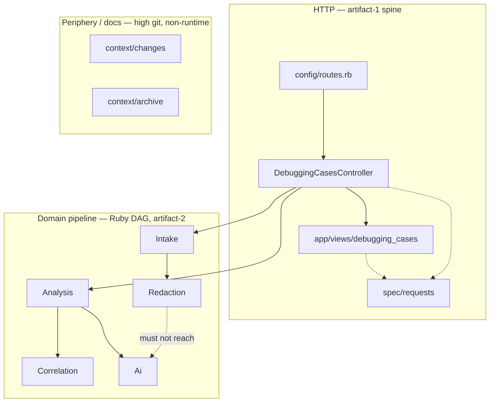

# SafeLog AI — Repo map (onboarding)

**Synthesized from:** [artifact-1-territory](artifact-1-territory.md) · [artifact-2-structure](artifact-2-structure.md) · [artifact-3-contributors](artifact-3-contributors.md)  
**Updated:** 2026-06-24 · **Map window:** git/structure analysis over requested 12 months (actual repo age ~3 weeks)

---

## 1. TL;DR

SafeLog AI is a **Rails 8 monolith** (SQLite, Devise, server-rendered ERB): the user pastes logs, the backend **redacts in memory**, persists only sanitized evidence, then produces a **hypothesis-framed** AI report — raw logs never reach the DB or the model. This is a **young solo MVP** (~3 weeks of history), not a legacy monolith — the map describes direction of work, not years of team specialization.

**Where work lives (runtime):** `app/services/*` (pipeline), thin HTTP in `app/controllers`, UI in `app/views/debugging_cases/`, oracles in `spec/requests` and `spec/services`. **High git activity, not product runtime:** `context/changes/` and `context/archive/` — 10x slice documentation, not deployable code.

**Pain points:** orchestrator `Analysis::AnalyzeCase`, HTTP corridor (`routes → controller → views → request specs`), security oracles, E2E hub `e2e/helpers.ts`. **No cycles** in Ruby services; **`redaction ⊥ ai`** boundary holds.

**Contributors:** single maintainer (Szymon Iwacz) — “who to ask” map is topic routing + fallback to `context/foundation/`.

---

## 2. Territory

### High responsibility vs periphery

| Zone | Depth | Git activity | Runtime? |
|------|-------|--------------|----------|
| **Service pipeline** (`intake`, `redaction`, `correlation`, `analysis`, `ai`) | Deep — product logic, PRD guardrails | Medium (33 touches in `app/services/`) | **Yes** |
| **HTTP slice** (controller, views, routes) | Medium — orchestration + UI | High (views #3, controller #8) | **Yes** |
| **Security oracles** (`spec/requests/*_security*`) | Deep — security contract | Highest runtime (#1: 32 touches) | **Yes (tests)** |
| **`context/changes/`** | Shallow for deploy — slice plans | **Highest in repo (#1: 146)** | **No** — looks like a module, but is not |
| **Deploy / cert / E2E** | Lighter operational layer | Growth in June 2026 | Partial (Fly, Playwright) |
| **Devise / dashboard** | Shallow — auth scaffold | Low vs debugging_cases | Yes, product periphery |

**Catalog illusion:** the top git-ranked folder is `context/changes/` — a **documentation workflow**, not a runtime bounded context. Completed slices → `context/archive/`. Active `context/changes/` today is practically only `README.md`.

### Activity over time

- **May 2026:** feature verticals (intake, redaction, analyze, AI, encryption) + slice archival.
- **June 2026:** certification, deploy, Playwright, foundation/reviews.

Trend: planned slices, no single-file “firefighting hotspot” (artifact-1).

---

## 3. Real couplings

Couplings with **evidence source** — do not confuse missing graph tooling with missing dependencies.

| Coupling | Type | Source | Change cost |
|----------|------|--------|-------------|
| `routes` ↔ `controller` ↔ `spec/requests` | Manual edit, vertical slice | **Git co-change** (6 runtime commits) | High — touches HTTP + oracle |
| `controller` ↔ `views/debugging_cases` | Manual edit | **Git co-change** (7 commits) | Medium — UI + request/system specs |
| `app/services` ↔ `spec/services` | Manual edit (TDD slice) | **Git co-change** (13 commits) | Medium — domain + unit tests |
| `intake` → `redaction` | One-way DAG | **Ruby constant scan** (artifact-2); no depcruise for Ruby | High — all sanitized content |
| `analysis` → `correlation` + `ai` | Orchestration | **Ruby constant scan** | Very high — `AnalyzeCase` |
| `redaction` ⊥ `ai` | Security boundary (no imports) | **Ruby constant scan** | Violation = critical |
| `context/changes` ↔ `spec/requests` | 10x workflow (plan + spec in one commit) | **Git co-change** (19) | Low for runtime — docs + code |
| `e2e/*.spec.ts` → `helpers.ts` → Playwright | Test hub | **dependency-cruiser** (fan-in 4, 0 violations) | Medium — helper change breaks all E2E |
| Ruby + E2E service graph | **No cycles** (DAG / star) | **Ruby constant scan** + **dependency-cruiser** (artifact-2) | Low — no loops to unwind on refactor |
| `spec/*` + CI ↔ `Ai::FakeClient` | **Mock / stub** (not manual OpenAI integration) | test-plan convention + `ClientResolver` in `test` | Low in CI — real API only when `OPENAI_API_KEY` outside test |
| `db/schema.rb` | **Regeneration** (`db:migrate`) | Git (excluded as noise in artifact-1) | Cheaper than manual edit — not a hotspot |
| Ruby service graph (full autoload) | — | **unknown** — static scan ≠ runtime autoload; ~25 service files | Treat Ruby couplings as scan-confirmed, not complete |

Heaviest orchestrator: `Analysis::AnalyzeCase`.

---

## 4. Risk zones

| # | Zone | Why |
|---|------|-----|
| 1 | **Security oracles** (`spec/requests/*_security_spec.rb`) | Only durable contract for “raw logs never persist / never reach AI” — regression breaks product narrative |
| 2 | **`Analysis::AnalyzeCase`** | Fan-out: Correlation + Ai + AR + retry; highest test and refactor cost (artifact-2) |
| 3 | **HTTP slice** (`debugging_cases_controller`, views, routes) | Tightest runtime co-change; every HTTP action pulls request specs |
| 4 | **`Intake::ProcessCaseSubmission` + `Redaction::Engine`** | Only contact with raw paste; bug = leak before redaction |
| 5 | **`e2e/helpers.ts`** | Fan-in 4 — one locator change breaks all Playwright (depcruise) |
| 6 | **Public Fly vs local demo** | `load_demo` dev/test only; Fly reviewers use manual intake — easy to mistake for deploy bug |

---

## 5. Who to ask

Solo MVP — **one contact**, no fictional RACI. Fallback when maintainer unavailable.

| Risk zone | Contact | Fallback |
|-----------|---------|----------|
| Security oracles | Szymon Iwacz | `context/foundation/test-plan.md`, `spec/requests/debugging_cases_security_spec.rb` |
| Analyze + AI | Szymon Iwacz | `app/services/analysis/analyze_case.rb`, `context/archive/…/analyze-hypothesis-report/` |
| HTTP slice | Szymon Iwacz | `config/routes.rb`, `spec/requests/debugging_cases_*` |
| Intake / redaction | Szymon Iwacz | `context/foundation/prd.md`, `spec/services/redaction/` |
| Deploy / E2E / cert | Szymon Iwacz | `context/deployment/deploy-plan.md`, `context/certification/certification-readiness.md` |
| Slice docs / decision history | Szymon Iwacz | `context/archive/` (not active `context/changes/`) |

---

## 6. First day — reading order (~15 min)

1. **`context/foundation/prd.md`** + **`context/foundation/shape-notes.md`** — product guardrails: redaction before AI, no raw persistence.
2. **`app/controllers/debugging_cases_controller.rb`** — HTTP entry; see which services it calls.
3. **`app/services/intake/process_case_submission.rb`** — intake + redaction in a transaction.
4. **`app/services/redaction/engine.rb`** — placeholder engine (pure domain).
5. **`app/services/analysis/analyze_case.rb`** — analyze orchestrator (highest risk).
6. **`app/services/ai/client_resolver.rb`** + **`fake_client.rb`** — AI boundary / tests without real API.
7. **`spec/requests/debugging_cases_security_spec.rb`** — security oracle (must-not-break).
8. **`AGENTS.md`** — hard rules for agents and contributors.

Optional after first flow: `context/map/artifact-1-territory.md` (where git activity lives) and `artifact-2-structure.md` (DAG + boundaries).

---

## 7. Limitations

**Window and method**

- Git analysis: requested 12 months, **actually ~3 weeks** (2026-05-18 → 2026-06-09, ~116 commits). Trends are directional, not statistically robust.
- **Territory / co-change:** `git log` + noise filter (artifact-1).
- **Ruby structure:** static `Module::Class` scan — **not** full autoload graph (marked **unknown** where depcruise does not cover Ruby).
- **E2E structure:** dependency-cruiser on ~7 TS files only (`e2e/`, Playwright).
- **Contributors:** 1 author; no bots in history; AI assist invisible in git metadata.

**What this map does NOT say**

- Does not rank `context/changes/` as a deployable module despite high git churn.
- Does not replace `context/foundation/test-plan.md` or CI procedures — points to where those procedures attach to code.
- Does not promise a team map — bus factor = 1.
- Does not cover post-MVP roadmap (Postgres, observability) — parked in foundation/roadmap.

**Source artifacts (detail):** [artifact-1](artifact-1-territory.md) · [artifact-2](artifact-2-structure.md) · [artifact-3](artifact-3-contributors.md) · [E2E graph](diagrams/e2e-helper-hub.svg)
